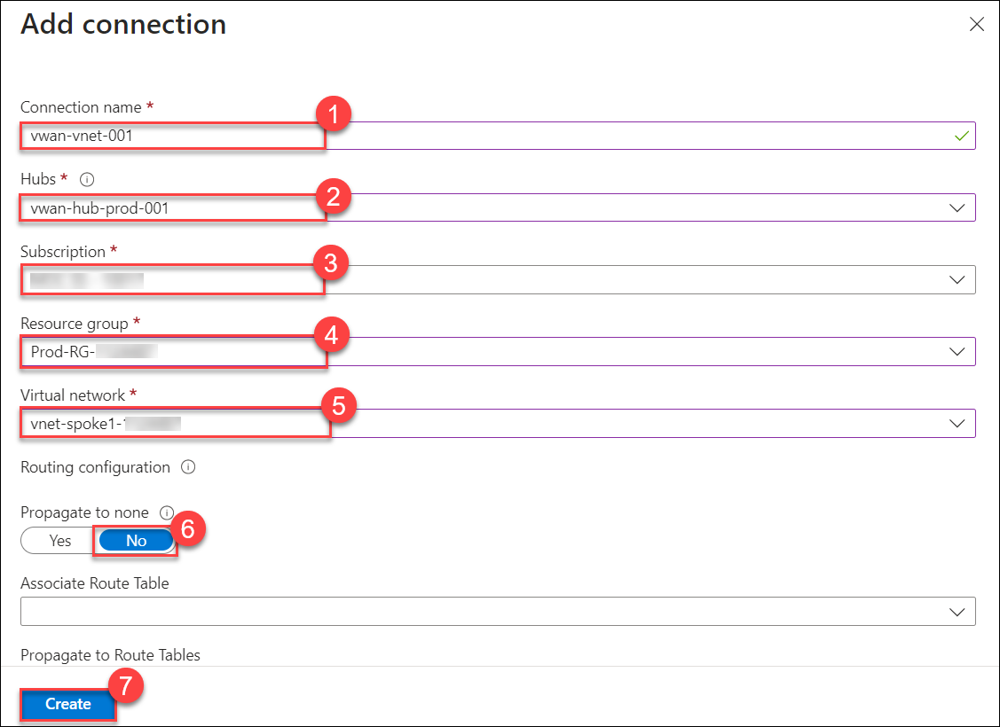
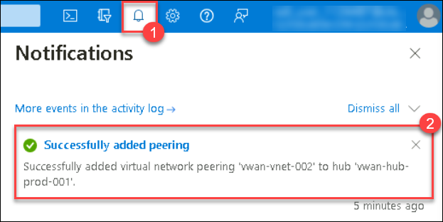
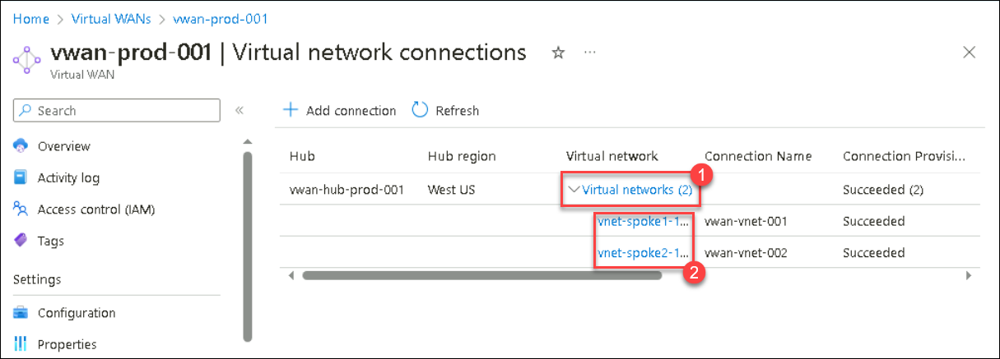

# Exercise 2: Provision your Azure Network Topology (Platform and Application Landing Zone)

## Scenario 

Contoso, a global technology company, has migrated its on-premises infrastructure to the Azure cloud to modernize its operations, improve scalability, and enhance security. Contoso needs to provision a comprehensive Azure Network Topology, including both the Platform and Application Landing Zone, to support its diverse workloads and applications as part of this digital transformation initiative.

## Overview

In this exercise, you'll familiarize yourself with Virtual WAN, virtual Hub and Virtual Network connections for your workloads.

## Task 1: Inspect the VM NIC effective routing. 

In this task, you will review effective route configurations of the Network Interface.

1. In the search bar of the Azure portal, type **network Interfaces (1)**, then select **Network Interfaces (2)** under **Services**.

     
     
1. Click on the **nic-spoke1-<inject key="DeploymentID" enableCopy="false"/>** and then select **Effective routes (1)**, Click on the **Download (2)** to download the file with the routes. You'll be able to compare these routes in steps later.

    
 
## Task 2: Connect Spoke vNets to Virtual WAN Hub

In this task, you will be creating Virtual network connections to Virtual WAN Hub.

1. In the search bar of the Azure portal, type **Virtual WANs (1)**, then click on **Virtual WANs (2)** under **Services**.

       

11. On the **Virtual WANs** page, select **vwan-prod-001**.

      

13. Select **Virtual network connections (1)** under the **Connectivity** section and click on **+ Add connection (2)**

      

14. On the **Add Connection** page, enter the following values:

    - **Connection Name (1):** Enter **vwan-vnet-001**

    - **Hubs (2):** Select **vwan-hub-prod-001**

    - **Subscriptions (3):** Select your subscription
    
    - **Resource group (4):** Select **Prod-RG-<inject key="DeploymentID" enableCopy="false"/>** resource group from the drop down list

    - **Virtual network (5):** Select **vnet-spoke1-<inject key="DeploymentID" enableCopy="false"/>**
    - Under **propagate to none**, make sure its selected to **No (6)**
    - Click on **Create (7)**.

        

15. After adding the creation, you receive a **Notifications (1)** stating **Successfully added peering (2)**.

    

16. To add a second connection, click on **+ Add Connection** and enter the following values:

     - **Connection Name (1):** Enter **vwan-vnet-002**

     - **Hubs (2):** Select **vwan-hub-prod-001**

     - **Subscriptions (3):** Select your subscription
    
     - **Resource group (4):** Select **Prod-RG-<inject key="DeploymentID" enableCopy="false"/>** resource group from the drop down list

     - **Virtual network (5):** Select **vnet-spoke2-<inject key="DeploymentID" enableCopy="false"/>**
       
     - Under **propogate to none**, make sure its selected to **No (6)**
       
     - Click on **Create (7)**.
    
          

1. After adding the creation, you receive a **Notifications (1)** stating **Successfully added peering (2)**.

     

17. Go back to **vwan-prod-001 | Virtual network connection**, click on the drop-down symbol next to **Virtual network (1)**, you can see **vnet-prod-001 (2)** and **vnet-prod-002 (2)** created.

    

## Task 3: Verify routing on both Spoke VMs.

In this task, you will review effective route configurations of the Network Interface after creating virtual network connections to the VWAN hub.

1. In the search bar of the Azure portal, type **network Interfaces (1)**, then select **Network Interfaces (2)** under **Services**.

     
     
1. Click on the **nic-spoke1-<inject key="DeploymentID" enableCopy="false"/>** and then select **Effective routes (1)**, Click on the **Download (2)** to download the file with the routes. You will compare these routes in steps later.

     

1. Compare the newly-downloaded file with the previously downloaded file prior to connecting the vNets to the Virtual WAN Hub. 

     

   >**Note**: You should see that the route for the target networks where the VMs reside was automatically programmed to transit via the virtual WAN Hub.

## Summary

In this exercise, you have covered the following:

- Reviewed effective route configurations of the Network Interface.
- Connected Spoke vNets to Virtual WAN Hub.
- Verified routing on both Spoke VMs.

