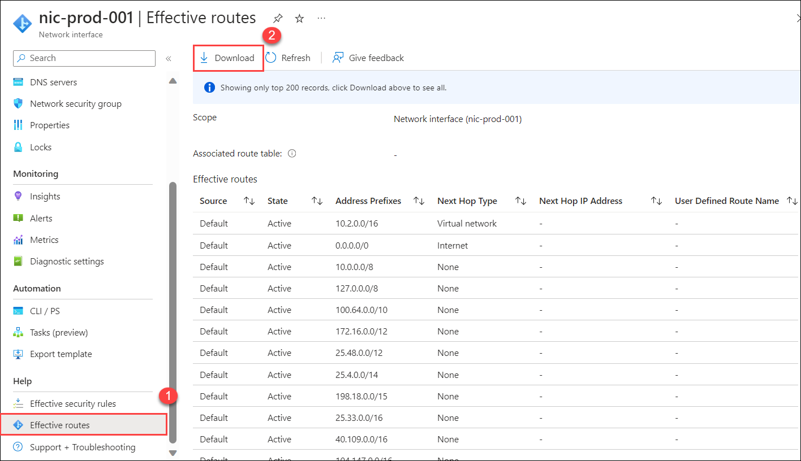
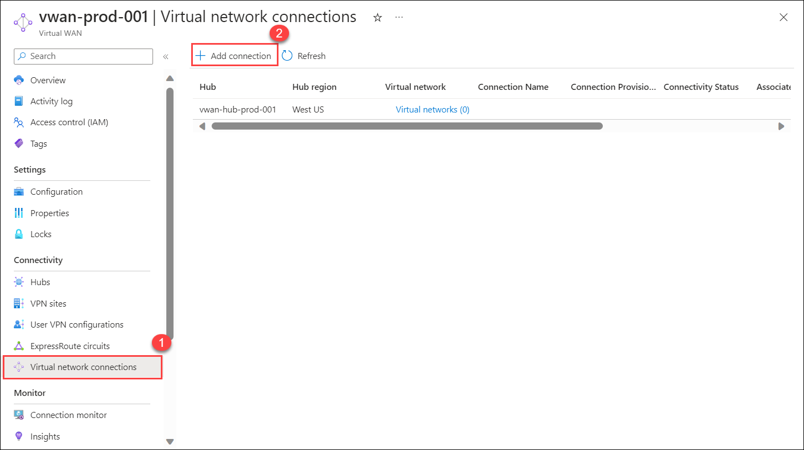
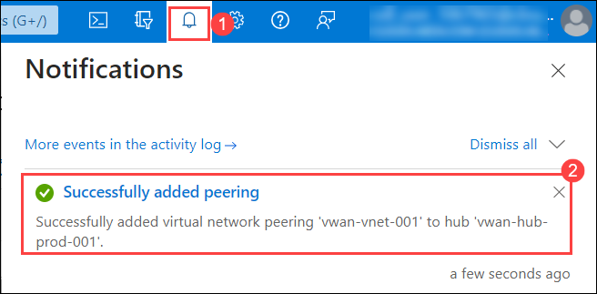
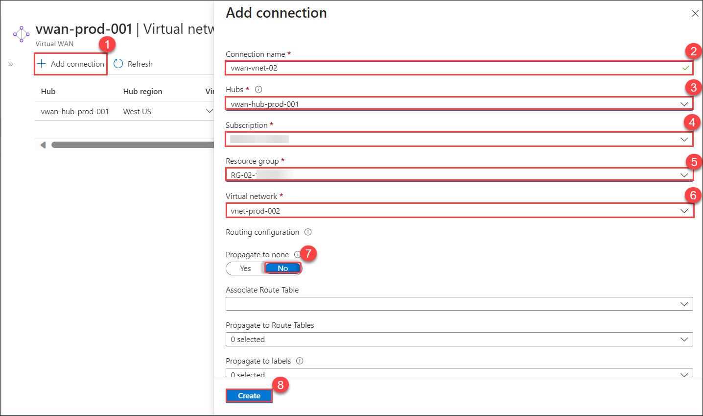

# Exercise 2: Provision your Azure Network Topology (Platform and Application Landing Zone)

In this exercise, you'll familiarize yourself with Virtual WAN, virtual Hub and Virtual Network connections for your workloads.

## Task 1: Inspect the VM NIC effective routing. 

In this task, you will create a virtual network.

1. In the search bar of the Azure portal, type **Network Interfaces (1)**, then select **Network Interfaces (2)** under **Services**.

     
     
1. Click on the **nic-prod-001** and then select **Effective routes(1)**, Click on the **Download(2)** to download the file with the routes. You'll be able to compare these routes in steps later.

    
 
## Task 2: Connect Spoke vNets to Virtual WAN Hub

1. In the search bar of the Azure portal, type **Virtual wan (1)**, then click on **Virtual WANs** under **Services**.

       

11. On the **Virtual WANs** page, select **vwan-prod-001**.

      

13. Select **Virtual network Connection(1)** under **Connectivity** blade and click on **+Add Connection(2)**

      

14. On the **Add Connection** page, enter the following values:

    - **Connection Name(1) :** Enter **vwan-vnet-001**

    - **Hubs (2):** Select **vwan-hub-prod-001**

    - **Subscriptions (3):** Select your subscription
    
    - **Resource group (4):** Select **RG-02-<inject key="DeploymentID" enableCopy="false"/>** resource group from the drop down list

    - **Virtual network (5):** Select **vnet-prod-001**

      Under **propagate to none**, make sure its selected to **No(6)** and click on **Create(7)**.

        

15. After adding the creation, you receive a **notification(1)** stating **Successfully added peering(2)**.

    

16. To add a second connection, click on **+Add Connection(1)** and enter the following values:

     - **Connection Name (2) :** Enter **vwan-vnet-02**

     - **Hubs (3):** Select **vwan-hub-prod-001**

     - **Subscriptions (4):** Select your subscription
    
     - **Resource group (5):** Select **RG-02-<inject key="DeploymentID" enableCopy="false"/>** resource group from the drop down list

     - **Virtual network (6):** Select **vnet-prod-002**

      Under **propogate to none**, make sure its selected to **No(7)** and click on **Create(8)**.
    
     

17. Go back to **vwan-prod-001 | Virtual network Connection**, click on the drop-down symbol next to **Virtual Networks(1)**, you can see **vnet-prod-001(2)** and **vnet-prod-002(2)** created.

    

## Task 3 : Verify routing and connectivity between VMs on both Spoke VMs.

1. In the search bar of the Azure portal, type **Network Interfaces (1)**, then select **Network Interfaces (2)** under **Services**.

     
     
1. Click on the **nic-prod-001** and then select **Effective routes(1)**, Click on the **Download(2)** to download the file with the routes. You will compare these routes in steps later.

     

1. Compare the newly downloaded file with the previously downloaded file prior to connecting the Spoke vNets to the Virtual WAN Hub. 

1. You should see that the route for the target networks where the VMs reside was automatically programmed to transit via the virtual WAN Hub. 

