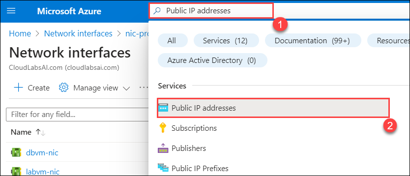
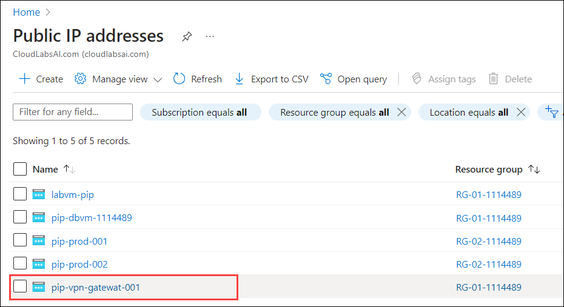
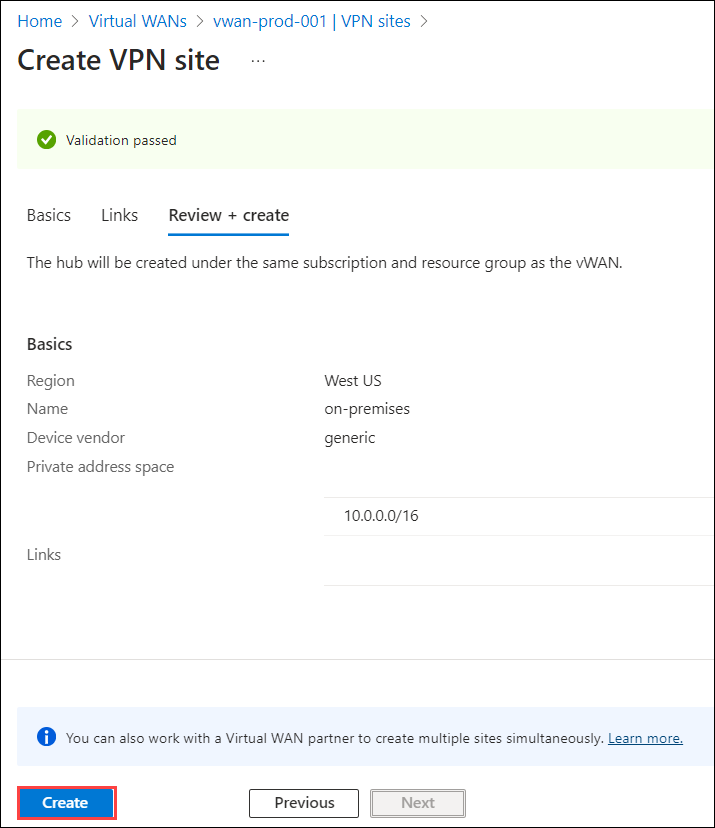
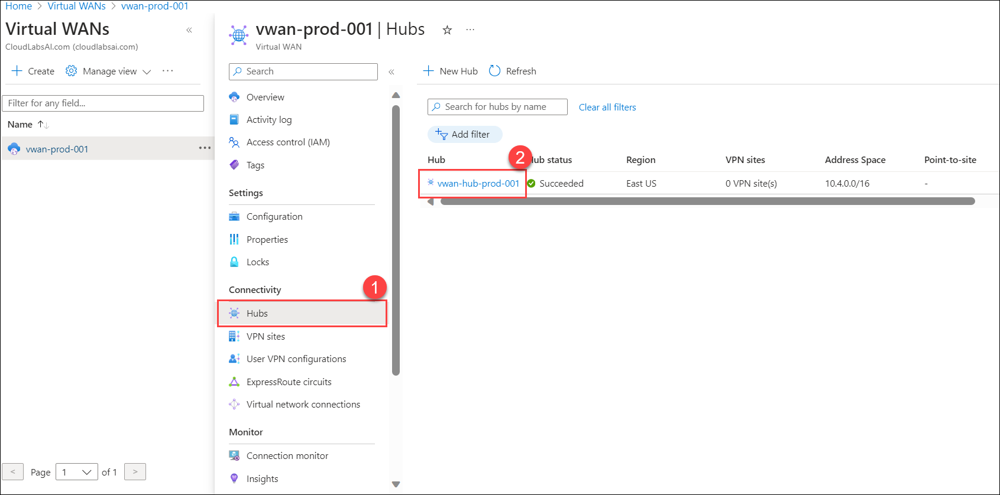
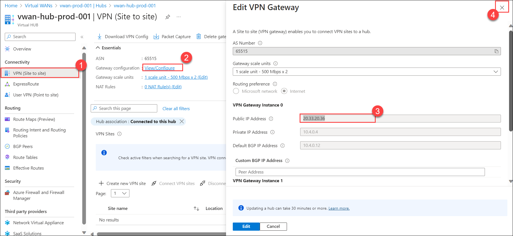
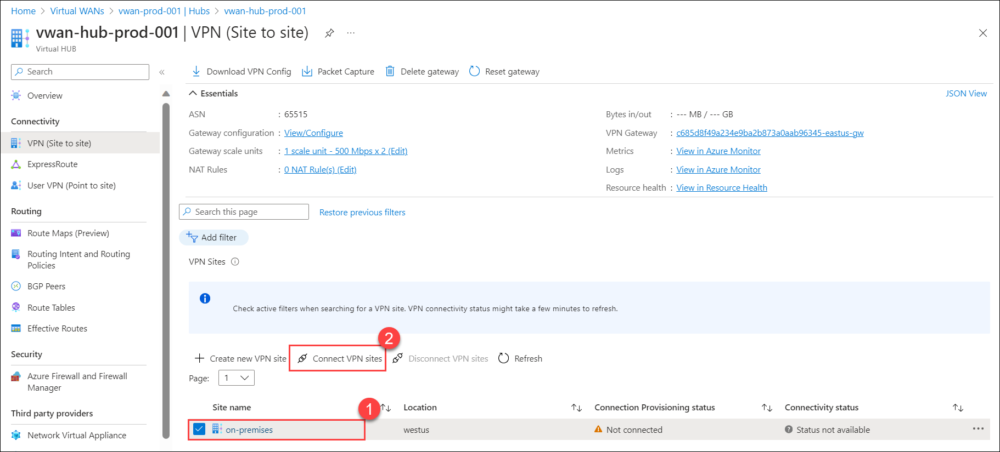
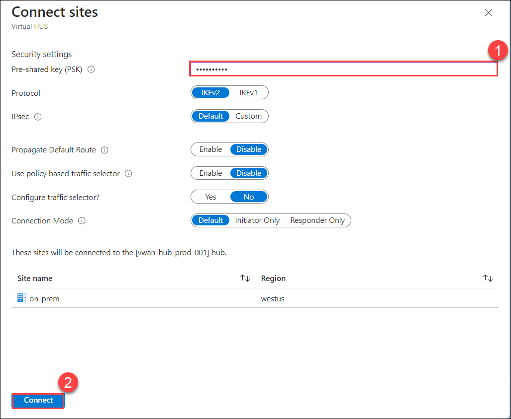
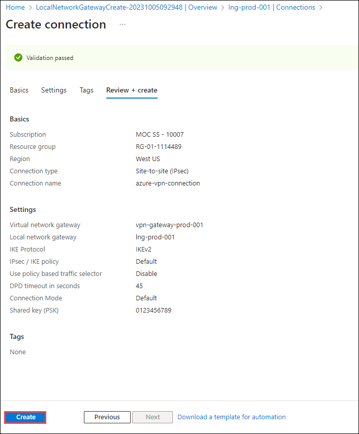
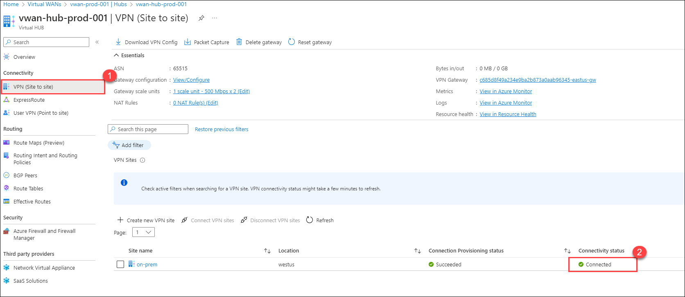

# Exercise 3. Provision Hybrid Connectivity

In this exercise you will provision connectivity from on-premises to Azure via Site-to-Site VPN (S2S VPN), with static routing and verify connectivity between on-premises and Azure. This lab will emulate an on-premises site using another separate VNet in Azure with and a Virtual Network Gateway as the VPN device. 

## Task 1: Create VPN and Configure dynamic routing 

1. In the search bar of the Azure portal, type **Public IP addresses  (1)**, then select **Public IP addresses  (2)** under **Services**.

   

1. Select the Azure virtual network gateway public IP address **(pip-vpn-gateway-001)**.

     

1. On the right side of the overview pane view find the IP address and hover the right side of the public IP to copy to the clipboard or record it on notepad.

   

1. In the search bar of the Azure portal, type **Virtual wan (1)**, then click on **Virtual WANs (2)** under **Services**.

      

1. On the **Virtual WANs** page, select **vwan-prod-001**.

    

1. On the **vwan-prod-001** Page, select **VPN sites (1)** under connectivity, then click on **Create site (2)**.

    

1. On the **Basic** page, fill in the following information:

    - **Subscription** : Leave as it as **default (1)** 
    - **Resource group** : Select **RG-03-<inject key="DeploymentID" enableCopy="false"/> (2)**
    - **Region** : Select **(US) West US (3)**
    - **Name** : Enter **on-prem (4)**
    - **Device vender** : Enter **generic (5)**
    - **Private address space** : Enter **10.0.0.0/16 (6)**
    -  Click on **Next : Links > (7)**

    

1. On the **Links** page, fill in the following information:
  
    - **Link name** : Enter **Onprem-ISP (1)**
    - **Link speed**: Enter **1000 (2)**
    - **Link provider name**: Enter **ISP-provider (3)**
    - **Link IP address/FQDN**: Enter **Public IP of on-prem VPN gateway (4)**.
    - Click on **Review + Create (5)**

    

1. Review the configuration, and click the **Create**.

    

1. Go back to the **Basics** tab of **vwan-prod-001 | Hubs** page, select **Hubs (1)** under the **Connectivity** section from the left navigation pane and then click on **vwan-hub-prod-001 (2)**.

      

1. Under the hub, perform the following steps:

 - Select **VPN (site to site) (1)** Under Gateway configuration.
 - Click the **View/Configure hyperlink (2)**. 
 - Under the Edit VPN Gateway, record in Notepad the **Public IP address for VPN Gateway instance 0 (3)**. This Public IP will be used in later on-premises VPN step configuration.

 - Click on**cancel (4)**. 

   

1. On the **VPN (site to site)** Under Gateway configuration click on **Clear all filters**.

   

1. Select the VPN site **on-premises (1)** then click on the **Connect VPN sites (2)**.

    

1. On the **Connect sites** Page, enter the following details.

- **Pre-shared key PSK** : enter **0123456789 (1)**

- Click on the **Connect (2)**. 

    

   >**Note**: Record Pre-shared key PSK in Notepad as you will be using it a step later to complete the VPN connectivity from the on-premises VPN configuration. 

1. Wait for the Connection to be **completed**.

    

## Task 2: Configure the on-premises environment to connect to Azure.  
    
1. Navigate back to the Azure portal, in the search box, type **Local Network gateway (1)** and select **Local Network gateway (2)** from results.

     

1. On the **Local network gateway** page, click on **Create**. 

    

1. On the **Basic** page, fill in the following information:
   
    - **Subscription** : Leave as it as **default (1)** 
    - **Resource group** : Select **RG-01-<inject key="DeploymentID" enableCopy="false"/> (2)**
    - **Region** : Select **(US) West US (3)**
    - **Name** : Enter **lng-prod-001 (4)**
    - **Endpoint** : Select **IP address (5)**
    - **IP address** : Enter **Public IP address for VPN Gateway instance 0 (6)** 
    - **Address space (s)** : Enter 
    
      - Address space of **vnet-prod-001 (10.2.0.0/16)**. 
      - Address space of **vnet-prod-002 (10.3.0.0/16)**.
      - Address space of **vwan-hub-prod-001 ( 10.4.0.0/16)**.
      - Address space of **DNSresolvervnet(10.5.0.0/16) (7)**
    -  Click on **Review + create (8)**

     

1. Review the configuration, and click the **Create**.
  
   

1. Monitor the deployment status on the **lng-prod-001** deployment overview page. In a minute or so, you should see a confirmation of the successful deployment and then click on Go to resource. This action will redirect you to the resource overview page.

   

## Task 3. Create the VPN connection to on-premises.  

1. On the **lng-prod-001** page, select **Connections (1)** which is under **Settings** blade and click on **+Add (2)**.

   

1. On the **Basics** tab, enter the following information:

   - **Subscription** : Leave it as **default (1)**
   - **Resource group** : Select **RG-01-<inject key="DeploymentID" enableCopy="false"/> (2)** from the drop-down.
   - **Connection type** : Select **Site-to-site (IPsec) (3)** from the drop-down.
   - **Name** : Enter **vpn-connection-001 (4)**
   - **Region** : Select **West US(5)** from the drop-down.
   -  Click on **Next : Settings > (6)**
     
      

1. On the **Settings** tab, enter the following information:

   - **Virtual network gateway** : Select **vpn-gateway-prod-001 (1)**
   - **Local network gateway** : Select **lng-prod-001 (2)**
   - **Shared key(PSK)** : Enter **0123456789 (3)**
   - Click on **Review + create (4)**

     
  
1. Review the configuration, click on the **Create**.
  
   

 ## Task 4. Validate Hybrid connectivity.  

1. From the Azure Portal, type **Virtual Network gateway (1)** in the search box and select **Virtual Network gateway (2)** from the results.

   
   
1. On the **Virtual network gateways** page, select **vpn-gateway-prod-001**.

   

1. On the **vpn-gateway-prod-001** page, select **Connections (1)** review the azure-vpn-connection shows **connected (2)**. 
    
   

   **Note**: This may take a few minutes to Connect. Refresh the page if needed. 

1. Click on the **azure-vpn-connection** and review additional information, then close the connection. 

   

1. In the search bar of the Azure portal, type **Virtual wan (1)**, then click on **Virtual WANs** under **Services**.

      

1. On the **Virtual WANs** page, select **vwan-prod-001**.

     

1. On the **Basics** tab of **vwan-prod-001 | Hubs** page, select **Hubs (1)** under the **Connectivity** section from the left navigation pane and then click on **vwan-hub-prod-001 (2)**.

      

1. Under Connectivity select **VPN (site to site) (1)**. Inspect the VPN Site is successfully **connected (2)**. 
  
   
