# Exercise 5: Configure private access to PaaS resources 

In this exercise, you will configure private access to PaaS Resources using the hybrid connectivity previously deployed and configure DNS resolution to properly access PaaS resources. 

## Task 1: Configure Private endpoint for PaaS resources

## Task 2. Create a DNS private resolver.  

1. In the search bar of the Azure portal, type **Virtual machines (1)**, then select **Virtual machines (2)** from results.

   

1. From the **Virtual machines** page, select **LabVM-<inject key="DeploymentID" enableCopy="false"/>**.
  
    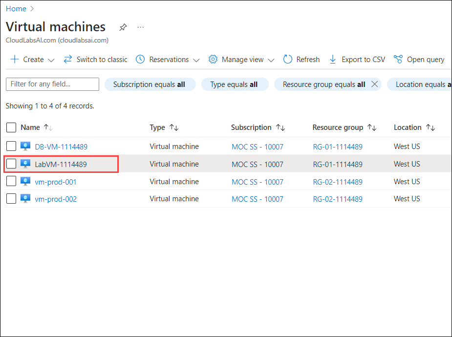

1. From the LabVM-<inject key="DeploymentID" enableCopy="false"/>overview page, record **private IP address** in notepad. You will use it on later steps.

   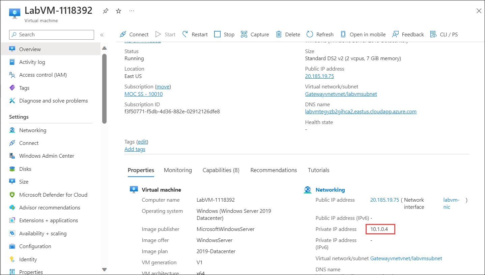

1. From the **Azure Portal**, search for **Private DNS Zones (1)** and select it **(2)** from results.

   

1. On **Private DNS zones** page, click on **+ Create**.

   

1. On **Basics** tab of Create Private DNS zone, follow the below instructions:

    - **Subscription (1)** : Leave it as **default**
    - **Resource group (2)** : Select **RG-03-<inject key="DeploymentID" enableCopy="false"/>** from the drop-down
    - **Name (3)** : Enter **private-dns-resolver-<inject key="DeploymentID" enableCopy="false"/>**
    - **Region (4)** : Select **(US) West US**
    - **Virtual Network (5)** : Select **DNSresolvervnet (rg-03-<inject key="DeploymentID" enableCopy="false"/>)** from the drop-down.
   - Click on **Next : Inbound Endpoints > (6)**
 
     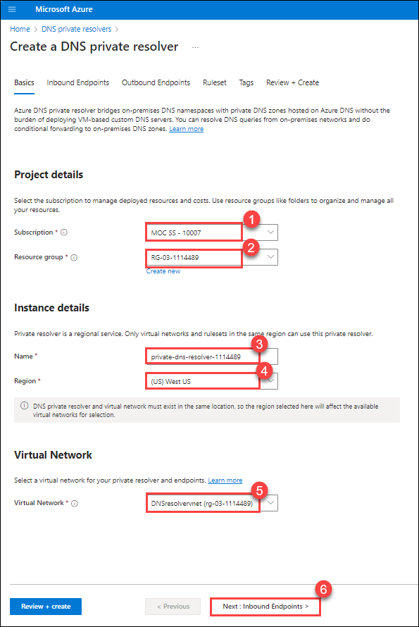

 1. On **Inbound Endpoints** tab of Create Private DNS zone, click on **Add an endpoint**.


      


 1. On **Add an inbound endpoint** tab of Create Private DNS zone, follow the below instructions:


   - **Endpoint name (1)** : Enter **endpoint-inbound**
   - **Subnet (2)** : Select **dns-resolver-Inbound (10.5.0.0/24)** from the drop-down.
   - Click on **Save (3)**

      

 1. On **Inbound Endpoints** tab of Create Private DNS zone, click on **Next : Outbound Endpoints>**


    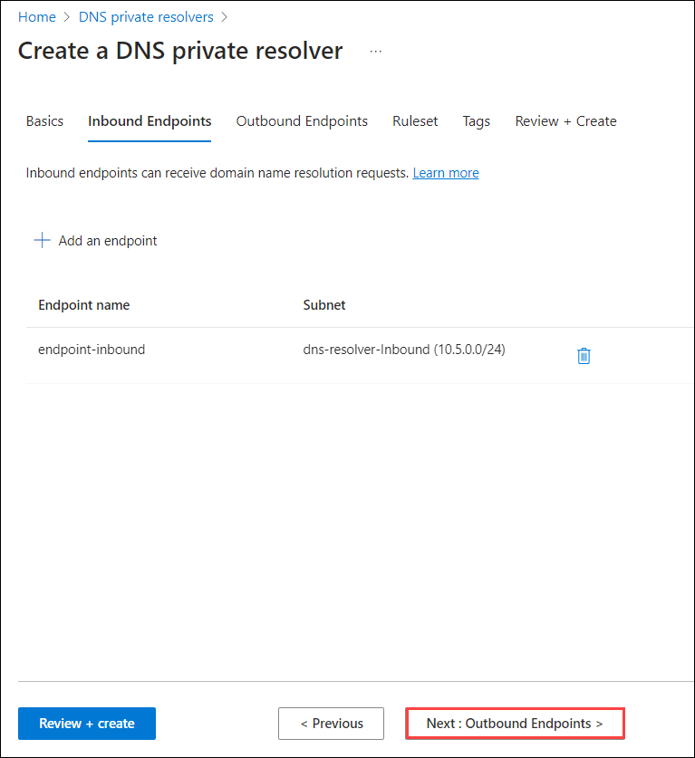


 1. On **Outbound Endpoints** tab of Create Private DNS zone, click on **Add an endpoint**.


      


 1. On **Add an inbound endpoint** tab of Create Private DNS zone, follow the below instructions:


   - **Endpoint name (1)** : Enter **endpoint-outbound**
   - **Subnet (2)** : Select **dns-resolver-Outbound (10.5.1.0/24)** from the drop-down.
   - Click on **Save (3)**

      


 1. On **Outbound Endpoints** tab of Create Private DNS zone, click on **Next : Ruleset >**


      


 1. On **Ruleset** tab of Create Private DNS zone, click on  **Add a ruleset** check box.


     


 1. On **Ruleset** tab of Create Private DNS zone, follow the below instructions:

    - **Ruleset name (1)** : Enter **onprem-ruleset**
    - **Endpoints (2)** : Select **endpoint-outbound** from tht drop-down.
    - On the **Rules** section, Click on **+ Add (3)** 


    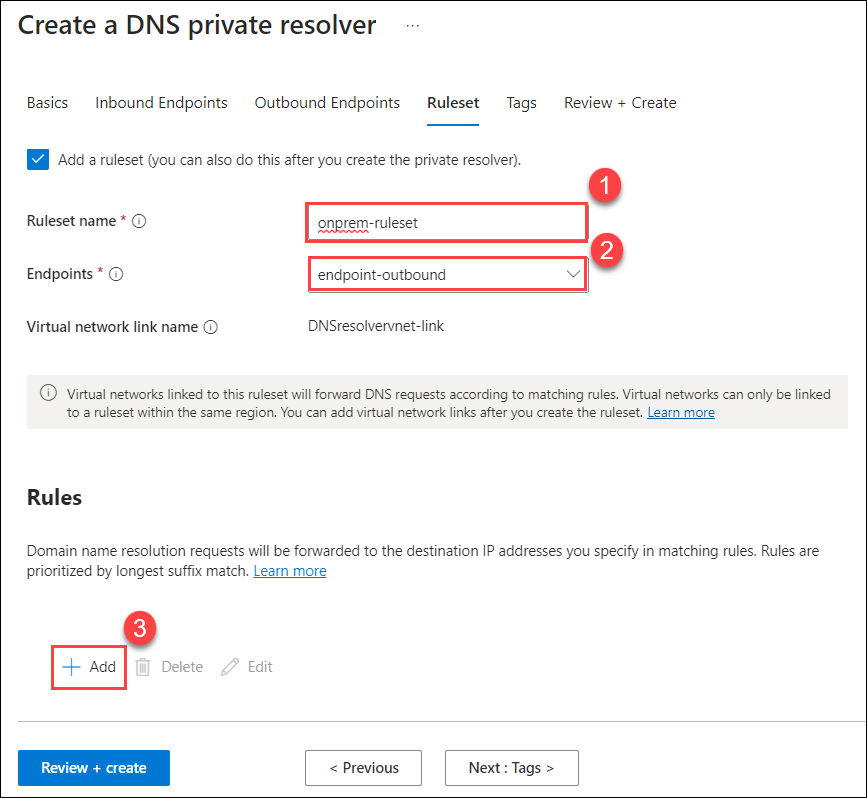

1. On **Add Rule** blade of Create Private DNS zone, follow the below instructions:

     - **Rule Name (1)** : Enter **onprem-local**
     - **Domain name (2)** : Enter **onprem.local.**
     - **Rule State (3)** : Select **Enabled** from the drop-down.
     - **Destination IP address (4)** : Enter the **private IP of LabVM-<inject key="DeploymentID" enableCopy="false"/>**

      


 1. Go back to the **Ruleset** tab, Click on **Review + Create**


    


1. Review the configuration and click on **Create**.

    

1. Once the deployment is succeeded, click on **Go to resource**.

    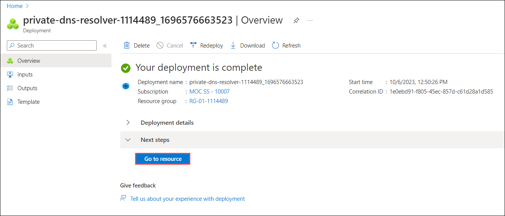

1. Click on **Inbound endpoints (1)** Under **Settings** and record the **IP address (2)** in notepad. You will use it on later steps.  


   

1. On the left menu select **Outbound endpoints (1)**, then click on the **onprem-ruleset (2)** hyperlink.

   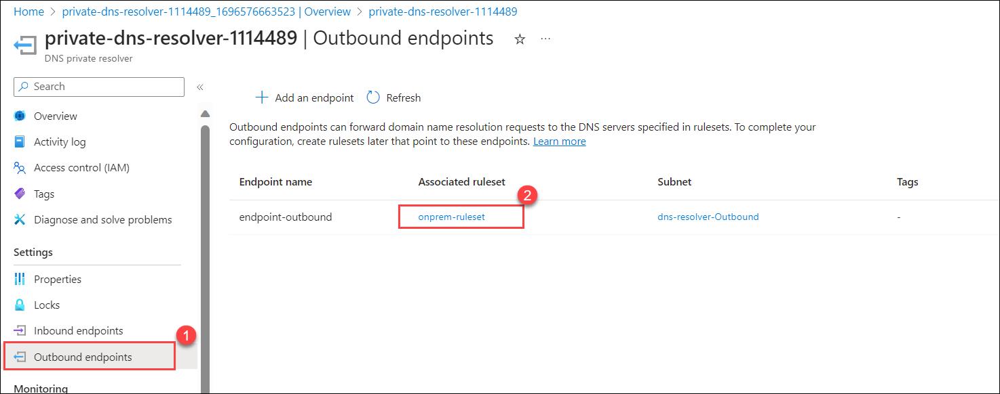

1. On the left menu select Virtual Network Links, then Click on the **+Add**.

   

1. On the **Add Virtual Network link** page, follow the below instructions:


    - **Subscription (1)** : Leave it as **default**.
    - **Resource group (2)** : Select **RG-02-<inject key="DeploymentID" enableCopy="false"/>** from the drop-down.
    - **Region (3)** : Leave it as **default**.
    - **Virtual Network (4)** : Select **vnet-prod-001** from the drop-down.
    - **Link Name (5)** : Leave it as **default**.
    - Click on **Add (6)**

     

1. Click on the **+ Add** button to add additional links.  

    

1. Repeat the previous step to add **vnet-prod-002** vNet, follow the below instructions: 

    - **Subscription (1)** : Leave it as **default**.
    - **Resource group (2)** : Select **RG-02-<inject key="DeploymentID" enableCopy="false"/>** from the drop-down.
    - **Region (3)** : Leave it as **default**.
    - **Virtual Network (4)** : Select **vnet-prod-002** from the drop-down.
    - **Link Name (5)** : Leave it as **default**.
    - Click on **Add (6)**
  
    


## Task 3: Validate Name Resolution to on-premises resources using Private DNS resolver outbound endpoint. 

1. In the search bar of the Azure portal, type **Virtual machines (1)**, then select **Virtual machines (2)** under **Services**.

   

1. From the **Virtual machines** page, select **vm-prod-001**.

   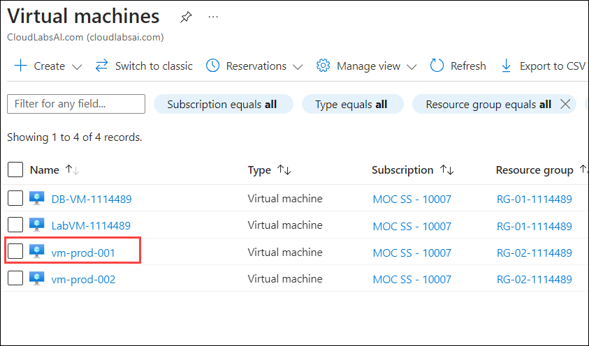

1. On the **Connect (1)** page under Settings, click on **Select (2)** under **Native RDP** and click on **Download RDP File (3)**. A file will download on the bottom left of your screen.

   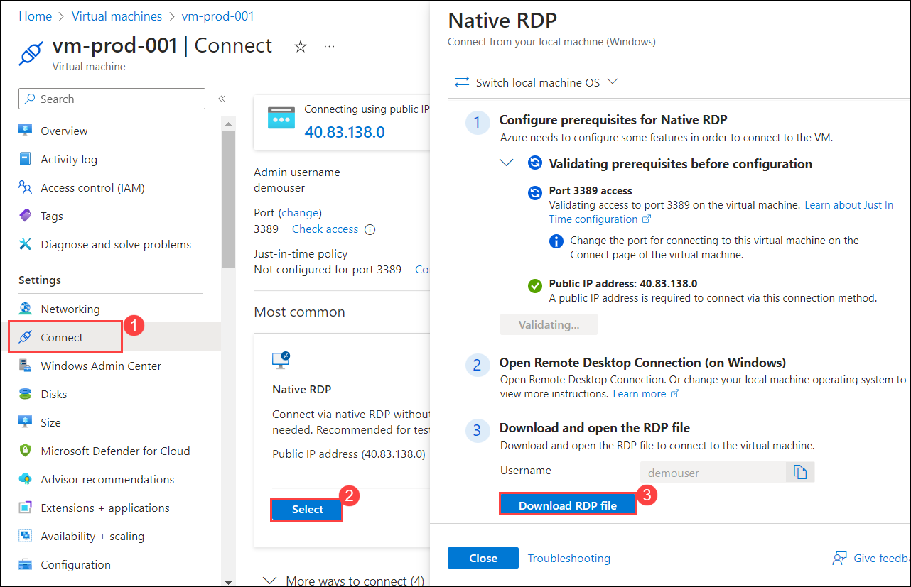

1. **Open** the downloaded RDP file (located on the bottom left of your lab machine) and click **Connect** when prompted. 

   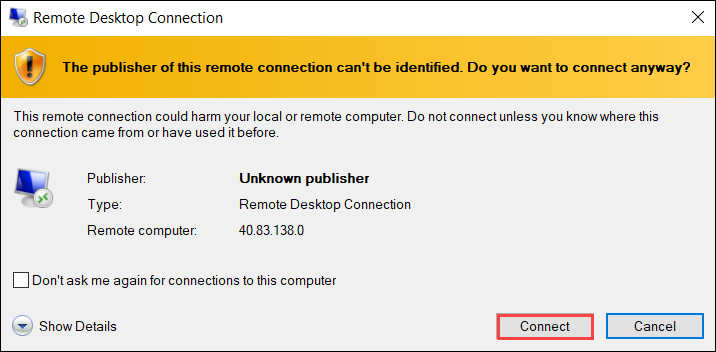

1. In the **Windows Security** window, sign in using the following Steps:

     - Username : **demouser (1)**
     - Password : **Password.1!! (2)**
     - Click **OK (3)**

       

1. From your **vm-prod-001** Search for **command prompt (1)** and open a **command prompt (2)**.

    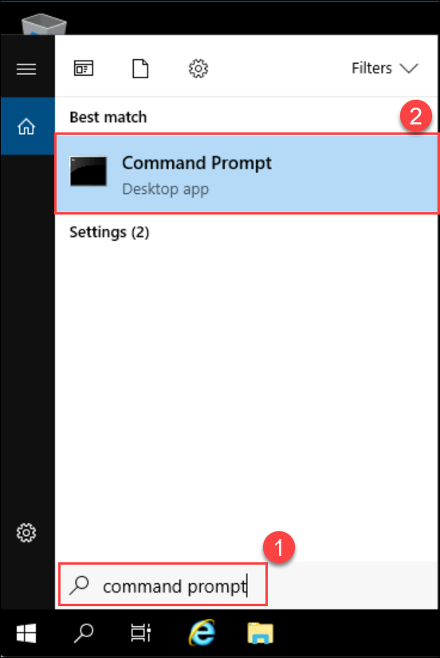

1. In the command prompt run the following command: 

   ```
    nslookup DB-VM-<inject key="DeploymentID" enableCopy="false"/>.onprem.local 
   ```  


1. Confirm you can retrieve the private IP address for the DB-VM-<inject key="DeploymentID" enableCopy="false"/>


## Task 3. Configure on-premises DNS forwarding to Azure DNS private resolver 


1. On your **LabVM-<inject key="DeploymentID" enableCopy="false"/>** Search for **DNS Manager (1)** and open a **DNS Manager (2)**.


  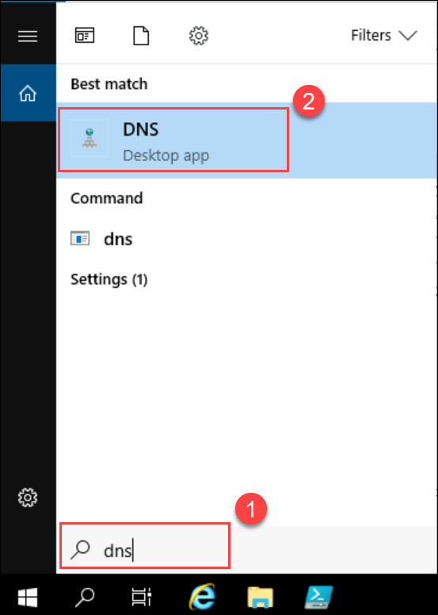

1. Expand **LabVM-<inject key="DeploymentID" enableCopy="false"/> (1)** and Right click on the **Conditional Forward (2)** and select **New Conditional Forwarder (3)**.  

   

1. On the **New Conditional Forwarder** pop-up,follow the below instructions:

- **DNS Domain (1)** : Enter **blob.core.windows.net**
- **IP addresses (2)** : Enter the IP address of the **DNS private resolver inbound endpoint** previously recorded under the IP address
- Click on **OK (3)** 

    

## Task 4. Configure private access to Azure PaaS Services

1. In the search bar of the Azure portal, type **Storage accounts (1)**, then select **Storage accounts (2)** under **Services**.

   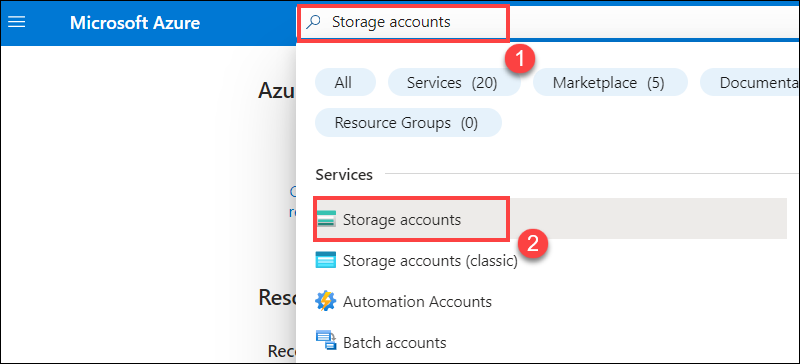

1. From the **Storage accounts** page, select **stacc<inject key="DeploymentID" enableCopy="false"/>**.
  
    

1. From the left menu select **Networking (1)**, then select the tab **Private endpoint connections (2)** and Click on **+Private endpoint (3)**. 

    

1. On **Basics** tab of Create a Private endpoint, follow the below instructions:

    - **Subscription (1)** :  Leave it as **default**.
    - **Resource group (2)** : Select **RG-02-<inject key="DeploymentID" enableCopy="false"/>** from the drop-down.
    - **Name (3)** : Enter **pep-storage-blob**
    - **network interface (4)**: The network interface name will automatically populate.
    - **Region (5)** : Leave it as **default**.
    - Click on **Next : Resource > (6)**

      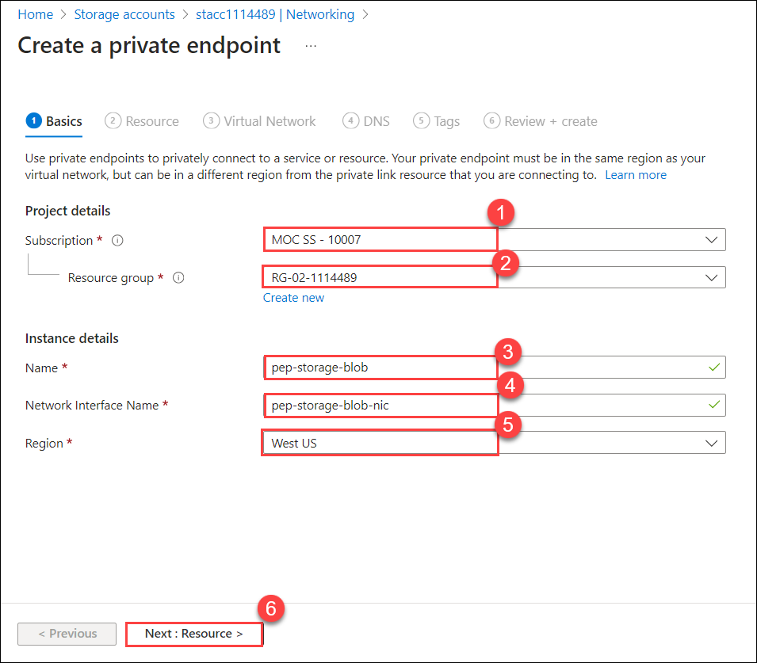

1. Select **blob (1)** as Target sub-resource. Click **Next: Virtual Network (2)**.

    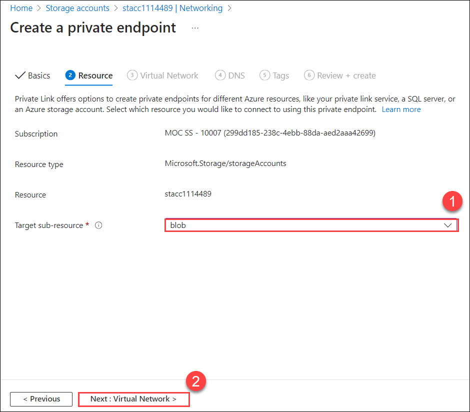

1. On **Resource** tab of Create a Private endpoint, follow the below instructions:

   - **Virtual network (1)** : Select **DNSresolvevnet (RG-03-<inject key="DeploymentID" enableCopy="false"/>)** from the drop-sown.

   - **Subnet (2)**: Select **private-endpoint-storage (2)** subnet from the drop-down. 
   
   - Click **Edit (3)** under the Network Policy for private endpoints.  

  
    


 1. On the **Edit subnet network policy** pop-up, Select both **Network security groups and Route tables (1)** and click **Save (2)**. (this will be used in a later exercise)


    

1. Under the **Application security** group. Click the **+ Create**.

   

1. Enter Name as **asg-blob-private-endpoint (1)** and click **OK (2)**. and then  

   

1. On **Resource** tab of Create a Private endpoint, Click on **Next: DNS >**


    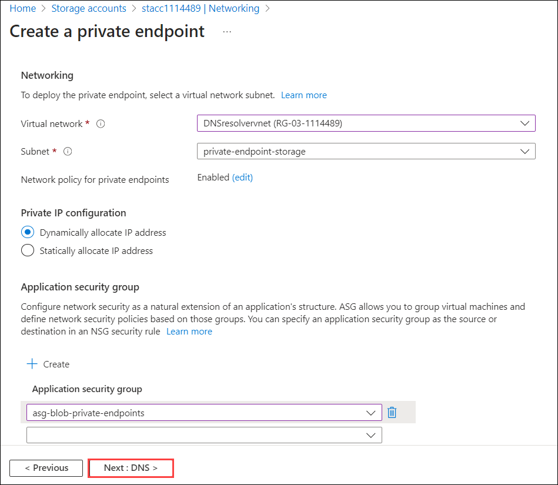


1. On the **DNS** Tab, follow the below instructions:


    - **Integrate with private DNS zone (1)** : Select **Yes**, 
    - **Subscription (2)** :  Leave it as **default**.
    - **Resource group (3)** : Select **RG-02-<inject key="DeploymentID" enableCopy="false"/>** from the drop-down. 
    -**Private DNS zone (4)** :  Leave it as **default**.
    - Click on **Next : Tags > (5)**


    


1. On the **Tags** Tab, click on **Next: Review+ create >**

   


1. After validation passed and reviewing click **Create** and wait for the deployment to complete. 

   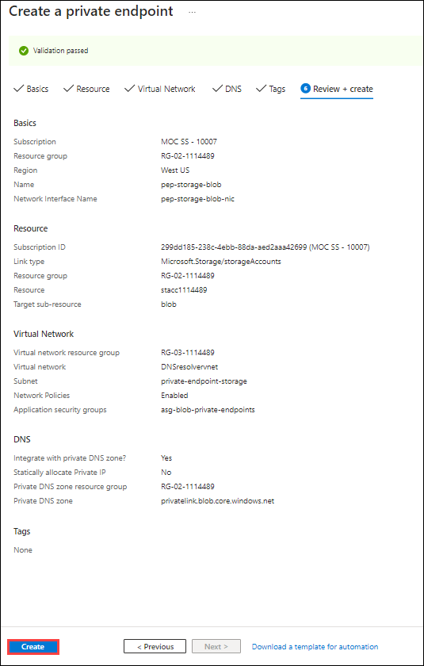

1. Wait for the deployment to complete. Then click on the **Go to resource**.  

    


1. On the left menu, click **DNS configuration**. Record the **IP address and FQDN** on notepad, you will use this info on later steps. Then click on the hyperlink **privatelink.blob.core.windows.net**


     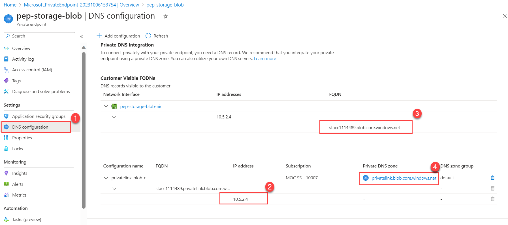

1. Under the **Overview**, review the **A** record and **IP address** which should match with the previous **DNS configuration**. On the left side menu, click on the **Virtual network links (2)** option.  


    

1. This shows the virtual network link created for the **privatelink.blob.core.windows.net** to the **DNSresolvervnet** vNet. In this way the **DNSresolvervnet** vNet and DNS private resolver will be able to have DNS resolution to the created private endpoint.  

     


## Task 5. Confirm on-premises client resolution to Azure PaaS Services  