# Exercise 5: Configure private access to PaaS resources 

In this exercise, you will configure private access to PaaS Resources using the hybrid connectivity previously deployed and configure DNS resolution to properly access PaaS resources. 

## Task 1: Configure Private endpoint for PaaS resources

1. In the search bar of the Azure portal, type **Virtual wan (1)**, then click on **Virtual WANs** under **Services**.

       

1. On the **Virtual WANs** page, select **vwan-prod-001**.

      

1. Select **Virtual network Connection(1)** under **Connectivity** blade and click on **+Add Connection(2)**

      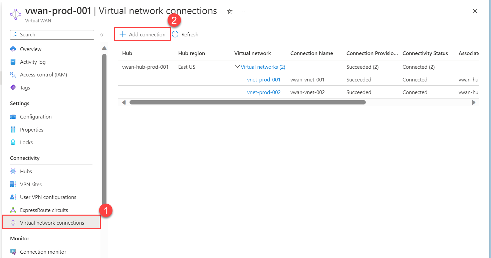

1. On the **Add Connection** page, enter the following values:

    - **Connection Name(1) :** Enter **onprem-vnet-001**

    - **Hubs (2):** Select **vwan-hub-prod-001**

    - **Subscriptions (3):** Select your subscription
    
    - **Resource group (4):** Select **RG-03-<inject key="DeploymentID" enableCopy="false"/>** resource group from the drop down list

    - **Virtual network (5):** Select **vnet-prod-001**

      Under **propagate to none**, make sure its selected to **No(6)** and click on **Create(7)**.

        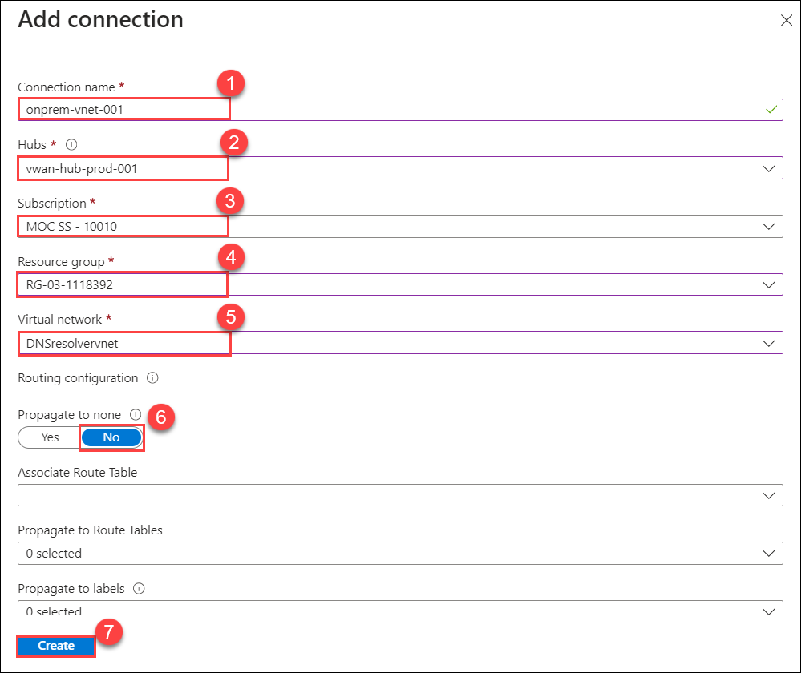

1. Go back to **vwan-prod-001 | Virtual network Connection**, click on the drop-down symbol next to **Virtual Networks(1)**, you can see **onprem-prod-001(2)** created.

      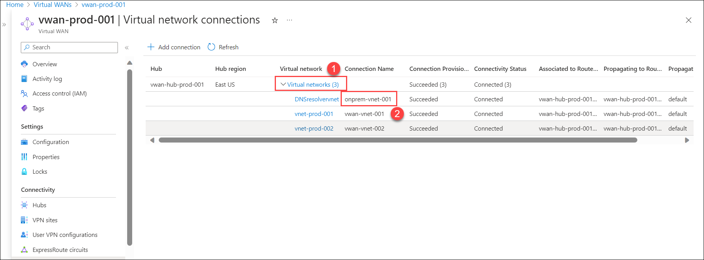

## Task 2: Create a DNS private resolver.  

1. In the search bar of the Azure portal, type **Virtual machines (1)**, then select **Virtual machines (2)** from results.

   

1. From the **Virtual machines** page, select **LabVM-<inject key="DeploymentID" enableCopy="false"/>**.
  
    

1. From the LabVM-<inject key="DeploymentID" enableCopy="false"/>overview page, record **private IP address** in notepad. You will use it on later steps.

   

1. From the **Azure Portal**, search for **DNS private resolver (1)** and select  **DNS private resolver (2)** from results.

   

1. On **DNS private resolver** page, click on **+ Create**.

   

1. On **Basics** tab of Create DNS private resolver, follow the below instructions:

    - **Subscription (1)** : Leave it as **default**
    - **Resource group (2)** : Select **RG-03-<inject key="DeploymentID" enableCopy="false"/>** from the drop-down
    - **Name (3)** : Enter **private-dns-resolver-<inject key="DeploymentID" enableCopy="false"/>**
    - **Region (4)** : Select **(US) West US**
    - **Virtual Network (5)** : Select **DNSresolvervnet (rg-03-<inject key="DeploymentID" enableCopy="false"/>)** from the drop-down.
   - Click on **Next : Inbound Endpoints > (6)**
 
     

 1. On **Inbound Endpoints** tab of DNS private resolver, click on **Add an endpoint**.


      


 1. On **Add an inbound endpoint** tab of DNS private resolver, follow the below instructions:


   - **Endpoint name (1)** : Enter **endpoint-inbound**
   - **Subnet (2)** : Select **dns-resolver-Inbound (10.5.0.0/24)** from the drop-down.
   - Click on **Save (3)**

      

 1. On **Inbound Endpoints** tab of DNS private resolver, click on **Next : Outbound Endpoints>**


    


 1. On **Outbound Endpoints** tab of DNS private resolver, click on **Add an endpoint**.


      


 1. On **Add an Outbound endpoint** tab of DNS private resolver, follow the below instructions:


   - **Endpoint name (1)** : Enter **endpoint-outbound**
   - **Subnet (2)** : Select **dns-resolver-Outbound (10.5.1.0/24)** from the drop-down.
   - Click on **Save (3)**

      


 1. On **Outbound Endpoints** tab of DNS private resolver, click on **Next : Ruleset >**


      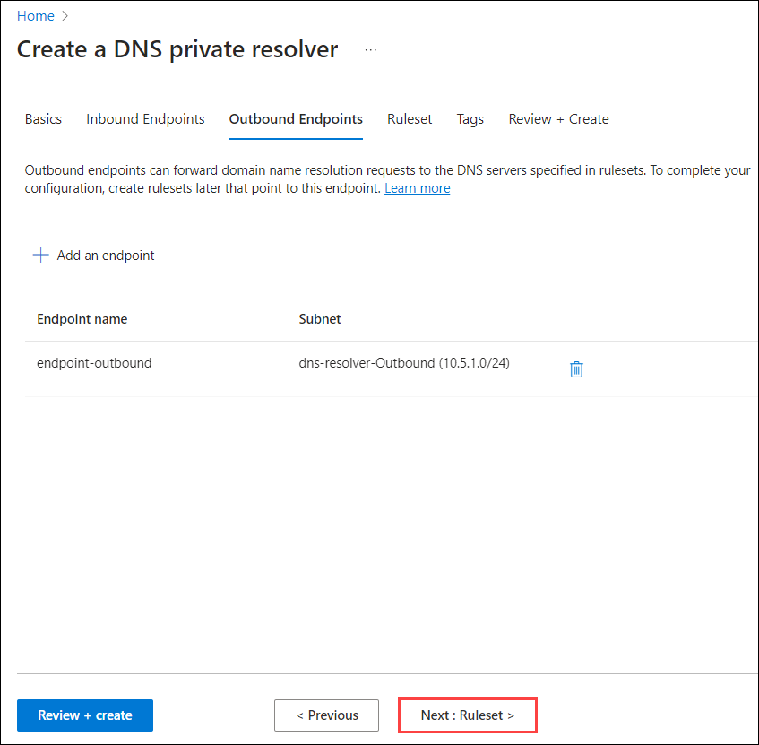


 1. On **Ruleset** tab of DNS private resolver, click on  **Add a ruleset** check box.


     


 1. On **Ruleset** tab of DNS private resolver, follow the below instructions:

    - **Ruleset name (1)** : Enter **onprem-ruleset**
    - **Endpoints (2)** : Select **endpoint-outbound** from tht drop-down.
    - On the **Rules** section, Click on **+ Add (3)** 


    

1. On **Add Rule** blade of DNS private resolver, follow the below instructions:

     - **Rule Name (1)** : Enter **onprem-local**
     - **Domain name (2)** : Enter **onprem.local.**
     - **Rule State (3)** : Select **Enabled** from the drop-down.
     - **Destination IP address (4)** : Enter the **private IP of LabVM-<inject key="DeploymentID" enableCopy="false"/>**

        


 1. Go back to the **Ruleset** tab, Click on **Review + Create**


    


1. Review the configuration and click on **Create**.

    

1. Once the deployment is succeeded, click on **Go to resource**.

    

1. Click on **Inbound endpoints (1)** Under **Settings** and record the **IP address (2)** in notepad. You will use it on later steps.  


   

1. On the left menu select **Outbound endpoints (1)**, then click on the **onprem-ruleset (2)** hyperlink.

   

1. On the left menu select Virtual Network Links, then Click on the **+Add**.

   

1. On the **Add Virtual Network link** page, follow the below instructions:


    - **Subscription (1)** : Leave it as **default**.
    - **Resource group (2)** : Select **RG-02-<inject key="DeploymentID" enableCopy="false"/>** from the drop-down.
    - **Region (3)** : Leave it as **default**.
    - **Virtual Network (4)** : Select **vnet-prod-001** from the drop-down.
    - **Link Name (5)** : Leave it as **default**.
    - Click on **Add (6)**

     

1. Click on the **+ Add** button to add additional links.  

    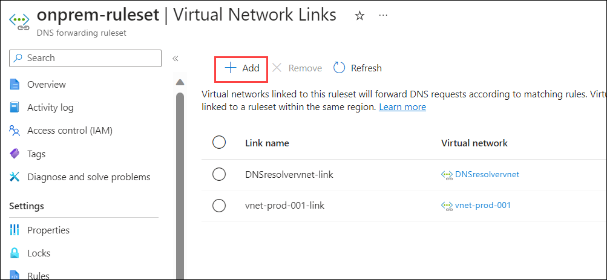

1. Repeat the previous step to add **vnet-prod-002** vNet, follow the below instructions: 

    - **Subscription (1)** : Leave it as **default**.
    - **Resource group (2)** : Select **RG-02-<inject key="DeploymentID" enableCopy="false"/>** from the drop-down.
    - **Region (3)** : Leave it as **default**.
    - **Virtual Network (4)** : Select **vnet-prod-002** from the drop-down.
    - **Link Name (5)** : Leave it as **default**.
    - Click on **Add (6)**
  
    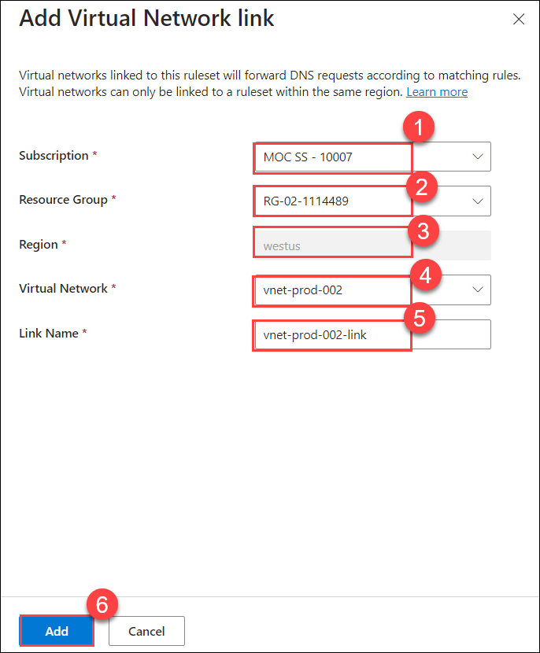

## Task 3: Configure on-premises DNS forwarding to Azure DNS private resolver 


1. On your **LabVM-<inject key="DeploymentID" enableCopy="false"/>** Search for **DNS Manager (1)** and open a **DNS Manager (2)**.


   


1. Expand **LabVM-<inject key="DeploymentID" enableCopy="false"/> (1)** and Right click on the **Forward Lookup Zones (2)** and select **New Zones (3)**.  

   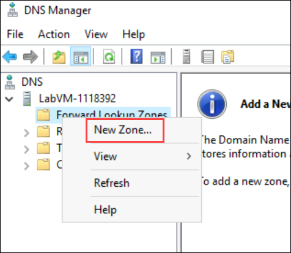


1. On the **Welcome to the New Zone Wizard** page, Click on **Next >**.

   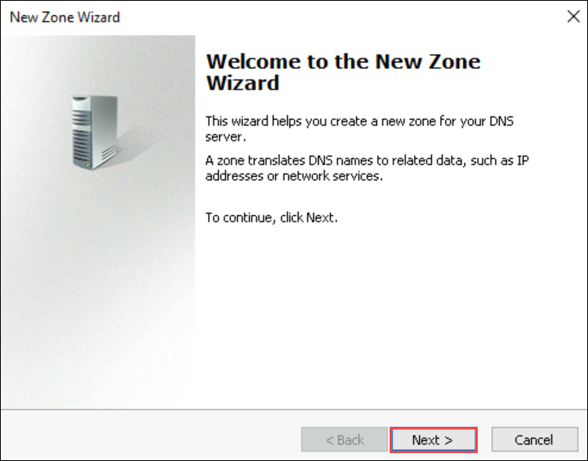

1. On the **Zone Type** page Click on **Next >**.

   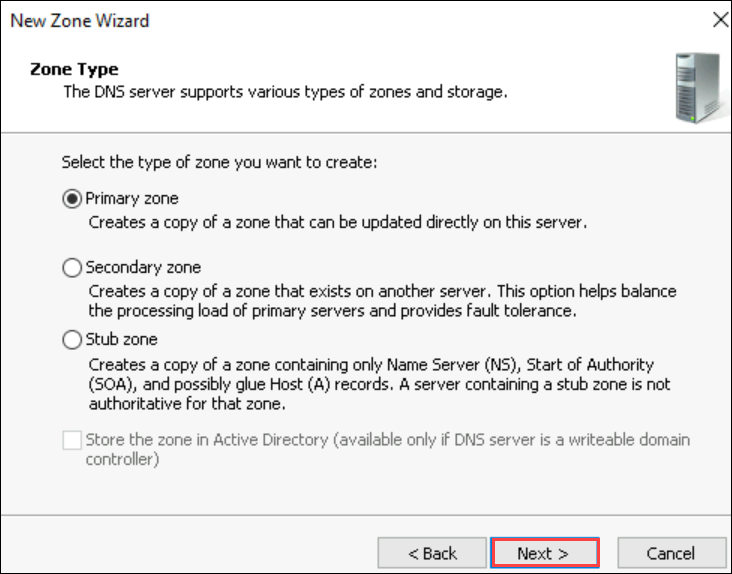

1. On the **Zone name** page, Enter **omprem.local** in the **zone name (1)** text-box then click on **Next > (2)**.

   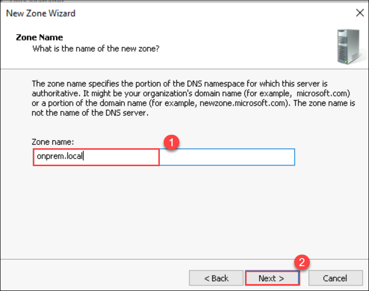

1. On the **Zone File** page, Click on **Next >**.
   
   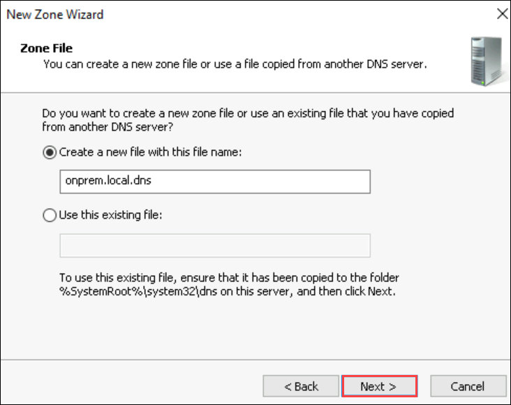

1. On the **Dynamic update** page, Click on **Next >**.

   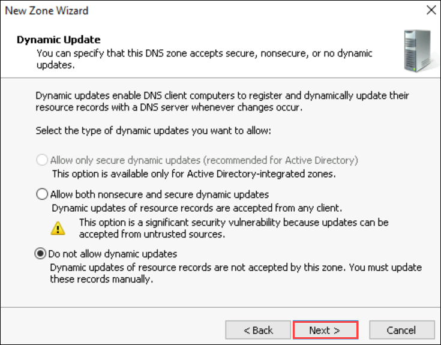

1. On the **Completing the new zone wizard** page, review and Click on **Finish**.

   
   

1. Right click on the **Forward Lookup Zones (2)** and select **New Zones (3)**.  

   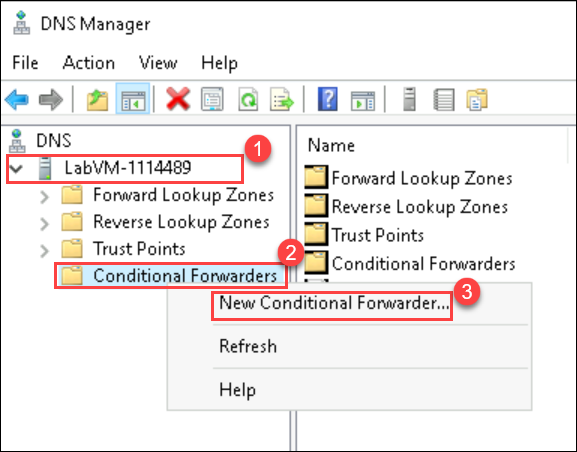 

1. On the **New Conditional Forwarder** pop-up,follow the below instructions:

- **DNS Domain (1)** : Enter **blob.core.windows.net**
- **IP addresses (2)** : Enter the IP address of the **DNS private resolver inbound endpoint** previously recorded under the IP address
- Click on **OK (3)** 

   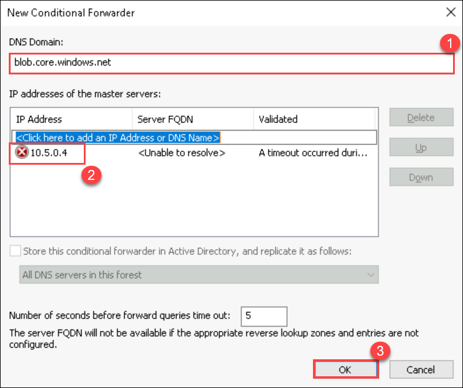 

## Task 4: Validate Name Resolution to on-premises resources using Private DNS resolver outbound endpoint. 

1. In the search bar of the Azure portal, type **Virtual machines (1)**, then select **Virtual machines (2)** under **Services**.

   

1. From the **Virtual machines** page, select **vm-prod-001**.

   

1. On the **Connect (1)** page under Settings, click on **Select (2)** under **Native RDP** and click on **Download RDP File (3)**. A file will download on the bottom left of your screen.

   

1. **Open** the downloaded RDP file (located on the bottom left of your lab machine) and click **Connect** when prompted. 

   

1. In the **Windows Security** window, sign in using the following Steps:

     - Username : **demouser (1)**
     - Password : **Password.1!! (2)**
     - Click **OK (3)**

       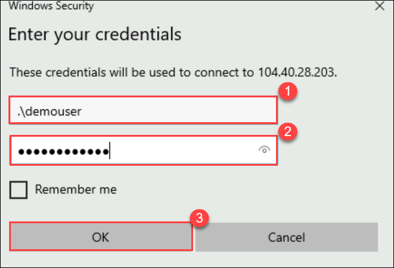

1. From your **vm-prod-001** Search for **command prompt (1)** and open a **command prompt (2)**.

    

1. In the command prompt run the following command: 

   ```
    nslookup DB-VM-<inject key="DeploymentID" enableCopy="false"/>.onprem.local 
   ```  


1. Confirm you can retrieve the private IP address for the DB-VM-<inject key="DeploymentID" enableCopy="false"/>


   

## Task 5. Configure private access to Azure PaaS Services

1. In the search bar of the Azure portal, type **Storage accounts (1)**, then select **Storage accounts (2)** under **Services**.

   

1. From the **Storage accounts** page, select **stacc<inject key="DeploymentID" enableCopy="false"/>**.
  
    

1. From the left menu select **Networking (1)**, then select the tab **Private endpoint connections (2)** and Click on **+Private endpoint (3)**. 

    

1. On **Basics** tab of Create a Private endpoint, follow the below instructions:

    - **Subscription (1)** :  Leave it as **default**.
    - **Resource group (2)** : Select **RG-02-<inject key="DeploymentID" enableCopy="false"/>** from the drop-down.
    - **Name (3)** : Enter **pep-storage-blob**
    - **network interface (4)**: The network interface name will automatically populate.
    - **Region (5)** : Leave it as **default**.
    - Click on **Next : Resource > (6)**

      

1. Select **blob (1)** as Target sub-resource. Click **Next: Virtual Network (2)**.

    

1. On **Resource** tab of Create a Private endpoint, follow the below instructions:

   - **Virtual network (1)** : Select **DNSresolvevnet (RG-03-<inject key="DeploymentID" enableCopy="false"/>)** from the drop-sown.

   - **Subnet (2)**: Leave it as **default**.
   
   - Click **Edit (3)** under the Network Policy for private endpoints.  

  
    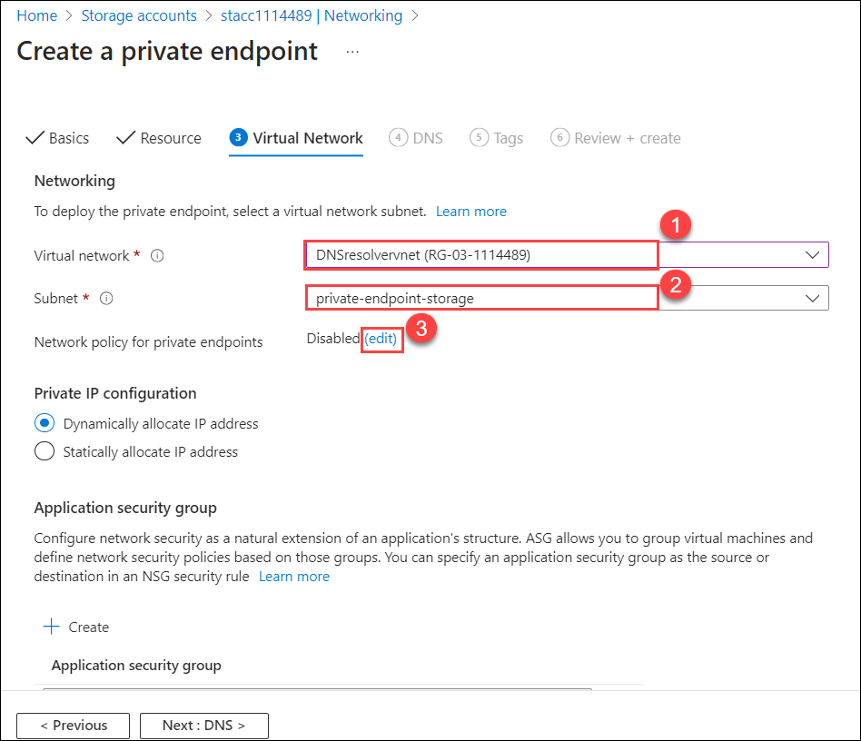


 1. On the **Edit subnet network policy** pop-up, Select both **Network security groups and Route tables (1)** and click **Save (2)**. (this will be used in a later exercise)


    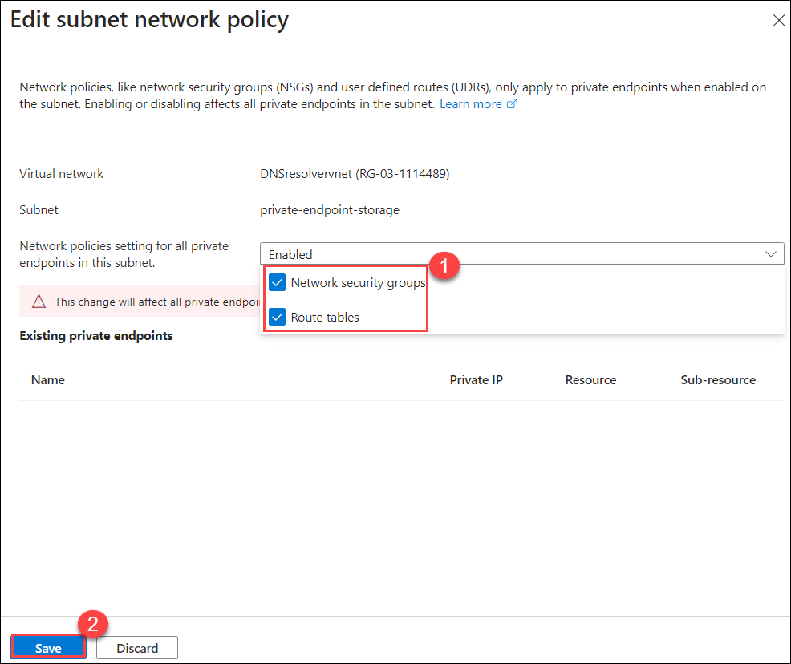

1. Under the **Application security** group. Click the **+ Create**.

   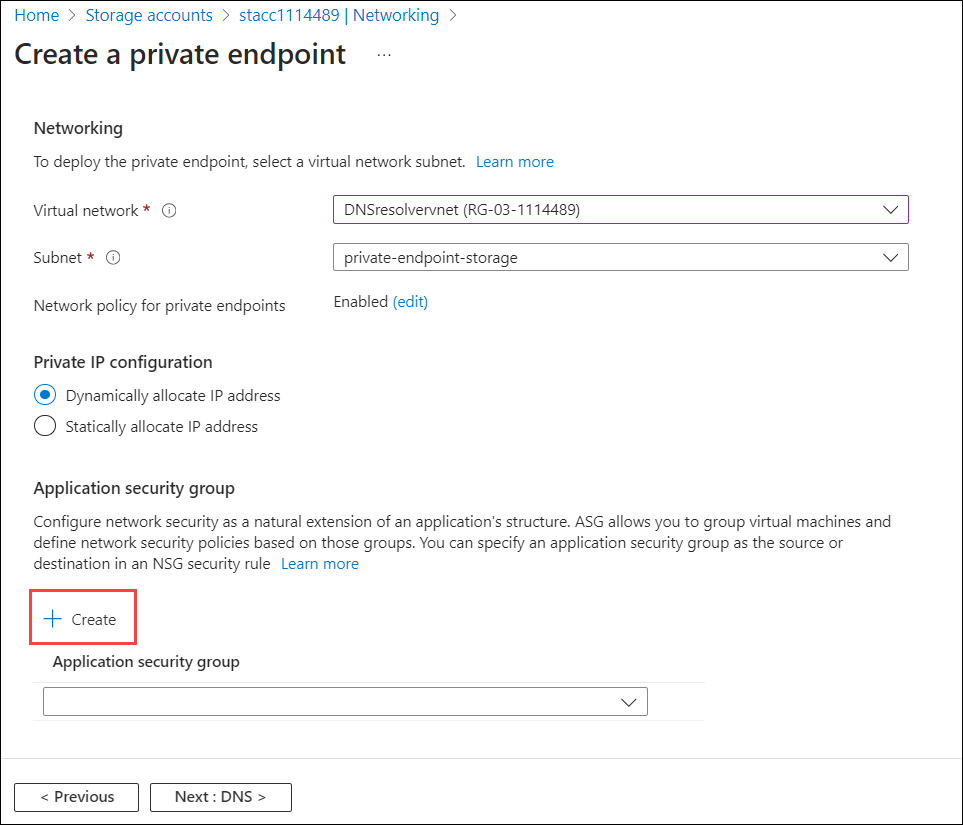

1. Enter Name as **asg-blob-private-endpoint (1)** and click **OK (2)**. and then  

   

1. On **Resource** tab of Create a Private endpoint, Click on **Next: DNS >**


    


1. On the **DNS** Tab, follow the below instructions:


    - **Integrate with private DNS zone (1)** : Select **Yes**, 
    - **Subscription (2)** :  Leave it as **default**.
    - **Resource group (3)** : Select **RG-02-<inject key="DeploymentID" enableCopy="false"/>** from the drop-down. 
    -**Private DNS zone (4)** :  Leave it as **default**.
    - Click on **Next : Tags > (5)**


    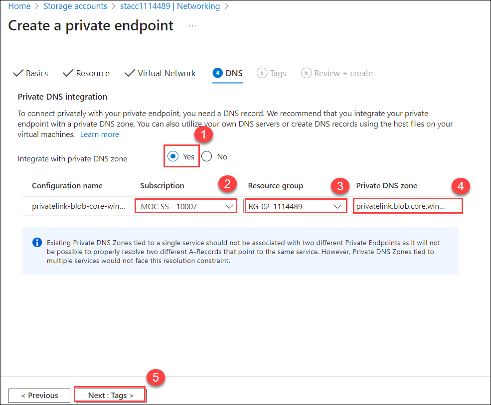


1. On the **Tags** Tab, click on **Next: Review+ create >**

   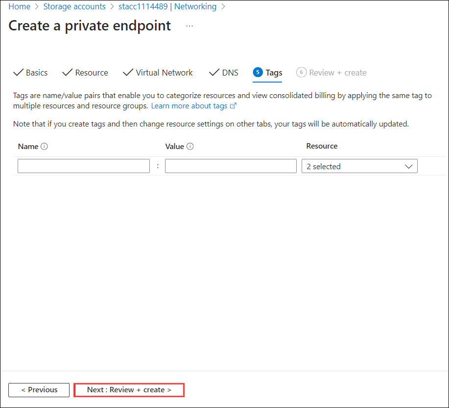


1. After validation passed and reviewing click **Create** and wait for the deployment to complete. 

   

1. Wait for the deployment to complete. Then click on the **Go to resource**.  

    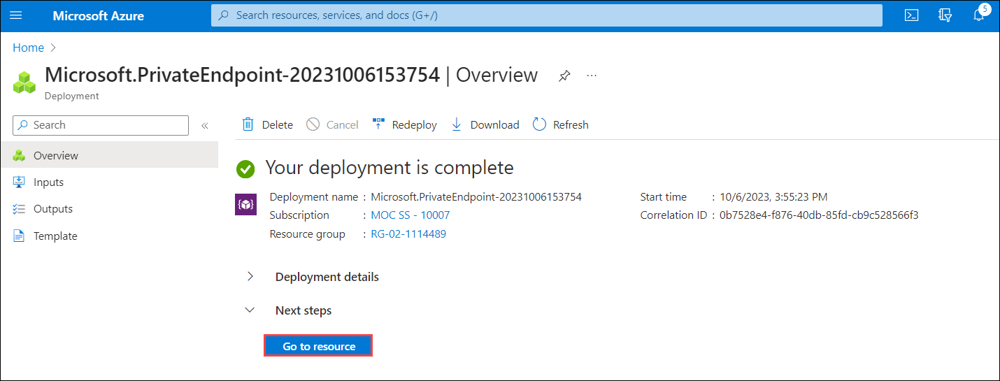


1. On the left menu, click **DNS configuration**. Record the **IP address and FQDN** on notepad, you will use this info on later steps. Then click on the hyperlink **privatelink.blob.core.windows.net**


     

1. Under the **Overview**, review the **A** record and **IP address** which should match with the previous **DNS configuration**. On the left side menu, click on the **Virtual network links (2)** option.  


    

1. This shows the virtual network link created for the **privatelink.blob.core.windows.net** to the **DNSresolvervnet** vNet. In this way the **DNSresolvervnet** vNet and DNS private resolver will be able to have DNS resolution to the created private endpoint.  

     


## Task 6: Confirm on-premises client resolution to Azure PaaS Services 

1. In the search bar of the Azure portal, type **Virtual machines (1)**, then select **Virtual machines (2)** from results.

   

1. From the **Virtual machines** page, select **DB-VM-<inject key="DeploymentID" enableCopy="false"/>**.
  
    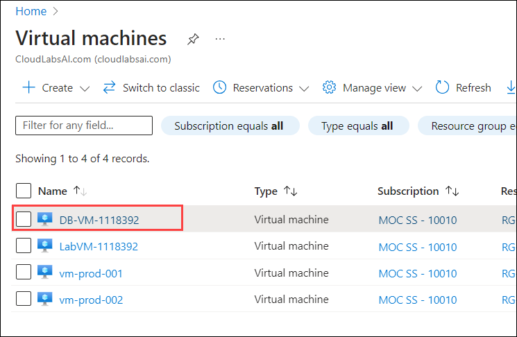
 
1. On the **Connect** page, click on **Select (1)** under **Native RDP** and click on **Download RDP File (2)**. A file will download on the bottom left of your screen.

   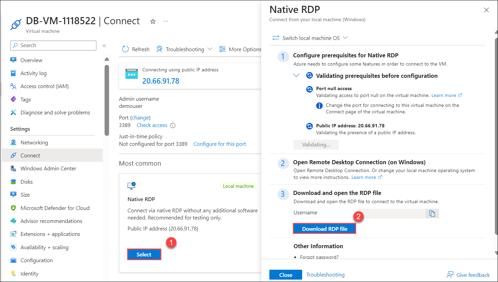

1. **Open** the downloaded RDP file (located on the bottom left of your lab machine) and click **Connect** when prompted. 

    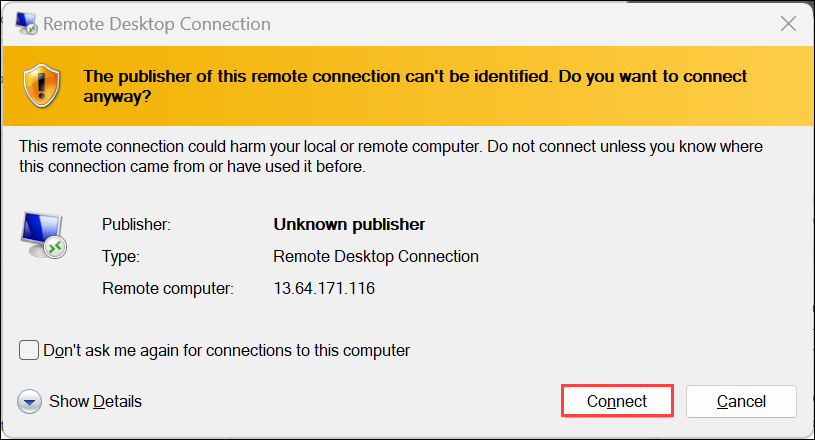

1. In the **Windows Security** window, sign in using the following instructions:

     - **Username** : **demouser (1)**
     - **Password** : **<inject key="LabVMAdminPassword" enableCopy="false"/> (2)**
     - Click **OK (3)**. 

    

1. You may receive a warning certificate during the sign-in process. Click **Yes** or to create the connection and connect to your deployed VM. You should connect successfully.

    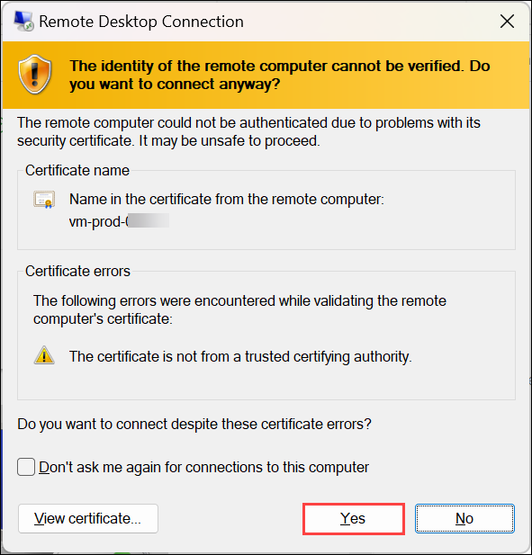


1. From your **DB-VM-<inject key="DeploymentID" enableCopy="false"/>** Search for **command prompt (1)** and open a **command prompt (2)**.

    

1. In the command prompt run the following command:   

   ```
   nslookup stacc<inject key="DeploymentID" enableCopy="false"/>.blob.core.windows.net
   ```

   
 
   >**Note**: Notice the IP address retrieved is still the public address for the storage account. 

1. From your **DB-VM-<inject key="DeploymentID" enableCopy="false"/>** Search for **Powershell (1)** and open a **Windows Powershell (2)**.

    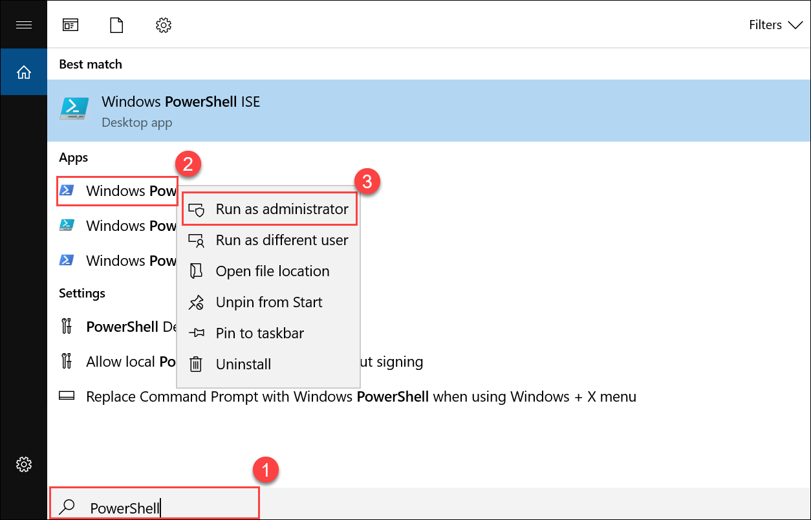

1.  From the **Administrator: Windows PowerShell ISE** console, run the following command to retrieve the DNS Server configured on the VM: 

      ```
      Get-DnsClientServerAddress 
      ```

      >**Note:** Notice the VM is not using the Lab-VM as DNS server for resolution yet.  

1.  From the previous output, note the **Interface Index** for the **ServerAddress** and also grab the Lab-VM IP address recorded in previous step. 


     

1. Now type the command below to set the DNS server configuration to the Lab-VM.  

      ```
      Set-DnsClientServerAddress -InterfaceIndex 6 -ServerAddresses "168.63.129.16" 
      ```

      

1. Go back to the **command prompt** run the following command:   

      ```
      nslookup stacc<inject key="DeploymentID" enableCopy="false"/>.blob.core.windows.net
      ```

1. Notice the IP address retrieved is the private IP address for the storage account private endpoint. 

   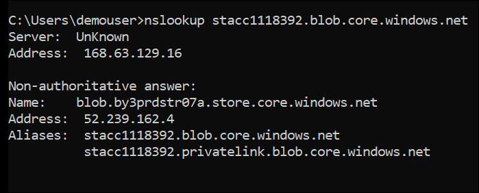


1. Go back to the **Powershell** run the following command below to probe access to the storage account private endpoint. 

   ```
   Test-NetConnection -ComputerName stacc1118392.blob.core.windows.net -Port 443 

   ```

1. Notice the **TcpTestSucceded** shows **True**. 

   

 

 

 

