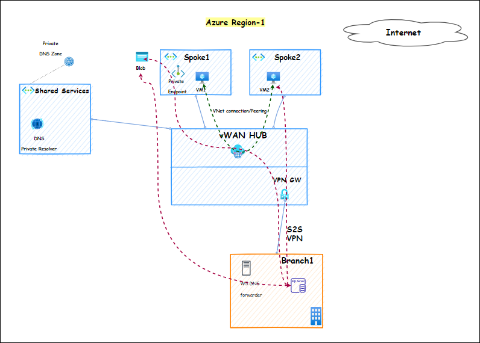

## Scalable Cloud Networking with Azure Virtual WAN

Azure Networking Solutions provides a fundamental understanding of key networking concepts within the Microsoft Azure cloud platform. This overview serves as a primer for individuals and organizations looking to leverage Azure's networking capabilities to build secure, scalable, and highly available cloud environments.

### Key features of Azure Networking Solutions

  - **Virtual Network:** An Azure Virtual Network (VNet) is a network or environment that can be used to run VMs and applications in the cloud. When it is created, the services and Virtual Machines within the Azure network interact securely with each other, the internet, and on-premises networks.
  - **Virtual Network Gateway:** It is a service used to send encrypted traffic between an Azure virtual network and on-premises locations over the public Internet.
  - **Virtual WAN:** It is a service that brings many networking, security, and routing functionalities together to provide a single operational interface.
  - **DNS Private Resolver:** It is a service that bridges an on-premises DNS with Azure DNS.
  - **Private DNS Zone:** It provides a reliable, secure DNS service to manage and resolve domain names in a virtual network without the need to add a custom DNS solution.
  - **DNS Forwarding Ruleset:** It is a setup with rules pointing to the on-prem dns zone and linked to hub vnet and using the private dns resolver outbound endpoint.

## Hands-on Labs Scenario

Contoso Insurance is a well-known brand in the industry. They are planning to launch a new Contoso Insurance portal in the market to start providing their insurance services online. Their development team has already developed the portal. They are all set to launch their new Contoso Insurance portal. Before they launch it, they want to get it tested by internal and beta users. To start testing the application they have chosen Azure as their cloud platform as Azure offers a massive range of IaaS facilities required for any business like computing, networking, storage, security, and much more.

Contoso wants to migrate its on-premises infrastructure to the Azure cloud to modernize its operations, improve scalability, and enhance security. Contoso needs to provision a comprehensive Azure Network Topology, including both the Platform and Application Landing Zone, to support its diverse workloads and applications as part of this digital transformation initiative. The company also needs to establish hybrid connectivity between its on-premises data center and the Microsoft Azure cloud to enable seamless data exchange, application deployment, and disaster recovery.

They need your help to configure the infrastructure and deploy their developed application. You need to choose the right approach to set up and deploy their Insurance application on Azure as per the end-state Architecture given below. However, you will be doing it in phases as the development and testing progress. In the end, the Infrastructure of the required Azure resources for the Contoso Insurance Application must look the same as the below end-state Architecture.

## Azure services and related products

  - Virtual Network
  - Virtual Machines
  - Virtual Network Gateway
  - DNS Private Resolver
  - Private DNS Zone
  - DNS Forwarding Ruleset

## Solution Architecture

## Lab Context

In this Hands-on Lab, you will learn about Azure networking fundamentals. You will get Hands-on experience with Azure resources and how to use networking resources and establish connections from Cloud to On-premise resources.

### Exercise 1: Getting Started with Azure 

In this exercise, you will log in to the Azure Portal and review the pre-deployed resources that are part of the lab environment. 

### Exercise 2: Provision your Azure Network Topology (Platform and Application Landing Zone)

In this exercise, you'll familiarize yourself with Virtual WAN, virtual Hub, and Virtual Network connections for your workloads

###  Exercise 3: Provision Hybrid Connectivity 

In this exercise, you will provision connectivity from on-premises to Azure via Site-to-Site VPN (S2S VPN), with static routing, and verify connectivity between on-premises and Azure. This lab will emulate an on-premises site using another separate VNet in Azure with a Virtual Network Gateway as the VPN device.  

### Exercise 4: Validate access to your application on Azure 

In this exercise, you will review the pre-deployed Virtual Machine on each spoke VNet, create network security group rules to allow required traffic and you will then test connectivity across your network. 

### Exercise 5: Configure private access to PaaS resources 

In this exercise, you will configure private access to PaaS Resources using the hybrid connectivity previously deployed and configure DNS resolution to properly access PaaS resources.
