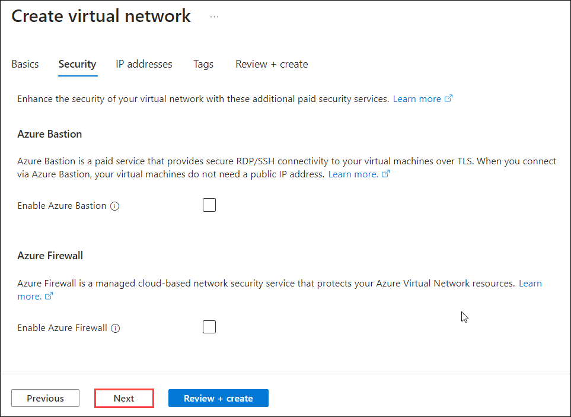
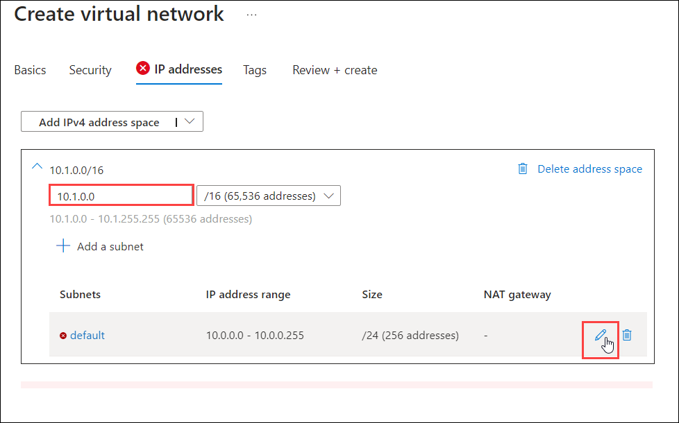
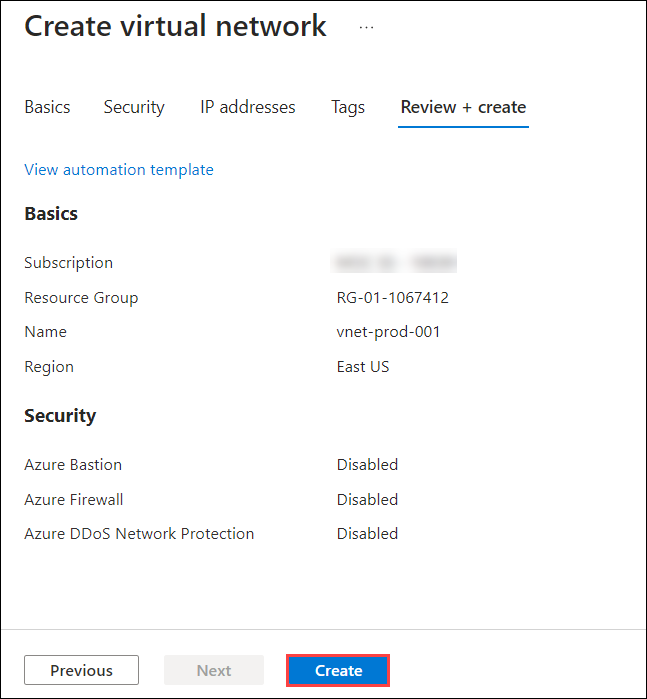

## Task 1: Provision Virtual Network 

In this task, you will create a virtual network.

1.  In the Azure Portal, from the upper left corner select **menu (1)** icon with three lines as highlighted below and then select **+ Create a resource (2)**.

      
     
1.  In the search box, type **Virtual Network (1)** and select **(2)** to open it.

     
     
1.  Within the Marketplace page, from the Virtual Network card, click on **Create (1)** and select **Virtual Network (2)**.

     

1. On the **Basics** tab of **Create virtual network**, enter the following information:

    -  **Subscription (1):** Select your Subscription
  
    -  **Resource group (2):** Select **RG-01-<inject key="DeploymentID" enableCopy="false"/>** resource group from the drop down list

    -  **Name (3):**  Enter **vnet-prod-001**

    -  **Location (4):** Select **East US**

    - Click on **Next(5)**
  
   

1. Leave everything as **default** under **Security** tab and click on **Next**.

    

1. On the **IP address** tab enter the following information:

    - **IPv4 address space** : Replace the existing IP address with **10.1.0.0/16 (1)**
    - **Subnets** : Click on edit symbol **(2)** next to default Subnet.
  
   

1.  On the **Edit Subnet** page, follow the below-mentioned instructions:

   - **Starting address** : Enter **10.1.0.0 (1)**
   - Click on **Save (2)**

   

1. Click on **Review + create**

   

1. Review the configuration and click on **Create**.

   
