## Task 1: Create and deploy virtual machine 
 
In this task, you will create a virtual machine in the Azure portal.

1. In the Search bar of the Azure portal, type Virtual machines (1), then select **Virtual machines (2)**.

   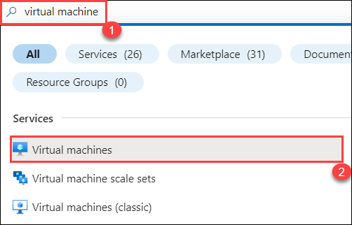

1. Click **+Create (1)** and choose **+Azure Virtual machine (2)** from the drop down.

   

1. On the **Basics** tab, fill in the following information (leave the defaults for everything else):

    | Settings | Values |
    |  -- | -- |
    | Subscription | **Use default supplied (1)** |
    | Resource group | **RG-01-<inject key="DeploymentID" enableCopy="false"/> (2)**|
    | Virtual machine name | **vm-prod-003 (3)** |
    | Region | **(US) West US (4)**|
    | Availability options | No infrastructure redundancy options required (5)|
    | Image | **Windows Server 2019 Datacenter - Gen2 (6)**|

      

    | Settings | Values |
    |  -- | -- |
    | Size | **Standard D2s v3 (1)**|
    | Username | **azureuser (2)** |
    | Password (type in carefully!) | **Pa$$w0rd1234 (3)**|

    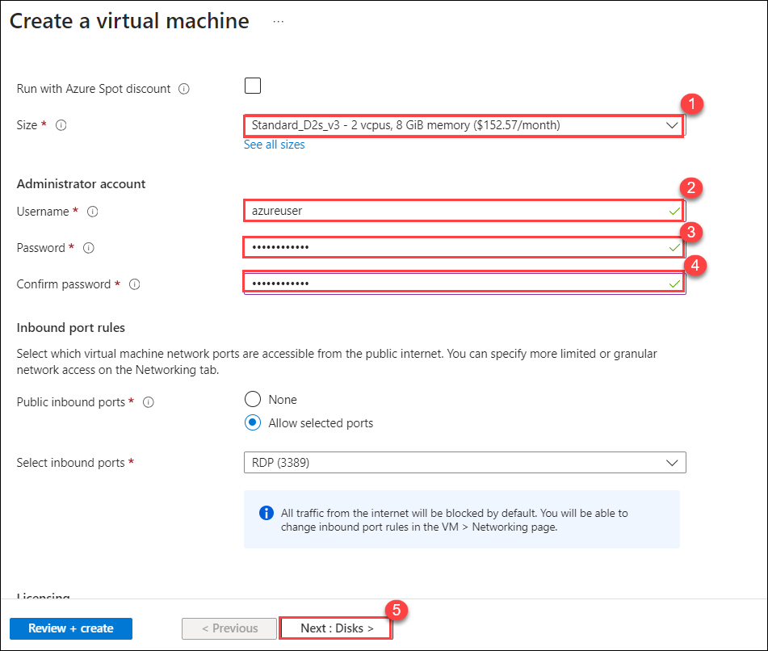
       
1. Switch to the Networking (1) tab, and in its **virtual network** section, select **create new (2)**,  fill in the following information: and click **OK (4)** :

    | Settings | Values |
    | -- | -- |
    | Name | **vm-prod-003-vnet (3)**|

    

1. Leave the remaining values on the defaults and then click the **Review + create** button at the bottom of the page.

1. Once Validation is passed click the **Create** button. It can take anywhere from five to seven minutes to deploy the virtual machine.

1. You will receive updates on the deployment page and via the **Notifications** area (the bell icon in the top menu bar).

1. Click on bell icon from the upper blue toolbar and select 'Go to resource' when your deployment has succeeded. 

    **Note**: You could also use the **Go to resource** link on the deployment page 

1. On the virtual machine **Overview** blade, click **Connect** button and choose **RDP** from the drop down.

    

    **Note**: The following directions tell you how to connect to your VM from a Windows computer. On a Mac, you need an RDP client such as this Remote Desktop Client from the Mac App Store and on a Linux computer you can use an open-source RDP client.

1. On the **Connect (1)** page, click Select under **Native RDP (2)** and click **Download RDP File (3)**. A file will download on the bottom left of your screen.

   

1. **Open** the downloaded RDP file (located on the bottom left of your lab machine) and click **Connect** when prompted. 

    

1. In the **Windows Security** window, sign in using the Admin Credentials you used when creating your VM **azureuser (1)** and the password **Pa$$w0rd1234 (2)** then click **OK (3)**. 

    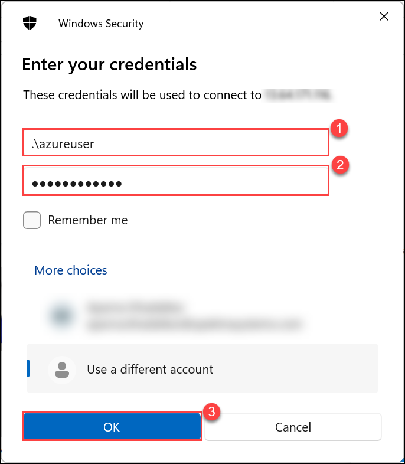

1. You may receive a warning certificate during the sign-in process. Click **Yes** or to create the connection and connect to your deployed VM. You should connect successfully.

    

## Task 2: Test the RDP connection 

In this task, you will connect to the virtual machine and install a routing role.

1. Once have the Server Manager dashboard in place, click on **Add roles and features**.

     

1. On the **Before You Begin (1)** page, Leave everything as **default** and click on **Next (2)**.

      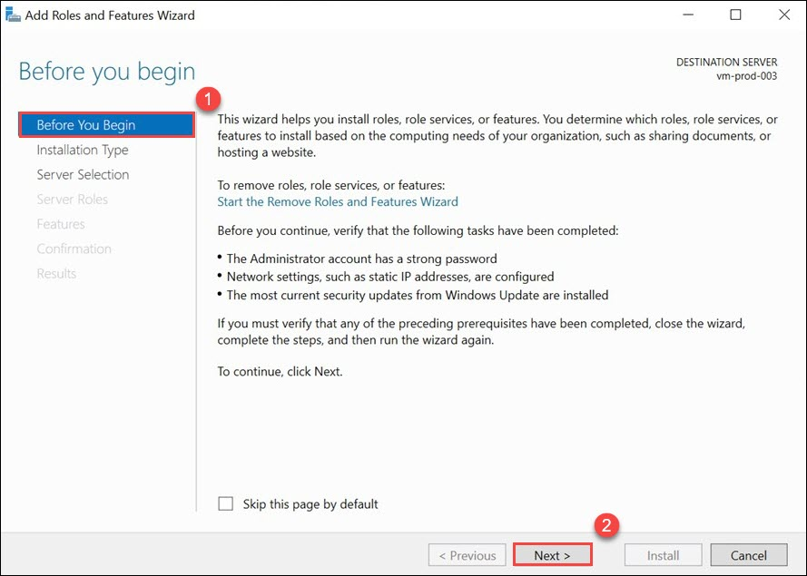

1. On the **Installation Type** and **Server Selection** page, leave everything as **default** and click on **Next**.

1. On the **Server Roles (1)** page, choose the option **Remote Access (2)** and click on **Next (3)**.

     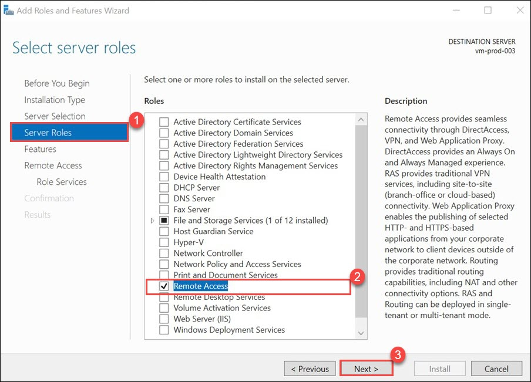

     >**Note**: If appears **Add Roles and Features Wizard** page, click on **Add Features**.

     

1. On the **Features**, **Remote Access** page, Leave everything as **default** and click on **Next**.

1. On t.he **Role Services (1)** page, In terms of the role services, choose **DirectAccess and VPN (2)** and **Routing (2)** and click on **Next (3)**

      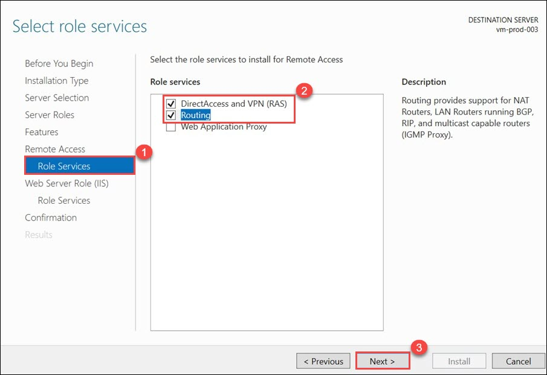

1. On the **Web Server Roles**, **Role Services** page, leave everything as **default** and click on **Next**.     

1. On the **Confirmation (1)** page click on **Install (2)**. 

      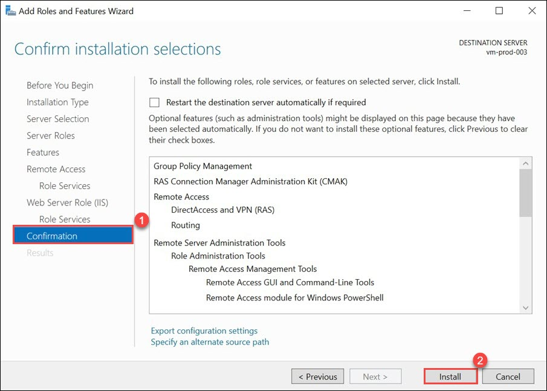

   >**Note**: Wait until the feature gets installed.

### Create a local gateway.
     
1. In the search box, type **Local Network gateway (1)** and select **Local Network gateway (2)** to open it.

     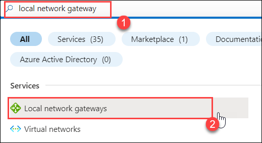
    
1. On the **Local network gateway** page, click on **Create**. 

    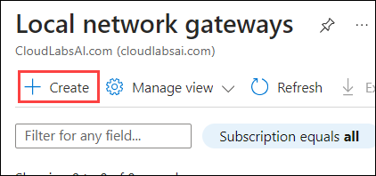

1. On the **Basic** page, fill in the following information (leave the defaults for everything else):

    | Settings | Values |
    |  -- | -- |
    | Subscription | **Use default supplied (1)** |
    | Resource group | **RG-01-<inject key="DeploymentID" enableCopy="false"/> (2)**|
    | Region | **(US) West US**|
    | Name | **lng-prod-001 (3)** |
    | IP address | Public IP of vm-prod-003 **(4)** |
    | Address space | **10.4.0.0/16 (5)**|

    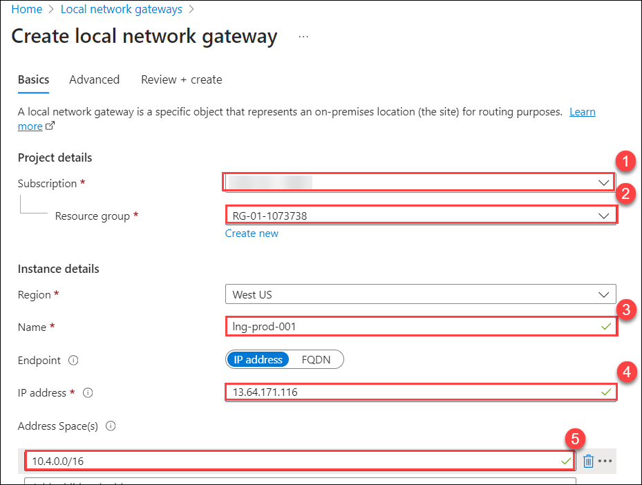

1. Leave the remaining values on the defaults and then click the **Review + create** button at the bottom of the page.

1. Once Validation is passed click the **Create** button. It can take anywhere from five to seven minutes to deploy the virtual machine.
  
   
   
1. Go back in the **vm-prod-003** virtual machine, click on **Notification (1)**, then click on **Open the Getting Started Wizard (2)**.

    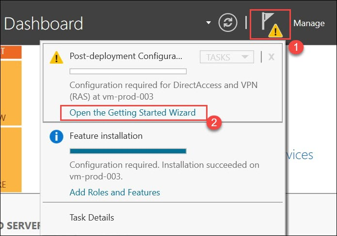

1. On the **Configure Remote Access** page, Select **Deploy VPN only**.

    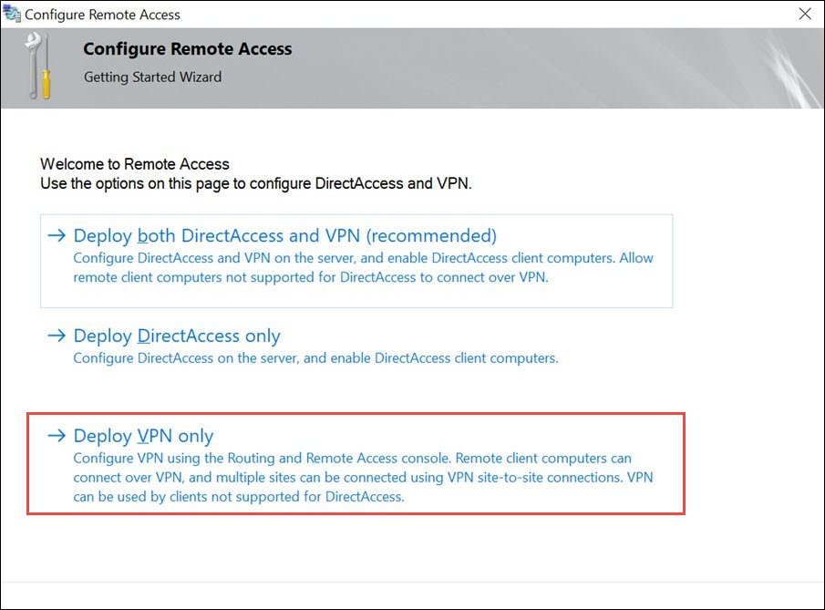

1. Right-Click on the **vm-prod-003(local) (1)** then select **Configure and Enable Routing and Remote Access (2)**

   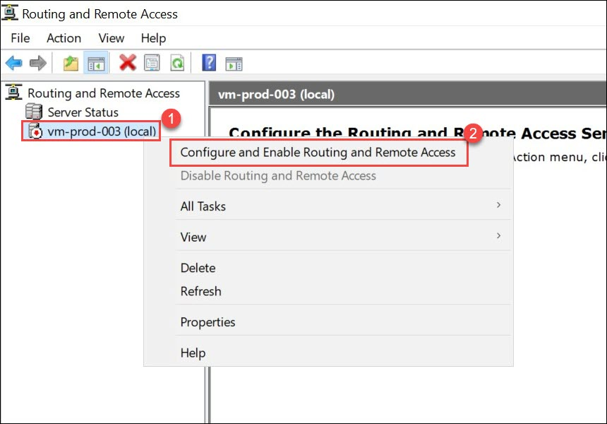

1. On the **Routing and Remote Access Server Setup Wizard**, Click **Next**.

   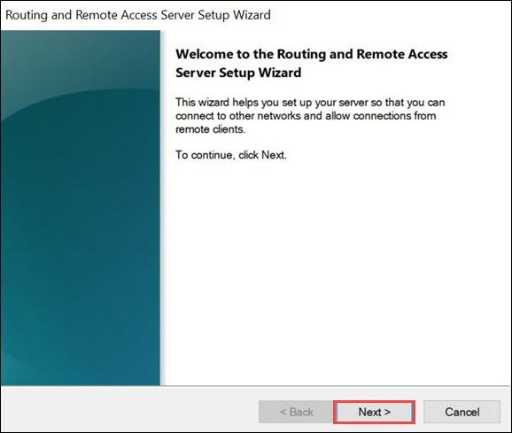

1. On the **Configuration** blade, Select **Custom configuration**.
 
   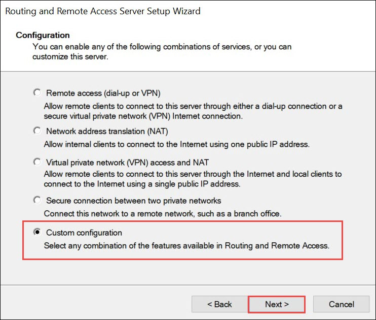

1. On the **Custom Configuration** blade, Select **VPN access** and **LAN routing** then click on **Next**

   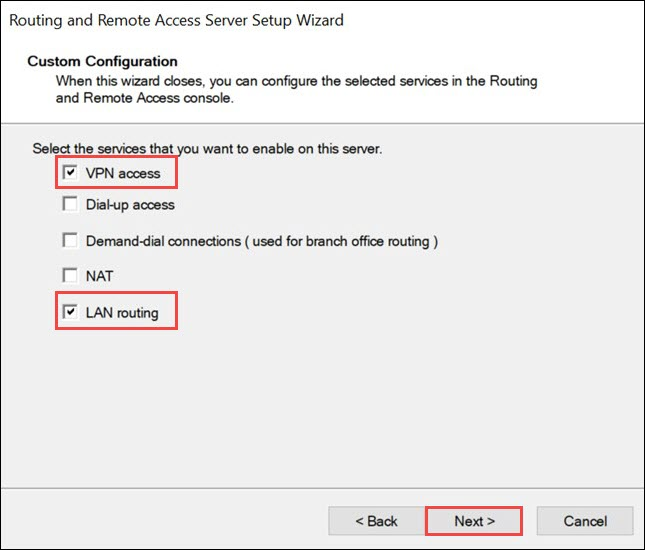

1. On the **Completing the Routing and Remote Access Server Setup Wizard**, Select **Finish**.

   

1. On the **Routing and Remote Access** Pop-up, click on **Start service**.

    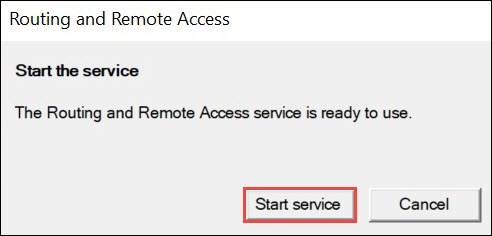

1. We have completely set up when it comes onto routing, on our Windows Server, on vm-prod-003. We also have local network gateway in place.

   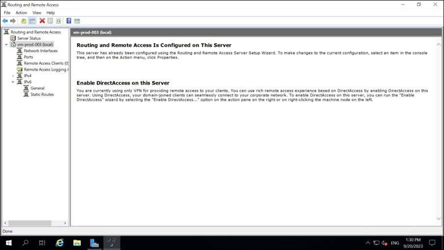
