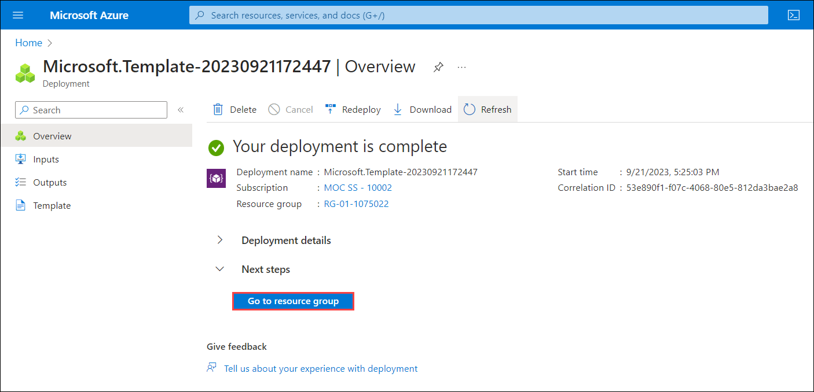
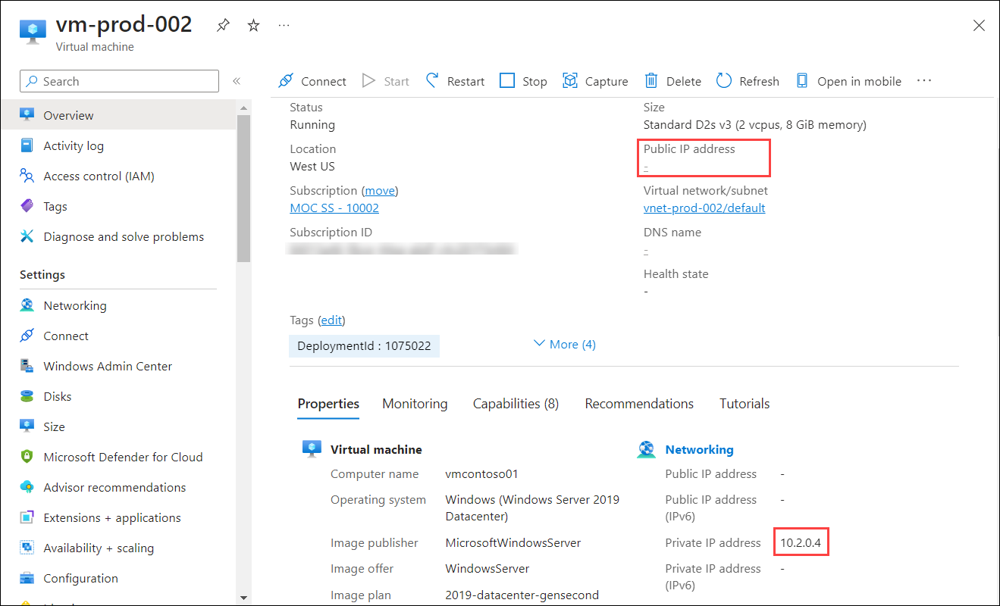

## Task 1: Create and deploy virtual machine 

1. In the search bar of the Azure portal, type **Virtual machines (1)**, then select **Virtual machines (2)** under **Services**.

   

1. On the **Virtual Machine** page, click **+Create (1)** and choose **+Azure Virtual machine (2)** from the drop down.

   

1. On the **Basics** tab, enter the following information to create a 
Virtual Machine:
    
    - **Subscription** : **Leave it as default (1)** 
    - **Resource group** : Select **RG-01-<inject key="DeploymentID" enableCopy="false"/> (2)**
    - **Virtual machine name** :  Enter **vm-prod-001 (3)** 
    - **Region** : **(US) West US (4)** 
    - **Availability options** : Select **No infrastructure redundancy options required (5)**
    -  **Security type** : Select **Trusted launch virtual machines (6)**
    - **Image** : Select **Windows Server 2019 Datacenter - Gen2 (7)**

   

    - **Size** : Select **Standard D2s v3 - 2 vcpus, 8GiB memory (8)**
    - **Username** : Enter **demouser (9)** 
    - **Password** : Enter **Password.1!! (10)**
    - **Confirm Password** : Enter **Password.1!! (11)**
    - **Select inbound port** : Select **HTTP(80), RDP(3389) (12)** from the drop-down.
    - Click on **Next : Disk > (13)**

      

1. On the **Disk** Tab, Leave the remaining values on the defaults and then click on **Next : Networking >** 

    
       
1. On **Networking** tab, Enter the following information: 

    - **Virtual network**: Select **vnet-prod-001 (1)** 
    - **Subnet name**:  Select **default(10.1.0.0/24) (2)**
    -  Click on **Review + create (3)**
      
    

1. Once Validation is succeeded, review the configuration, and click on **Create**.
   
    

   Note: The deployment will take up to 20 minutes to complete.

1. Monitor the deployment status on the **vm-prod-001** deployment overview page. In a minute or so, you should see a confirmation of the successful deployment and then click on **Go to resource**. This action will redirect you to the resource overview page.

   

1. Copy and paste the below **Link** in the new tab of your browser and launch the template deployment.  Log in to the Azure portal using your credentials if you are prompted to do so.

     ```
https://portal.azure.com/#create/Microsoft.Template/uri/https%3A%2F%2Fraw.githubusercontent.com%2FCloudLabsAI-Azure%2FAzure-Networking-Solution-101-201%2Fmain%2Ftemplate%2Fcontoso-iaas-region1.json
    ```

1. On the **Basics** tab, enter the following information to create a 
Virtual Machine:
    
    - **Subscription** : **Leave it as default (1)** 
    - **Resource group** : Select **RG-01-<inject key="DeploymentID" enableCopy="false"/> (2)**
    -  Click on **Review + create (3)**

       

1. Once Validation is succeeded, review the configuration, and click on **Create**.
   
    

1. Monitor the deployment status of **vm-prod-002** on the deployment overview page. In a minute or so, you should see a confirmation of the successful deployment and then click on **Go to resource**. This action will redirect you to the resource overview page.

   

1. You can notice that on the  b page,lade of **vm-prod-002**| Overview, you can notice that **public IP address** is not assigned to the virtual machine.

   **Note:** Copy and make a note of **Private IP address**, you will be needing private IP in the next tasks.

   

1. In the search bar of the Azure portal, type **Virtual network (1)**, then select **Virtual mnetwork (2)** under **Services**.

   

1. On the **Virtual networks** page, select **vnet-prod-003**.

   

   

   

   

   


## Task 2: Test the RDP connection 
