# Exercise 4: Provision your application 

In this exercise, you will deploy a Virtual Machine on each spoke VNet, create network security groups, rules to allow required traffic and you will then test connectivity across your network. ​

## Task 1: Create and deploy a virtual machine 

1. In the search bar of the Azure portal, type **Virtual machines (1)**, then select **Virtual machines (2)** from results.

   

1. On the **Virtual Machine** page, click **+Create (1)** and choose **+Azure Virtual machine (2)** from the drop down.

   

1. On the **Basics** tab, enter the following information to create a 
Virtual Machine:
    
    - **Subscription** : Leave it as **default (1)** 
    - **Resource group** : Select **RG-01-<inject key="DeploymentID" enableCopy="false"/> (2)**
    - **Virtual machine name** :  Enter **vm-prod-001 (3)** 
    - **Region** : **(US) West US (4)** 
    - **Availability options** : Select **No infrastructure redundancy options required (5)**
    -  **Security type** : Select **Trusted launch virtual machines (6)**
    - **Image** : Select **Windows Server 2019 Datacenter - Gen2 (7)**

   

    - **Size** : Select **Standard D2s v3 - 2 vcpus, 8GiB memory (8)**
    - **Username** : Enter **demouser (9)** 
    - **Password** : Enter **Password.1!! (10)**
    - **Confirm Password** : Enter **Password.1!! (11)**
    - **Select inbound port** : Select **HTTP(80), RDP(3389) (12)** from the drop-down.
    - Click on **Next : Disk > (13)**

      

1. On the **Disk** Tab, leave everything as default and then click on **Next : Networking >**.

    
       
1. On the **Networking** tab, Enter the following information: 

    - **Virtual network**: Select **vnet-prod-001 (1)** from the drop-down list.
    - **Subnet name**:  Select **default(10.1.0.0/24) (2)**
    -  Click on **Review + create (3)**
      
    

1. Review the configuration, and click on **Create**.
   
    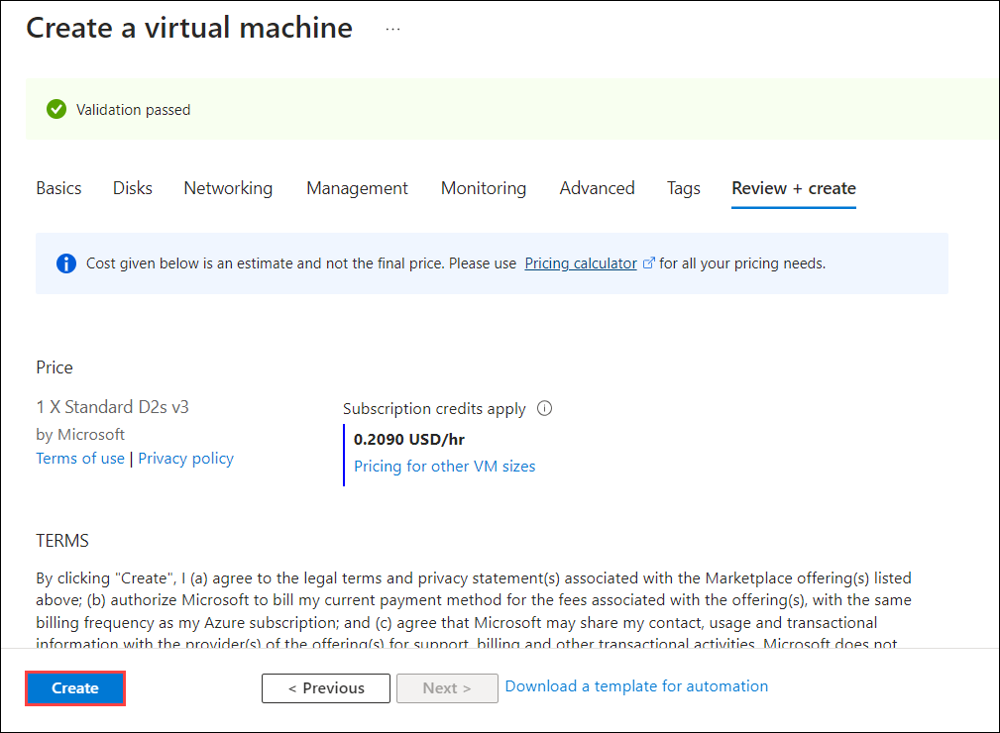

   Note: The deployment will take up to 20 minutes to complete.

1. Monitor the deployment status on the **vm-prod-001** deployment overview page. In a minute or so, you should see a confirmation of the successful deployment and then click on **Go to resource**. This action will redirect you to the resource overview page.

   

1. Copy and paste the below **Link** in the new tab of your browser and launch the template deployment.  Log in to the Azure portal using your credentials if you are prompted to do so.

     ```
     https://portal.azure.com/#create/Microsoft.Template/uri/https%3A%2F%2Fraw.githubusercontent.com%2FCloudLabsAI-Azure%2FAzure-Networking-Solution-101-201%2Fmain%2Ftemplate%2Fcontoso-iaas-region1.json
    ```

1. On the **Basics** tab, enter the following information to create a 
Virtual Machine:
    
    - **Subscription** : Leave it as **default (1)** 
    - **Resource group** : Select **RG-01-<inject key="DeploymentID" enableCopy="false"/> (2)**
    -  Click on **Review + create (3)**

       

1. Once Validation is succeeded, review the configuration, and click on **Create**.
   
    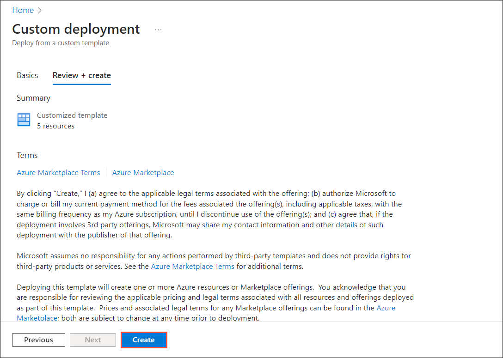

1. Monitor the deployment status of **vm-prod-002** on the deployment overview page. In a minute or so, you should see a confirmation of the successful deployment and then click on **Go to resource**. This action will redirect you to the resource overview page.

   

1. You can notice that on the blade of **vm-prod-002**| Overview, you can notice that **public IP address** is not assigned to the virtual machine.

   **Note:** Copy and make a note of **Private IP address**, you will need a private IP to perform the next tasks.

   

1. In the search bar of the Azure portal, type **Virtual network (1)**, then select **Virtual network (2)** under **Services**.

   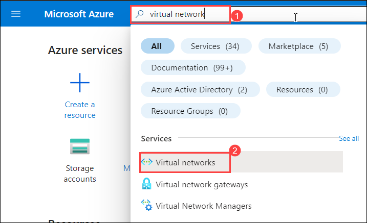

1. On the **Virtual networks** page, select **vnet-prod-003**.

   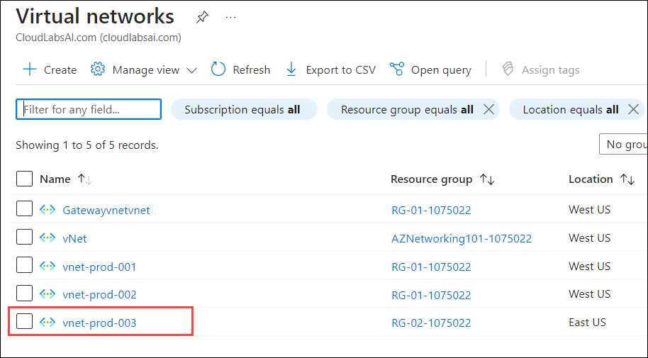

1. On the **vnet-prod-003 | Subnets** blade, Select **Subnet (1)** under settings and fill the following information:

    - Click on **+ Subnet (2)**
    - **Name** : Enter **sqlservernet (3)**
    - Click on **Save (4)**
   
   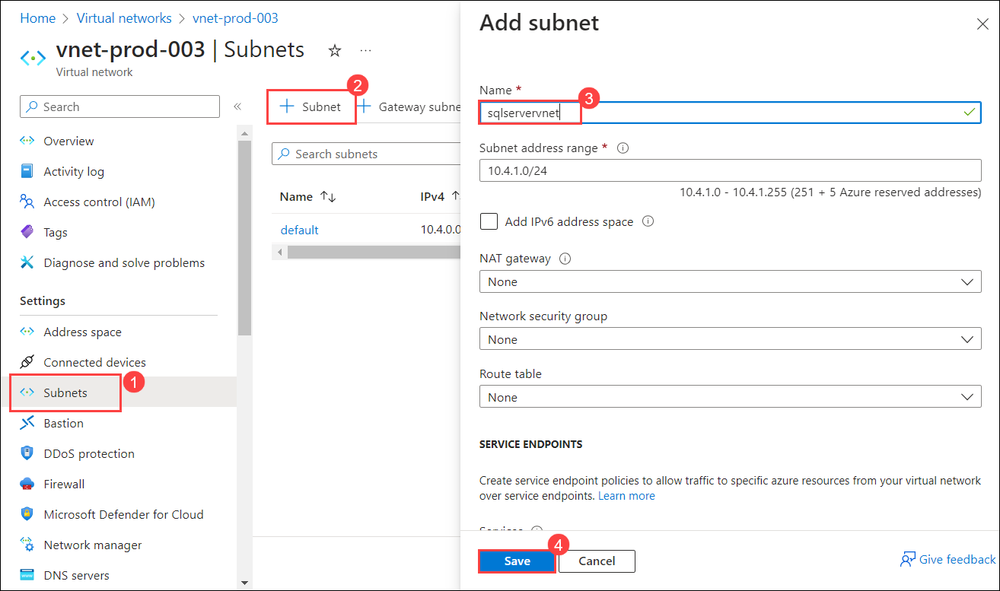

1. In the search bar of the Azure portal, type **Virtual machines (1)**, then select **Virtual machines (2)** under **Services**.

   

1. On the **Virtual Machine** page, click **+Create (1)** and choose **+Azure Virtual machine (2)** from the drop down.

   

1. On the **Basics** tab, enter the following information to create a 
Virtual Machine:
    
    - **Subscription** : **Leave it as default (1)** 
    - **Resource group** : Select **RG-02-<inject key="DeploymentID" enableCopy="false"/> (2)**
    - **Virtual machine name** :  Enter **sqlservervm-<inject key="DeploymentID" enableCopy="false"/> (3)** 
    - **Region** : **(US) East US (4)** 
    - **Availability options** : Select **No infrastructure redundancy options required (5)**
    - **Image** : Select **See all images**
      
    

1. On the **Select an image** page, scroll-down to the **SQL Server 2019 on Windows Server 2019 (1)**, click on **Select(2)**.

    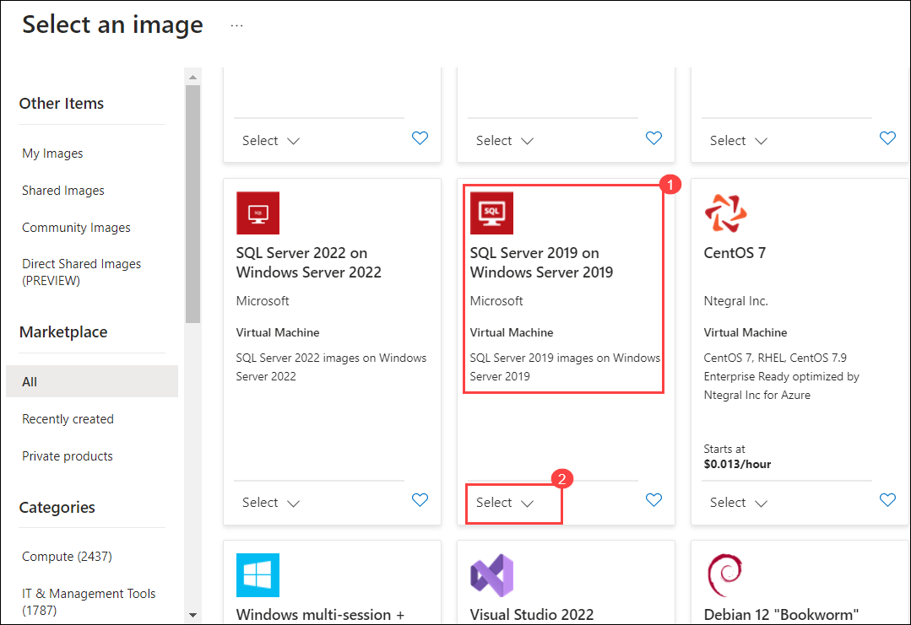

  - From the drop-down select **SQL Server 2019 Standard on Windows Server 2019 - x64 Gen 2**.

    

   - **Image** : Selected **SQL Server 2019 Standard on Windows Server 2019 - x64 Gen 2 (1)**
   -  **Size** : Select **Standard_D2s_v3-2vcpus,8 GiB memory (2)**
   -  **Username** : Enter **demouser (3)**
   -  **Password** : Enter **Password.1!! (4)**
   -  **Confirm Password** : Enter **Password.1!! (5)**
   -  **Select inbound port** : Select **HTTP(80), RDP(3389) (6)** from the drop-down.
   - Click on **Next : Disk > (7)**

     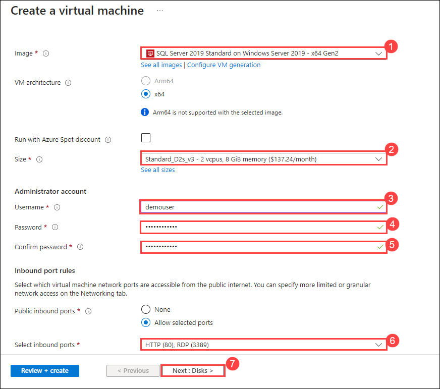

1. On the **Networking** tab, enter the following information:

    - **Virtual network**: Select **vnet-prod-003 (1)** 
    - **Subnet name**:  Select **sqlservervnet(10.4.1.0/24) (2)**
    -  Click on **Review + create (3)**

   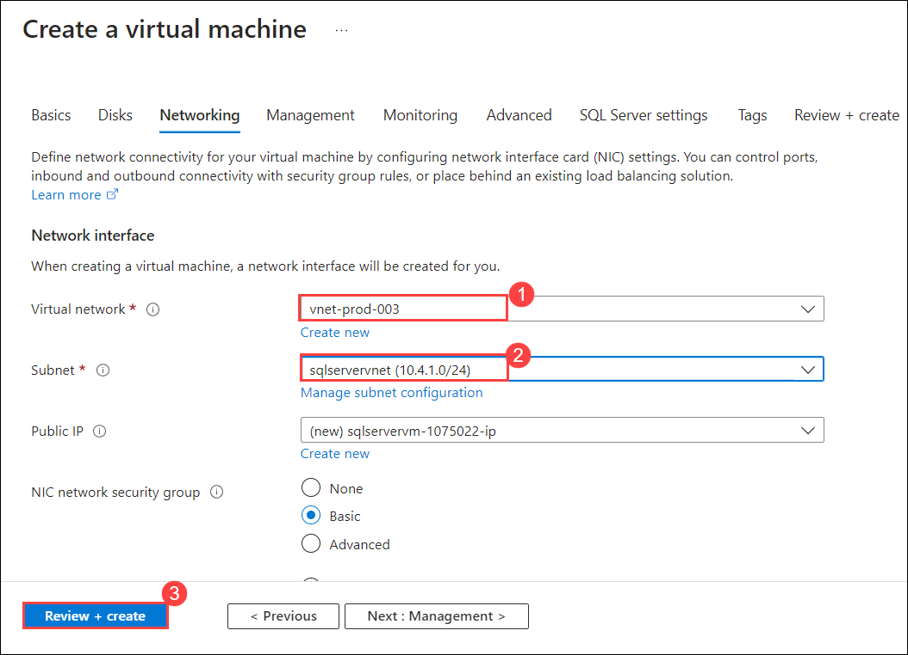

1. Once Validation is succeeded, review the configuration, and click on **Create**.
   
    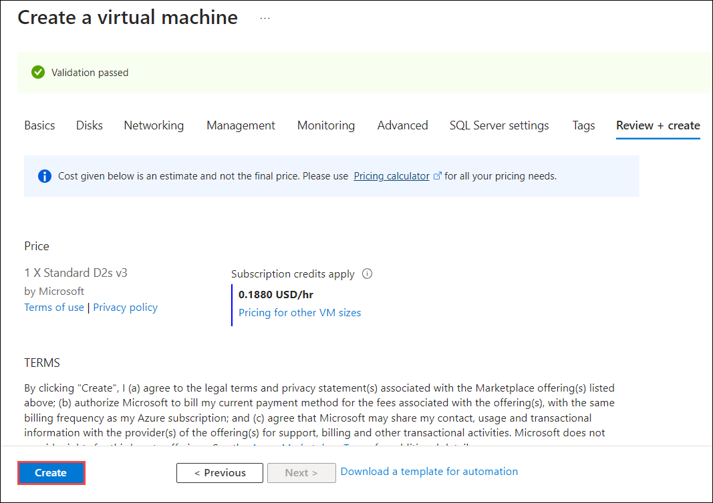

1. Monitor the deployment status of **vm-prod-003** on the deployment overview page. In a minute or so, you should see a confirmation of the successful deployment and then click on **Go to resource**. This action will redirect you to the resource overview page.

   

## Task 2: Test the RDP connection 

1. In the search bar of the Azure portal, type **Virtual machines (1)**, then select **Virtual machines (2)** under **Services**.

   

1. From the **Virtual machines** page, select **vm-prod-001**.

   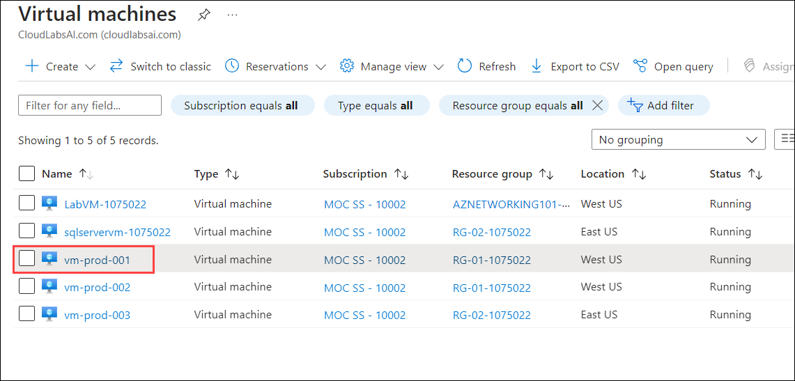

1. On the **Connect (1)** page under Settings, click on **Select (2)** under **Native RDP** and click on **Download RDP File (3)**. A file will download on the bottom left of your screen.

   

1. **Open** the downloaded RDP file (located on the bottom left of your lab machine) and click **Connect** when prompted. 

   

1. In the **Windows Security** window, sign in using the following Steps:

     - Username : **demouser (1)**
     - Password : **Password.1!! (2)**
     - Click **OK (3)**

    

1. You may receive a warning certificate during the sign-in process. Click **Yes** or to create the connection and connect to your deployed VM. You should connect successfully.

    

1. In the vm-prod-001 virtual machine, search for **edge (1)** in the search bar and open **Microsoft Edge (2)**.
   
    

1. Now, paste the Private IP address of **vm-prod-002**, that you have copied in the previous task paste it into a new tab, and hit enter. You'll be directed to the webpage as shown in the screenshot below.

     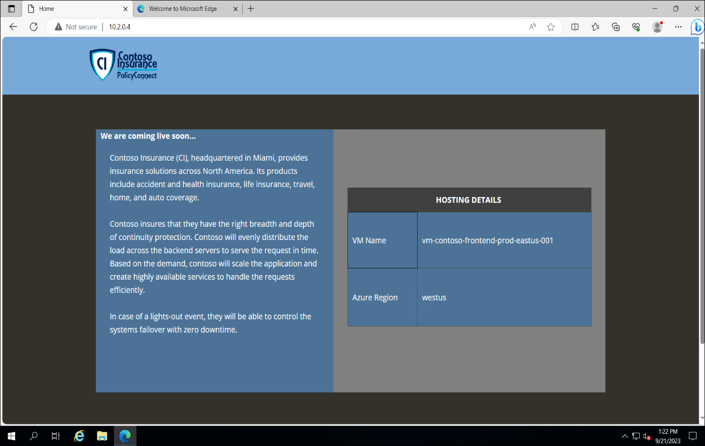
   
1. On the Azure portal, type **Virtual wan (1)**, then click on **Virtual WANs** under **Services**.

          

1. On the **Virtual WANs** page, select **vwan-prod-001**.

    


1. Select **Virtual network Connection(1)** under **Connectivity** blade and click on **+Add Connection(2)**.

      

1. On the **Add Connection** page, enter the following values:

    - **Connection Name :** Enter **vwan-003 (1)**

    - **Hubs:** Select **vwan-hub-prod-001 (2)**

    - **Subscriptions:** **leave it as default (3)**
    
    - **Resource group :** Select **RG-02-<inject key="DeploymentID" enableCopy="false"/> (4)** resource group from the drop down list

    - **Virtual network:** Select **vnet-prod-003 (5)**

      Under **propagate to none**, make sure it's selected to **No** and click on **Create (6)**.

    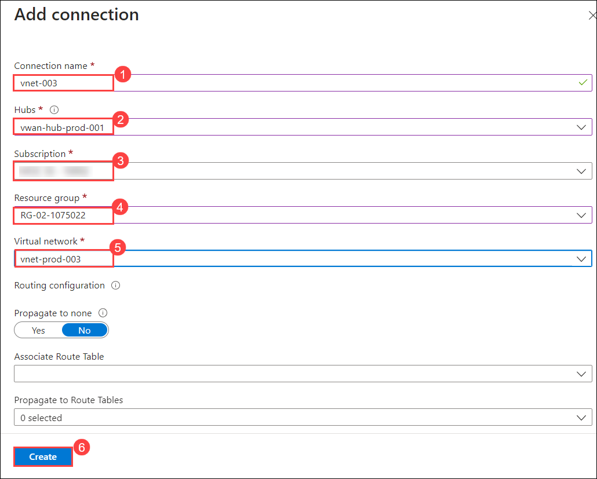


1. In the search bar of the Azure portal, type **Virtual machines (1)**, then select **Virtual machines (2)** under **Services**.

   

1. From the **Virtual machines** page, select **sqlservervm-<inject key="DeploymentID" enableCopy="false"/>**.

   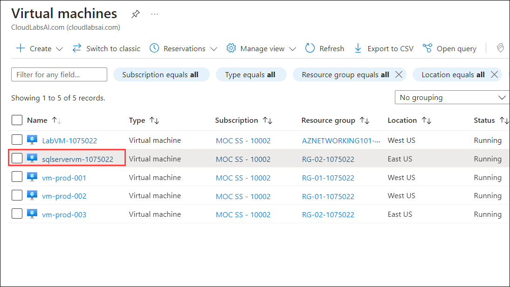

1. On the **Connect (1)** page under Settings, click on **Select (2)** under **Native RDP** and click on **Download RDP File (3)**. A file will download on the bottom left of your screen.

   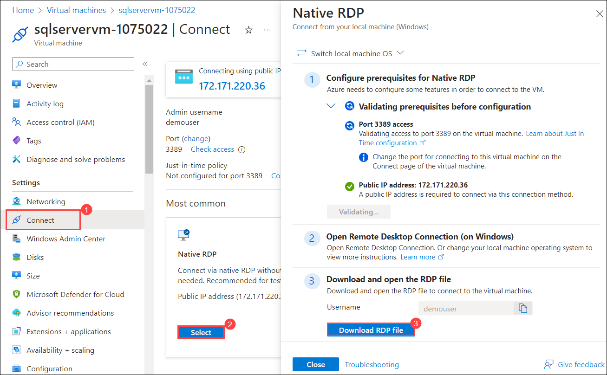

1. **Open** the downloaded RDP file (located on the bottom left of your lab machine) and click **Connect** when prompted. 

   

1. In the **Windows Security** window, sign in using the following Steps:

     - Username : **demouser (1)**
     - Password : **Password.1!! (2)**
     - Click **OK (3)**. 

    

1. You may receive a warning certificate during the sign-in process. Click **Yes** or to create the connection and connect to your deployed VM. You should connect successfully.

    

1. In the vm-prod-001 virtual machine, search for **edge (1)** in the search bar and open **Microsoft Edge (2)**.
   
    

1. Now, paste the Private IP address of **vm-prod-002**, that you have copied in the previous task paste it into a new tab, and hit the enter key on the keyboard. You'll be directed to the webpage as shown in the screenshot below.

     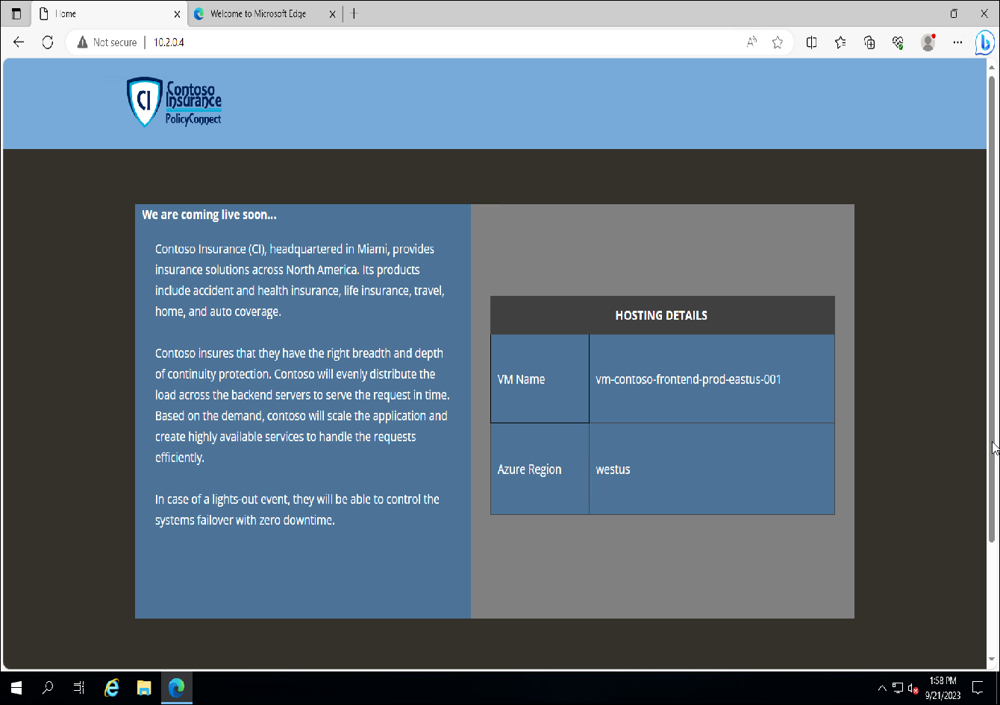
   
