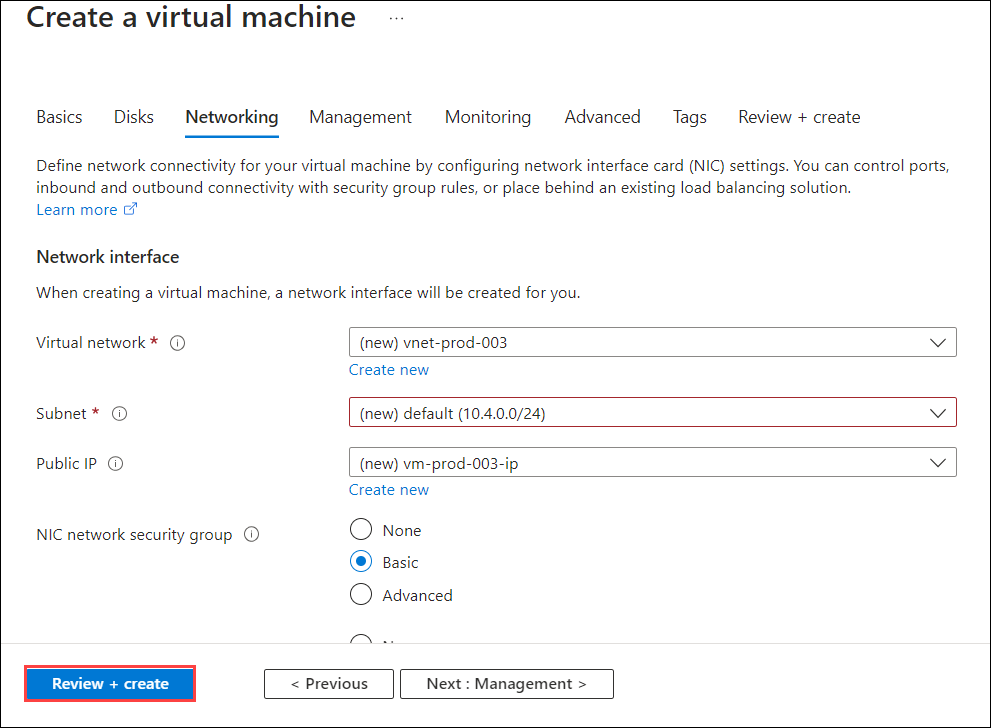
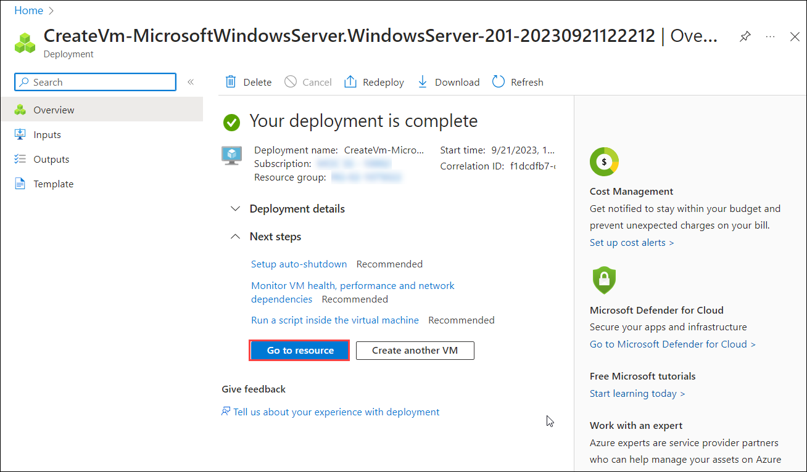

# Exercise 1: Provision user remote access to Azure

In this exercise, you'll 

## Task 1: Explore on the already automated services from 101 

## Task 2: Explore and configure VPN to provide user remote access 

. In the search bar of the Azure portal, type **Virtual machines (1)**, then select **Virtual machines (2)** under **Services**.

   

1. On the **Virtual Machine** page, click **+Create (1)** and choose **+Azure Virtual machine (2)** from the drop down.

   

1. On the **Basics** tab, enter the following information to create a 
Virtual Machine:
    
    - **Subscription** : Leave it as **default (1)** 
    - **Resource group** : Select **RG-02-<inject key="DeploymentID" enableCopy="false"/> (2)**
    - **Virtual machine name** :  Enter **vm-prod-005 (3)** 
    - **Region** : **East US 2 (4)** 
    - **Availability options** : Select **No infrastructure redundancy options required (5)**
    -  **Security type** : Select **Trusted launch virtual machines (6)**
    - **Image** : Select **Windows Server 2019 Datacenter - Gen2 (7)**
    - **Size** : Select **Standard D2s v3 - 2 vcpus, 8GiB memory (8)**

   
 
    - **Username** : Enter **demouser (9)** 
    - **Password** : Enter **Password.1!! (10)**
    - **Confirm Password** : Enter **Password.1!! (11)**
    - **Select inbound port** : Select **HTTP(80), RDP(3389) (12)** from the drop-down.
    - Click on **Next : Disk > (13)**

      

1. On the **Disk** Tab, leave the values on the default and then click on **Next : Networking >** 

    
       
1. On **Networking** tab, enter the following information: 

    - **Virtual network**: Click on **Create new (1)**
    - **Name**: Enter **vnet-prod-005 (2)**
    - **Address range**: Enter **10.5.0.0/16 (3)**
    - **Subnet name**: Enter **default (4)**
    - **Address range**: Enter **10.5.0.0/24 (5)**
    -  Click on **OK (6)**
      
    

1.  On the **Networking** tab, click on **Review + create**.
   
    

1. Once Validation is succeeded, review the configuration, and click on **Create**.
   
    

    > **Note:** The deployment will take up to 20 minutes to complete.

1. Monitor the deployment status on the **vm-prod-003** deployment overview page. In a minute or so, you should see a confirmation of the successful deployment and then click on Go to resource. This action will redirect you to the resource overview page.

   

1. On the virtual machine **Overview** blade, click **Connect**.

    
