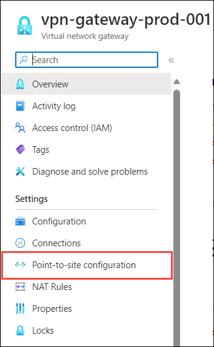
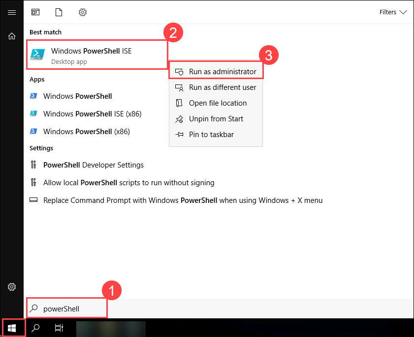
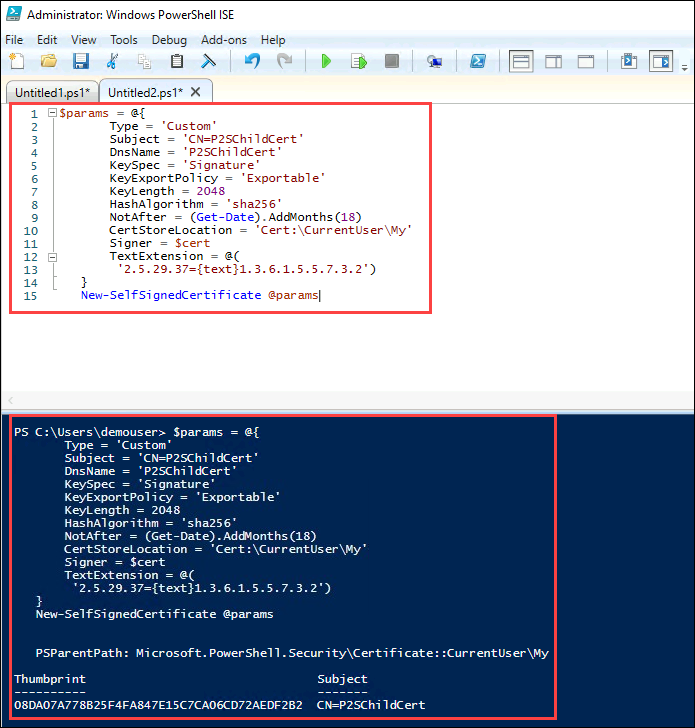
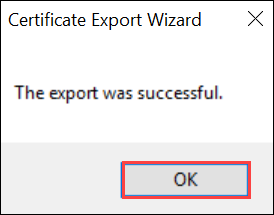
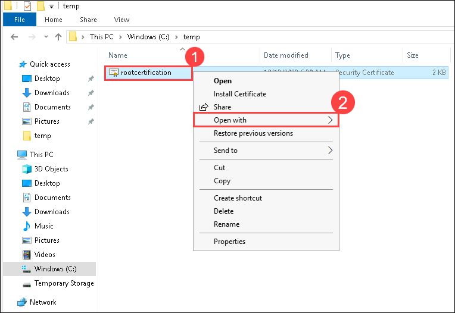
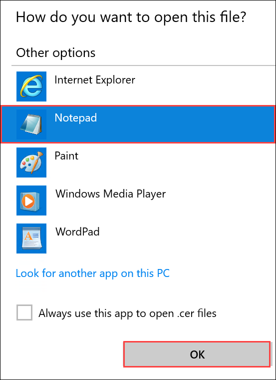
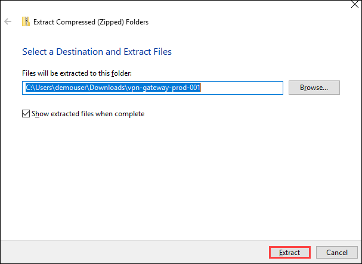
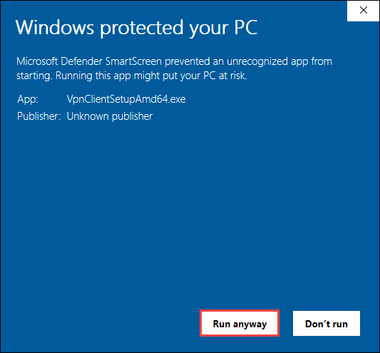
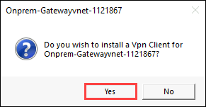
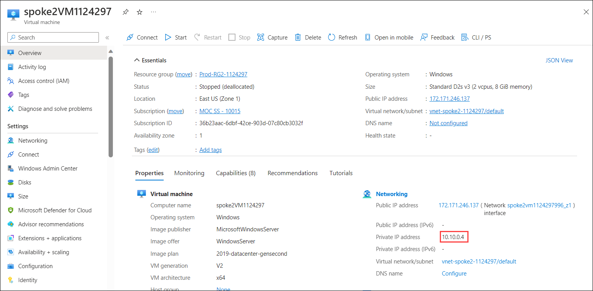

# Exercise 1: Provision user remote access to Azure

In this exercise, you'll exploring and configuring VPN to provide user remote access.

## Task 1: Explore the already automated services from 101 

## Task 2: Explore and configure VPN to provide user remote access 

1. In the Azure Portal, type **virtual network gateway (1)** in the search box and select **Virtual Network gateways (2)** from the results.

   

1. On the **Virtual network gateways** page, select **vpn-gatway-prod-001**.

   

1. On the **vpn-gatway-prod-001** page, select **Point-to-site configuration** under Settings.

   

1. On the **vpn-gatway-prod-001|Point-to-site configuration** page, select **Configure now**. 

   

1. On the **vpn-gatway-prod-001|Point-to-site configuration** enter the below details:

   - **Address pool (1)**: Enter **172.16.0.0/16** private IP address range. 

   - **Tunnel type (2)**: Select **IKEv2** from the drop-down list.

   - **Authentication type (3)**: Select **Azure certificate** from the drop-down list.

      

1. In the **LABVM**, type **PowerShell (1)** in the search bar, right-click on **Windows PowerShell ISE (2)** and click on **Run as administrator (3)** in the context menu.

     

1. In the **Windows PowerShell ISE** run the following commands to **Create a self-signed root certificate** and **Generate a client certificate**:

   ### Create a self-signed root certificate

   ```
   $params = @{
    Type = 'Custom'
    Subject = 'CN=P2SRootCert'
    KeySpec = 'Signature'
    KeyExportPolicy = 'Exportable'
    KeyUsage = 'CertSign'
    KeyUsageProperty = 'Sign'
    KeyLength = 2048
    HashAlgorithm = 'sha256'
    NotAfter = (Get-Date).AddMonths(24)
    CertStoreLocation = 'Cert:\CurrentUser\My'
   }
   $cert = New-SelfSignedCertificate @params
   ```
   
   
   ### Generate a client certificate:

   ```
   $params = @{
       Type = 'Custom'
       Subject = 'CN=P2SChildCert'
       DnsName = 'P2SChildCert'
       KeySpec = 'Signature'
       KeyExportPolicy = 'Exportable'
       KeyLength = 2048
       HashAlgorithm = 'sha256'
       NotAfter = (Get-Date).AddMonths(18)
       CertStoreLocation = 'Cert:\CurrentUser\My'
       Signer = $cert
       TextExtension = @(
        '2.5.29.37={text}1.3.6.1.5.5.7.3.2')
   }
   New-SelfSignedCertificate @params 
   ```
   

1. To get the certificate .CER file, search for **Manage user certificates (2)** and open **Manage user certificates (3)**.

   

1. Locate the self-signed **root certificate (1)**, typically in **"Certificates - Current User\Personal\Certificates" (2)**, and right-click. Click **All Tasks (3)** -> **Export (4)**. This opens the Certificate Export Wizard.

   

1. In the wizard, click **Next**.

   

1. Select **No, do not export the private key**, and then click on **Next**.

   

1. On the Export File Format page, select **Base-64 encoded X.509 (.CER)**, and then click on **Next**.

   

1. For File to Export, click on **Browse...** to the location to which you want to export the certificate for the File name.

   

1. Navigate to the path `This PC > Windows (C:) >`, to create a new folder, click on **New folder (1)**, enter **temp (2)** as the folder name, and click on **Open (3)**.

   

1. Enter the file name as **rootcertification (1)** and click on **Save (2)**.

   

1. Click on **Finish** to export the certificate.

   

1. You'll see a confirmation saying **The export was successful**, click on **OK**.

    

1. Search and Go to the **File Explorer**.

   

1. Open the path where you have exported the root certificate such as `C:\temp`, right-click on the **rootcertification (1)** and click on **Open with... (2)**.

   

1. Select **Notepad** on the other options page then click on **OK**.

   
 
1. If you exported the certificate in the required Base-64 encoded X.509 (.CER) format, you'll see text similar to the following example. The section highlighted in blue contains the information that you copy and upload to Azure.

    

1. Navigate back to the azure portal on the **vpn-gateway-prod-001| Point-to-site configuration** page enter the below details: under **Root certificates**:
 
   - **Name (1)**: Enter **rootcertificate**
   - **Public certificate data (2)**: Paste the certificate in the required Base-64 encoded X.509 (.CER) format that you have copied in the previous step.
   - Click on **Save (3)**

      

1. Once the **Point to site configuration** implementation is completed click on **Download VPN client**.

   

1. Open the **vpn-gateway-prod-001 (1)** downloaded zip file, right-click on the zip file and click on **Extract All (2)**.

   

1. On the Extract Compressed (Zipped) folders page click on **Extract**.

   

1. Click on **WindowsAmd64** from the extracted folders.

   

1. Right click on the **VpnClientSetupAmd64** application and click on **Run as administrator**.

   

1. You see the pop-up **Windows protected your PC**, click on **More info**.

   

1. Click on **Run anyway**.

   

1. On the **Onprem-Gatewayvnetvnet-<inject key="DeploymentID" enableCopy="false"/>** pop-up click on **Yes**.

   

1. In the LabVM-<inject key="DeploymentID" enableCopy="false"/>, search for **VPN (2)** and select **VPN settings (3)**.

   

1. On the **Onprem-Gatewayvnetvnet-<inject key="DeploymentID" enableCopy="false"/>** section, click on **Connect**.

   

1. On the **Connection status** pop-up click on **Connect**.
 
   

1. On the **CMROUTE.DLL - to update your routing table** pop-up, click on **Continue**.

    

1. On the **Connection Status** pop-up, click on **Connect**.

    

1. You can notice that the **Onprem-Gatewayvnetvnet-<inject key="DeploymentID" enableCopy="false"/>** status is on **Connected**. 

    

1. In the Azure Portal, type **Virtual machines (1)** in the search box and select **Virtual machines (2)** from the results.

   

1. On the **Virtual machines** page, select **spoke2VM<inject key="DeploymentID" enableCopy="false"/>**.

   

1. Select **Overview (1)** in the left-hand menu of **spoke2VM<inject key="DeploymentID" enableCopy="false"/>** and copy the **Private IP address (2)** to launch the website. This link opens the URL in a browser window.

    

1. Verify that the website and data are loaded correctly. The page should look like the following:

    

1. Congratulations! You successfully connected your **LABVM** to **spoke2VM<inject key="DeploymentID" enableCopy="false"/>**.

1. Click on the **Next** button present in the bottom-right corner of this lab guide.


## Summary:

In this exercise, you have covered the following:

- Explored the already automated services from 101.
- Explored and configured VPN to provide user remote access.
