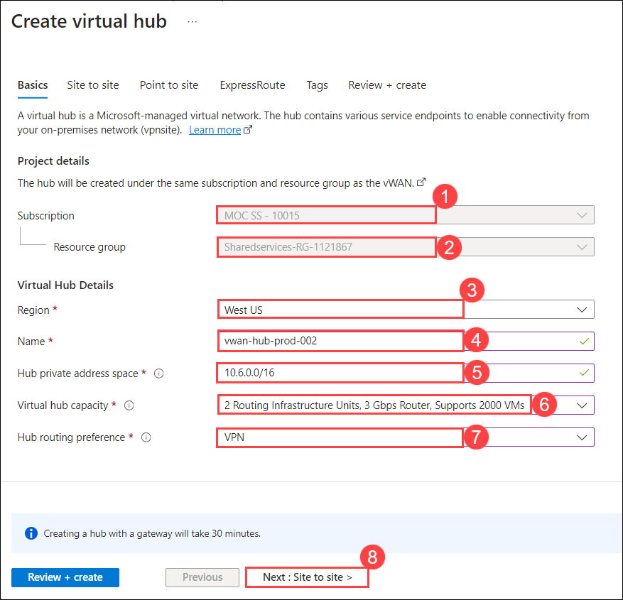
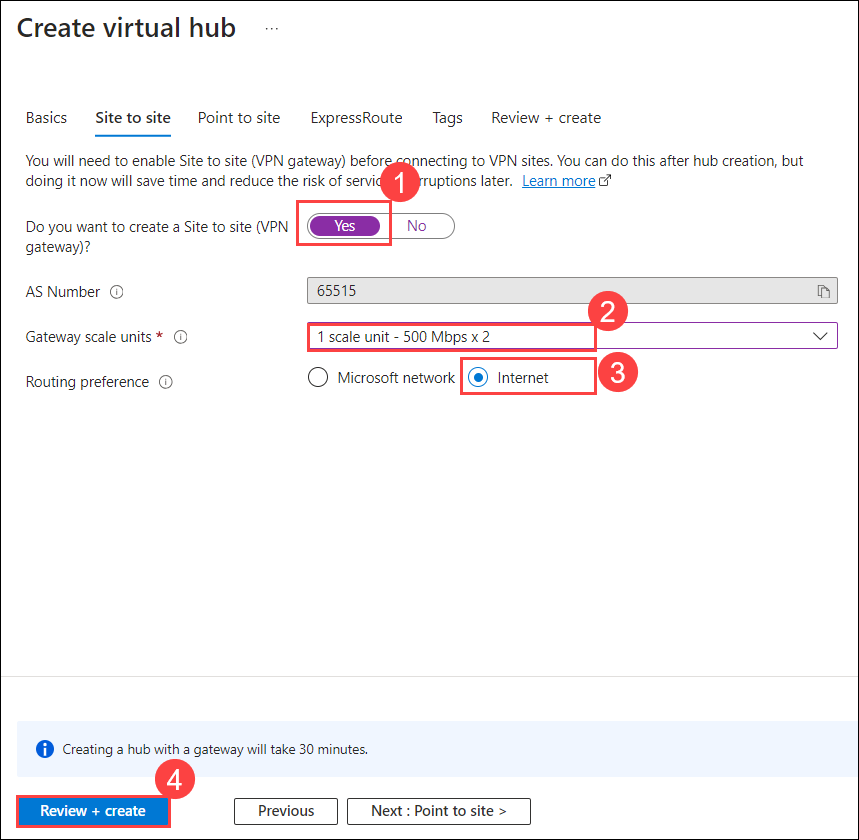
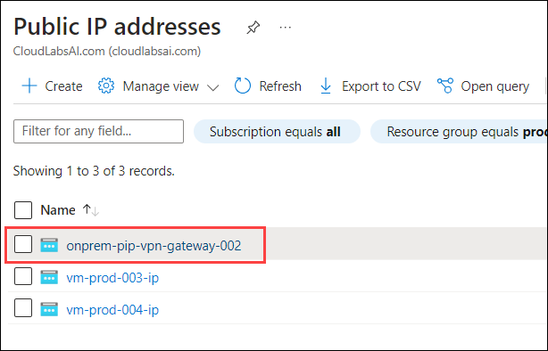
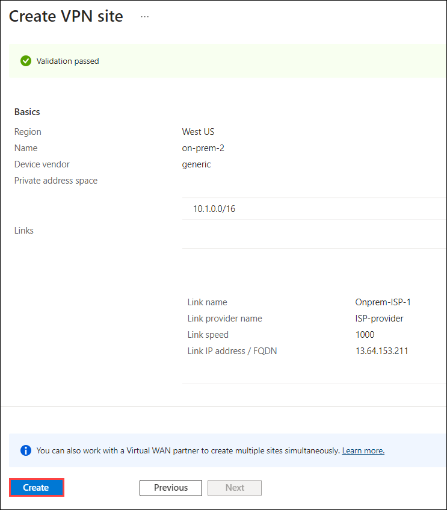
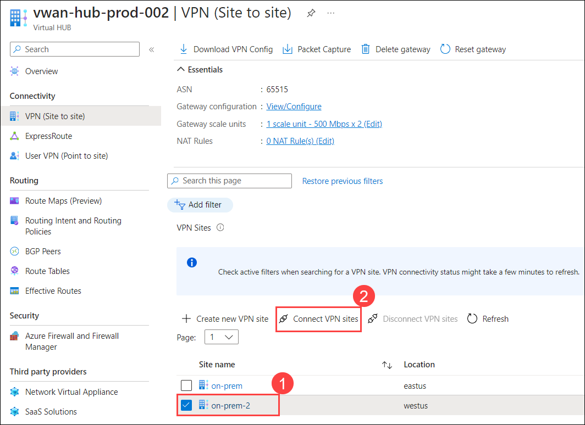
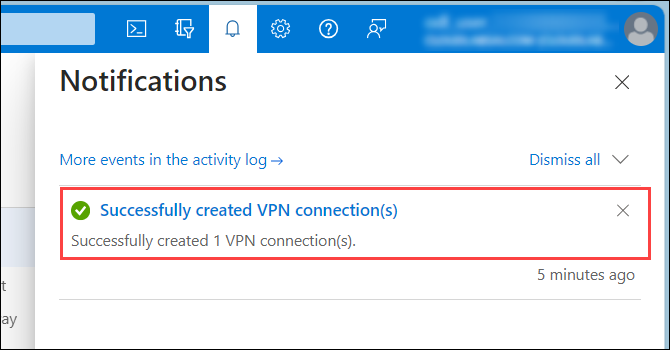

# Exercise 2: Expand to a second Azure Region

In this exercise, you'll 

## Task 1: Create secondary Hub and Spoke network and infrastructure. 

1. In the search bar of the Azure portal, type **Virtual WANs (1)**, then click on **Virtual WANs (2)** under **Services**.

      

1. On the **Virtual WANs** page, select **vwan-prod-001**.

      

1. On the **vwan-prod-001** Page, select **Hubs (1)** under connectivity, then click on **+ New Hub (2)**.

      

1. On the **Basic** page, fill in the following information:

   - **Subscription (1)**: Leave as it as default 
   - **Resource group (2)**: Select **Sharedservices-RG-<inject key="DeploymentID" enableCopy="false"/>**
   - **Region (3)**: Select **West US**
   - **Name (4)**: Enter **vwan-hub-prod-002**
   - **Hub private address space (5)**: Enter **10.6.0.0/16**
   - **Virtual hub capacity (6)**: Select **2 Routing Infrastructure Units, 3 Gbps Router, Supports 2000 VMs**
   - **Virtual routing preference (7)**: Select **VPN**
   - Click on **Next : Site to site > (8)**

       

1. On the **Site to site** page, fill in the following information:

   - **Do you want to create a Site to site(VPN gateway)  (1)**: Select **Yes** 
   - **Gateway scale units (2)**: Select **1 scale unit - 500 Mbps * 2** 
   - **Routing preference (3)**: Select **Internet**
   - Click on **Review + create (4)**

      

1. Review the configuration, and click on **Create**.

      

      >**Note**: Deployment to create a hub with a gateway will take 30 minutes.

1. In the search bar of the Azure portal, type **Public IP addresses  (1)**, then select **Public IP addresses  (2)** under **Services**.

   

1. Select the Azure virtual network gateway public IP address **onprem-pip-vpn-gateway-002**.

     

1. On the right side of the overview pane view find the IP address and hover the right side of the **Public IP address** to copy to the clipboard or record it on notepad.

   

1. On the **vwan-prod-001** Page, select **VPN sites (1)** under connectivity, then click on **Create site (2)**.

    

1. On the **Basic** page, fill in the following information:

   - **Subscription (1)**: Leave as it as default 
   - **Resource group (2)**: Select **Sharedservices-RG-<inject key="DeploymentID" enableCopy="false"/>**
   - **Region (3)**: Select **West US**
   - **Name (4)**: Enter **on-prem-2**
   - **Device vender (5)**: Enter **generic**
   - **Private address space (6)**: Enter **LabVM-<inject key="DeploymentID" enableCopy="false"/>** address space i.e. `10.1.0.0/16`
   -  Click on **Next : Links > (7)**

      

1. On the **Links** page, fill in the following information:
  
    - **Link name (1)**: Enter **Onprem-ISP-1**
    - **Link speed (2)**: Enter **1000**
    - **Link provider name (3)**: Enter **ISP-provider**
    - **Link IP address/FQDN (4)**: Enter **Public IP of onprem-pip-vpn-gateway-002** that you copied in step 9.
    - Click on **Next : Review + Create > (5)**

      

1. Review the configuration, and click the **Create**.

      

1. Go back to the **Basics** tab of **vwan-prod-001** page, select **Hubs (1)** under the **Connectivity** section from the left navigation pane and then click on **vwan-hub-prod-002 (2)**.

      

1. Select **VPN (site to site) (1)** Under the hub, perform the following steps:

   - Click the **View/Configure (2)**. 
   - Under the Edit VPN Gateway, record in Notepad the **Public IP address for VPN Gateway instance 0 (3)**. This Public IP will be used in later on-premises VPN step configuration.
   - Click on **Cancel (4)**. 

      

1. On the **VPN (site to site)** Under Gateway configuration click on **Clear all filters**.

   

1. Select the VPN site **on-prem (1)** then click on the **Connect VPN sites (2)**.

    

1. On the **Connect sites** Page, enter the following details.

   - **Pre-shared key PSK (1)** : Enter **0123456789**

   - Click on the **Connect (2)**. 

      

     >**Note**: Record the Pre-shared key PSK in Notepad as you will be using it a step later to complete the VPN connectivity from the on-premises VPN configuration. 

15. Wait for the Connection to be **completed**.

    

## Task 2: Configure network peering between primary and secondary Hub. 

## Task 3: Test inter-VM connectivity among primary and secondary region