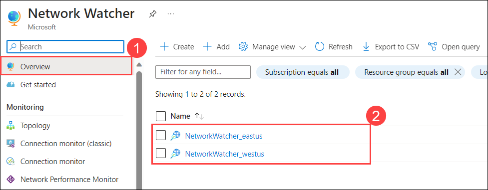
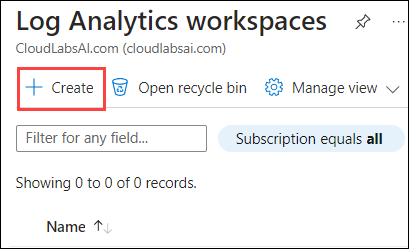
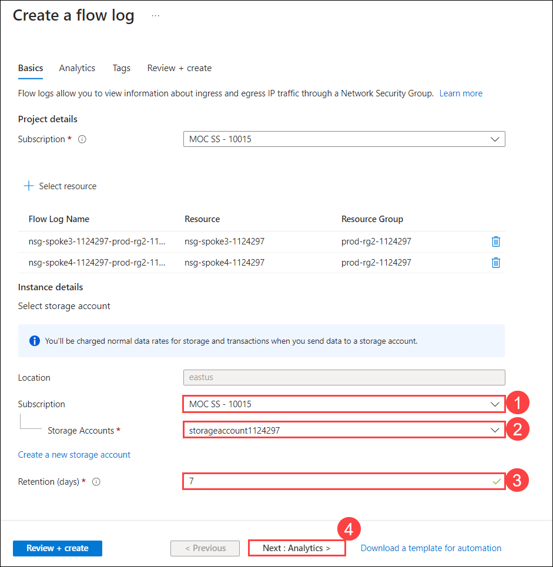
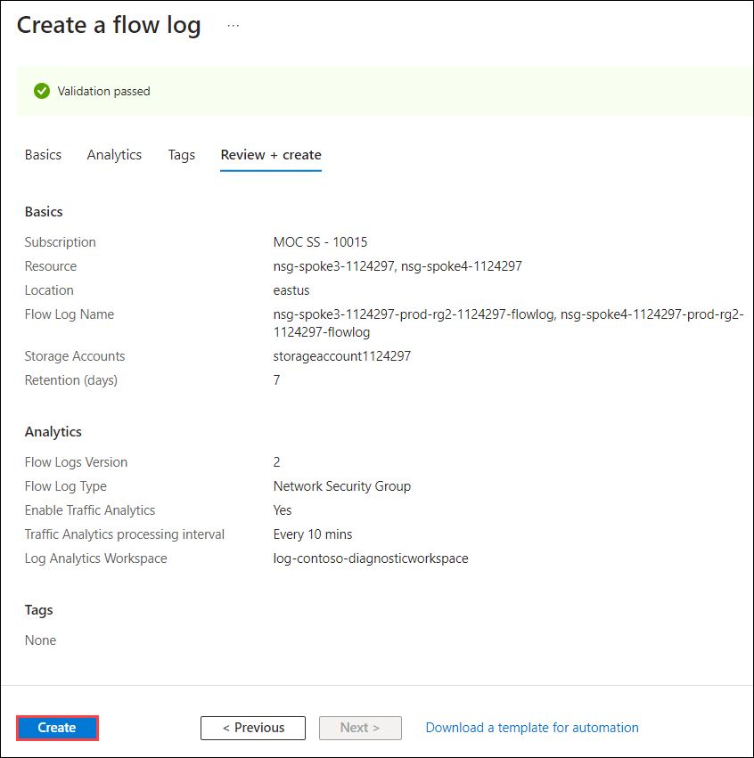

# Exercise 3: Monitoring Azure Network

In this exercise, you'll 

## Task 1: Enable Network Watcher

In this task, you will enable Network Watcher to monitor, diagnose, view metrics, and enable logs for resources in an Azure virtual network. 

1. From the **Home** page of Azure Portal, search **Network Watcher (1)** in the search box and then click on it **(2)**.

   
     
1. On the **Overview (1)** page of the Network Watcher, you can see the Network Watcher for both **primary and secondary regions (2).**

   
     
1. In case, if you don't see the **Network Watcher** for the preferred regions you can follow the below steps:

     - From the **Overview (1)** page of Network Watcher, select **+ Create (2)**

       

    -  In the **Add Network Watcher** blade, follow the below instructions: 

       - **Subscription (1)**: From the drop-down select your **Subscription**

       - **Region (2)**: Choose the region **(US) East US** from the drop-down list and click on it.

       - Click on **Add (3)**

         

## Task 2: Create Flow Logs and Log Analytics Workspace 

Network Security Group (NSG) flow logs are a feature of Azure Network Watcher that allows you to log information about IP traffic flowing through an NSG. Flow data is sent to Azure Storage accounts from where you can access it as well as export it to any visualization tool, SIEM, or IDS of your choice. To learn more about flow logs refer: ```https://docs.microsoft.com/en-us/azure/network-watcher/network-watcher-nsg-flow-logging-overview```

### Task 2.1: Create Storage Account

In this task, you will create a storage account, this storage account will be used to store the NSG flow logs
     
1. Now from the **Home** page of Azure Portal, search **Storage account (1)** on the search box and then click on it **(2)**. 

   
     
1. In the **Storage account** page, select **Create**.

   
     
1.  On the **Basics** tab of **Storage account** blade, enter the below details:

     - **Subscription (1)**: Select your **Subscription**

     - **Resource Group (2)**: Select **Prod-RG2-<inject key="DeploymentID" enableCopy="false"/>** from the drop down.

     - **Storage account name (3)**: Enter **storageaccount<inject key="DeploymentID" enableCopy="false"/>**

     - **Region (4)**: Select **East US**

     - Select **Review (5)**

       
         
 1.  Review the configuration of the storage account and click on **Create**.

           
      
 ### Task 2.2: Create Log Analytics Workspace
 
 In this task, you will create Log Analytics Workspace. This Log Analytics workspace will be used by Traffic Analytics to store the aggregated and indexed data that is then used to generate the analytics.
      
 1. From the **Home** page of Azure Portal, search **Log Analytics Workspaces (1)** on the search box and then click on it **(2)**. 

    
    
 1. Select **+ Create**.

    
      
 1.  On the **Basics** tab of **Create Log Analytics workspace**, enter the below information:
       
       - **Subscription (1)**: Select your **Subscription**.

       - **Resource Group (2)**: Select **Prod-RG2-<inject key="DeploymentID" enableCopy="false"/>**.

       - **Name (3)**: **log-contoso-diagnosticworkspace**

       - **Region (4)**: Select **East US**

       - Select **Review + Create (5)**.

         
       
 1. Review the configuration of analytics workspace and select **Create**

    
       
 ### Task 2.3: Create NSG flow logs.
 
 In this task, you will create NSG flow logs in the Network Watcher.

1. Now navigate back to Azure **Home** page, from search bar search for **Network Watcher (1)** and select it **(2)**.

   
   
1. On the Network Watcher page select the **Flow logs** under Logs.

   
    
      
1. Now click on **Create flow log**.

   
      
1. On the **Basics** tab of **Create a flow log**, enter the following details:

      - Under **Project details** click on **+ Select resource**.

         
         
      - On the **Select network security group** page, select **nsg-spoke3-<inject key="DeploymentID" enableCopy="false"/> (1)** and **nsg-spoke4-<inject key="DeploymentID" enableCopy="false"/> (1)** click on **Confirm selection (2)**.

        
        
      - Under **Instance details**, follow the below steps:


         - **Subscription (1)**: Select your **Subscription**.
         
         - **Storage Accounts (2)**: Enter **storageaccount<inject key="DeploymentID" enableCopy="false"/>**

         - **Retention (days) (3)**: Enter **7**

         - Select **Next : Analytics > (4)**

           
        
1. Under the **Analytics** tab, check the box to **Enable Traffic Analytics (1)**.

    - **Traffic Analytics processing interval (2)**: Select **Every 10 mins** from drop down.

    - **Subscription (3)**: Select your **Subscription**.

    - **Log Analytics Workspace (4)**: Select **log-contoso-diagnosticworkspace** from drop down.

    - Select **Review + Create (5)**.

      
        
1. Review the configuration of the flow log and select **Create**.

        
         
1. You'll be able to see the created NSG flow logs for both virtual machines under **Flow logs** of **Network watcher blade**

    

## Task 3: Deploy Network Monitoring Solution 

## Task 4: Setup Azure Monitor Alerts and test notifications 

### Add traffic manager 

### Traffic analytics -- NSG 
