# Exercise 3: Monitoring Azure Network

In this exercise, you will enable a Network Watcher and create Flow Logs to run Sample traffic and perform Sample network troubleshooting. You'll also deploy Log Analytics Workspace and Network Monitoring Solution to set up Azure Monitor Alerts and test notifications.

## Task 1: Enable Network Watcher

In this task, you will enable Network Watcher to monitor, diagnose, view metrics, and enable logs for resources in an Azure virtual network. 

1. From the **Home** page of Azure Portal, search **Network Watcher (1)** in the search box and then click on it **(2)**.

   
     
1. On the **Overview (1)** page of the Network Watcher, you can see the Network Watcher for both **primary and secondary regions (2).**

   
     
1. In case, if you don't see the **Network Watcher** for the preferred regions you can follow the below steps:

     - From the **Overview (1)** page of Network Watcher, select **+ Create (2)**.

       

    -  In the **Add Network Watcher** blade, follow the below instructions: 

       - **Subscription (1)**: Select your Subscription.

       - **Region (2)**: Choose the region **(US) East US** from the drop-down list and click on it.

       - Click on **Add (3)**

         

## Task 2: Create Flow Logs and Log Analytics Workspace 

Network Security Group (NSG) flow logs are a feature of Azure Network Watcher that allows you to log information about IP traffic flowing through an NSG. Flow data is sent to Azure Storage accounts from where you can access it as well as export it to any visualization tool, SIEM, or IDS of your choice. To learn more about flow logs refer: ```https://docs.microsoft.com/en-us/azure/network-watcher/network-watcher-nsg-flow-logging-overview```

### Task 2.1: Create Storage Account

In this task, you will create a storage account, this storage account will be used to store the NSG flow logs.
     
1. Now from the **Home** page of Azure Portal, search **Storage account (1)** on the search box and then click on it **(2)**. 

   
     
1. In the **Storage account** page, select **Create**.

   
     
1.  On the **Basics** tab of **Storage account** blade, enter the below details:

     - **Subscription (1)**: Select your Subscription.

     - **Resource Group (2)**: Select **Prod-RG2-<inject key="DeploymentID" enableCopy="false"/>** from the drop down.

     - **Storage account name (3)**: Enter **storageaccount<inject key="DeploymentID" enableCopy="false"/>**

     - **Region (4)**: Select **East US**

     - Select **Review (5)**

       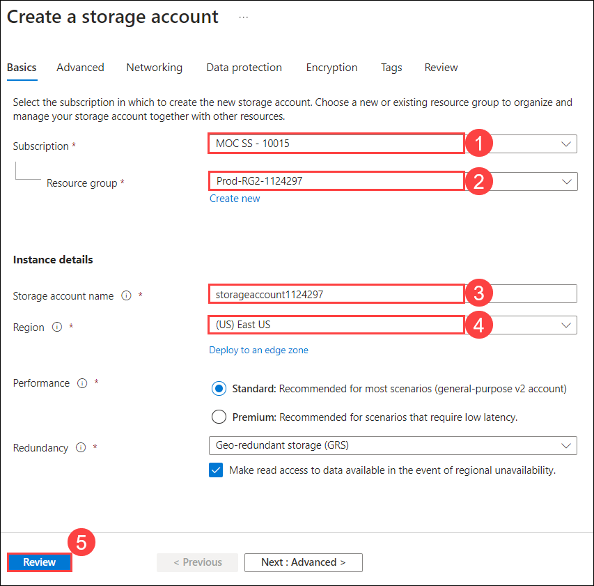
         
 1.  Review the configuration of the storage account and click on **Create**.

     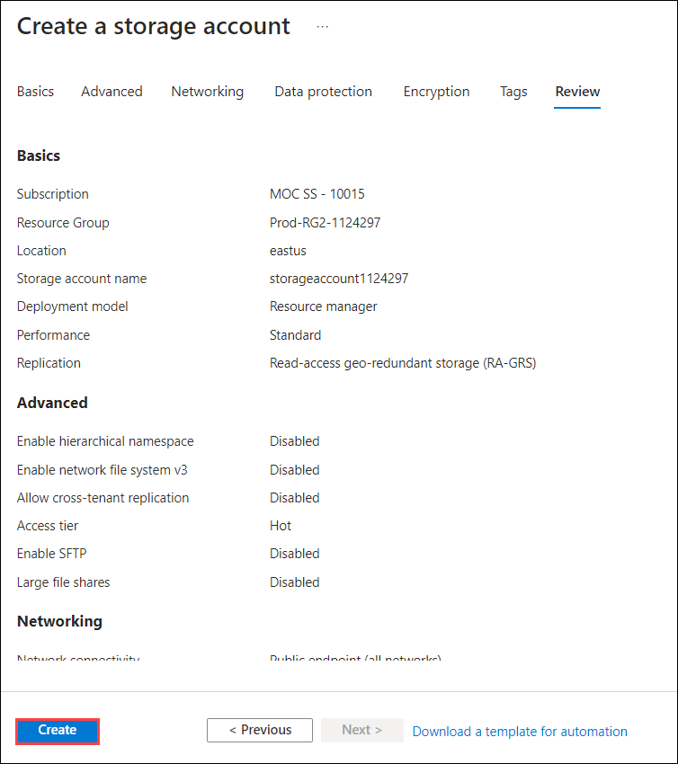      
      
 ### Task 2.2: Create Log Analytics Workspace
 
 In this task, you will create a Log Analytics Workspace. This Log Analytics workspace will be used by Traffic Analytics to store the aggregated and indexed data that is then used to generate the analytics.
      
 1. From the **Home** page of Azure Portal, search **Log Analytics Workspaces (1)** on the search box and then click on it **(2)**. 

    
    
 1. Select **+ Create**.

    
      
 1.  On the **Basics** tab of **Create Log Analytics workspace**, enter the below information:
       
       - **Subscription (1)**: Select your Subscription.

       - **Resource Group (2)**: Select **Prod-RG2-<inject key="DeploymentID" enableCopy="false"/>**.

       - **Name (3)**: **log-contoso-diagnosticworkspace**

       - **Region (4)**: Select **East US**

       - Select **Review + Create (5)**.

         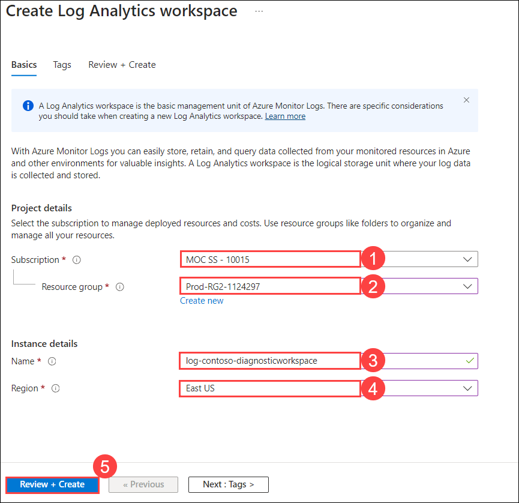
       
 1. Review the configuration of the analytics workspace and select **Create**.

    
       
 ### Task 2.3: Create NSG flow logs.
 
 In this task, you will create NSG flow logs in the Network Watcher.

1. Now navigate back to Azure **Home** page, from search bar search for **Network Watcher (1)** and select it **(2)**.

   
   
1. On the Network Watcher page select the **Flow logs** under Logs.

   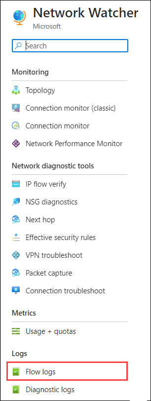
        
1. Now click on **Create flow log**.

   
      
1. On the **Basics** tab of **Create a flow log**, enter the following details:

      - Under **Project details** click on **+ Select resource**.

         
         
      - On the **Select network security group** page, select **nsg-spoke3-<inject key="DeploymentID" enableCopy="false"/> (1)** and **nsg-spoke4-<inject key="DeploymentID" enableCopy="false"/> (1)** click on **Confirm selection (2)**.

        
        
      - Under **Instance details**, follow the below steps:

         - **Subscription (1)**: Select your Subscription.
         
         - **Storage Accounts (2)**: Enter **storageaccount<inject key="DeploymentID" enableCopy="false"/>**

         - **Retention (days) (3)**: Enter **7**

         - Select **Next : Analytics > (4)**

           
        
1. Under the **Analytics** tab, check the box to **Enable Traffic Analytics (1)**.

    - **Traffic Analytics processing interval (2)**: Select **Every 10 mins** from drop down.

    - **Subscription (3)**: Select your Subscription.

    - **Log Analytics Workspace (4)**: Select **log-contoso-diagnosticworkspace** from drop down.

    - Select **Review + Create (5)**.

      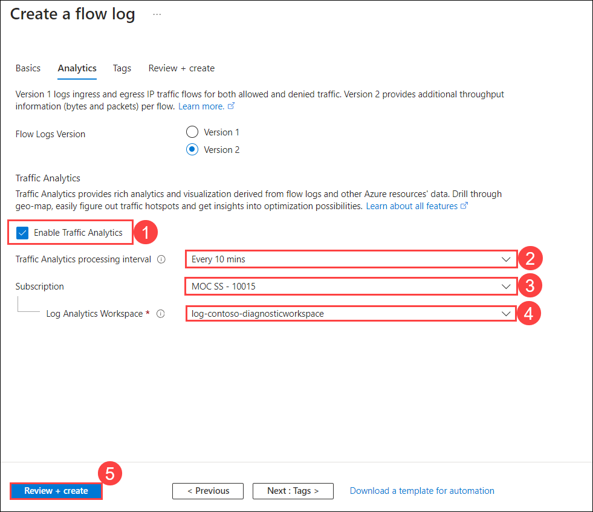
        
1. Review the configuration of the flow log and select **Create**.

        
         
1. You'll be able to see the created NSG flow logs for both virtual machines under **Flow logs** of **Network watcher blade**.

    

## Task 3: Deploy Network Monitoring Solution

Monitoring solutions in Azure Monitor provide analysis of the operation of a particular Azure application or service. You can add monitoring solutions to Azure Monitor for any applications and services that you use. In this task you'll add a Network performance monitor for the log analytics workspace under the Network watcher, you'll also use Solutions to confirm the deployment of Network monitoring solutions and monitor the multiple types of Azure resources.

1. Select **Network Performance Monitor (1)** under **Monitoring** from Network Watcher page and click on **+ Add NPM (2)**.

   
     
1. In the **Enable Non-Azure** page, enter the following details:

   - **Subscription (1)**: Select your Subscription.

   - **Workspace (2)**: Select **Log-contoso-diagnosticworkspace** from drop-down list.

   - Click on **Create (3)**

     
 
1. After successful deployment, navigate back to the **Network Watcher** page and under **Network Performance Monitor** notice you are able to see the newly added workspace.

   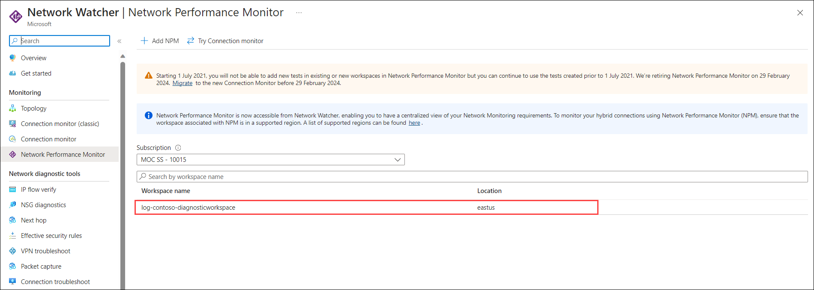
     
1. Search **Solutions (1)** on the search bar of the Azure Portal's **Home** page and select it **(2)**.

   
     
1. You can see the **NetworkMonitoring(Log-contoso-diagnosticWorkspace)** under **Solutions** page. This confirms the deployment of **Network Monitoring Solution**.

    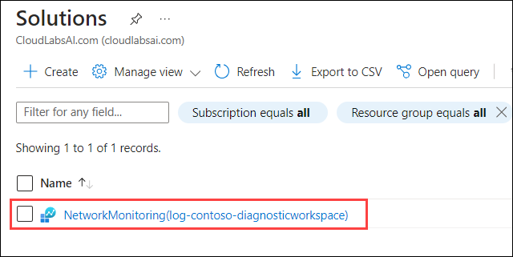
       
1. You can also monitor the performance of Log Analytics Workspace from **Monitor**.

1. Search **Monitor (1)** on the search box of the Azure Portal's **Home** page and select it **(2)**.

    
      
1. Select **Insights Hub** under **Insights** from Monitor blade.

    
       
1. Select **Log Analytics workspaces** from the **Insights** page.

    
       
1. Select **log-contoso-diagnosticworkspace** from **Log Analytics workspaces** page.

    
       
1. From the **Overview** page, you can monitor multiple types of Azure resources.

   

   > **Note**: The data may take up to 30 minutes to appear when deployed for the first time.

## Task 4: Setup Azure Monitor Alerts and test notifications

In this task, you will be creating Azure Monitor Alerts and testing the notification. Alerts proactively notify you when issues are found with your infrastructure or application using your monitoring data in Azure Monitor.

1. Search **Monitor (1)** on the search box of the Azure Portal's **Home** page and select it **(2)**.

    
      
1. Select **Alerts (1)** under Monitor blade and click on **+ Create (2)** then select **Alert rule (3)**.

   
   
1. Under **Scope** tab, click on **+ Select scope**.

   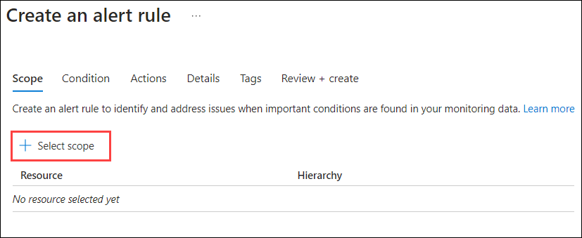
       
1. On **Select a resource** page, search for **Virtual machines (1)** Under Filter by resource type and select it **(2)**.

   
     
1. Now expand the resource group **Prod-RG2-<inject key="DeploymentID" enableCopy="false"/>** and select **spoke3VM<inject key="DeploymentID" enableCopy="false"/> (2)**, then click on **Apply (3)**.

   
   
1. After selecting the scope, click on **Next :  Condition >**.

   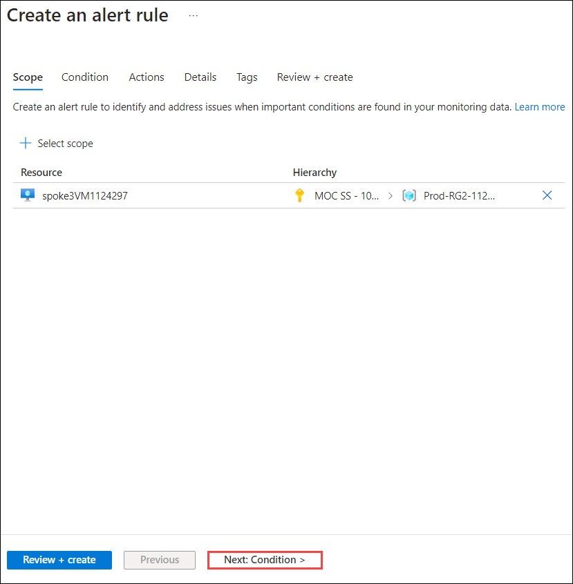
    
1. Click on **See all signals (1)**, search for **Network (2)**, and select **Network In total**, click on **Apply (4)**.

   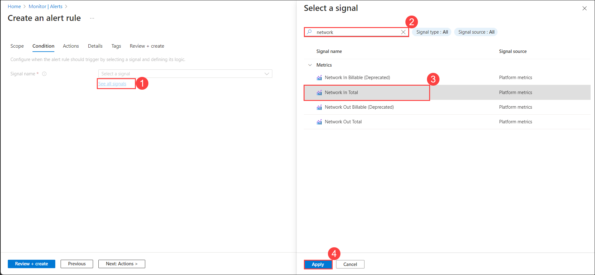
    
1. Under the **Configure Signal Logic** page, follow the below steps: 
   
   - **Aggregation type (1)**: Select **Total**

   - **Operator (2)**: Select **Greater than**

   - **Unit (3)**: Select **(B)**
   
   - **Threshold value (4)**: Enter **50**

   - Click on **Next : Actions> (5)**

     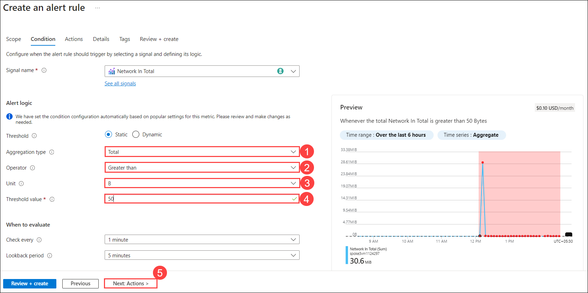
    
1. Select **+ Create action group** under Add action group page.

   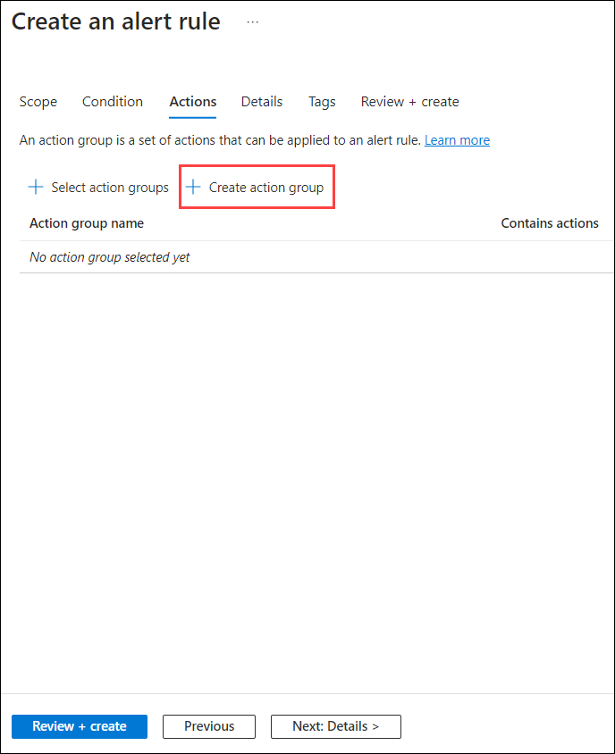
     
1. Under the **Basics** tab of **Create action group**, enter the below details:

      - **Subscription (1)**: Select your Subscription.

      - **Resource group (2)**: Select **Prod-RG2-<inject key="DeploymentID" enableCopy="false"/>**

      - **Action group name (3)**: Enter **agcontosoalert001**

      - **Display name (4)**: Enter **agcontosoalt**

      - Click on **Next: Notifications (5)**.

        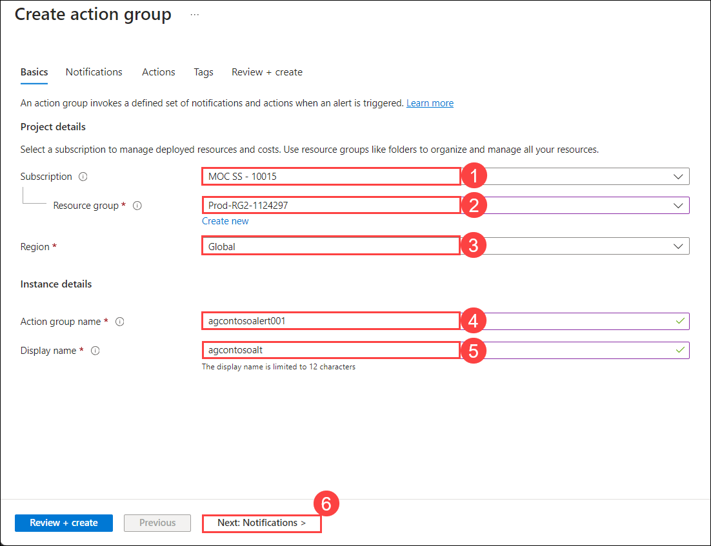
       
1. Under the **Notification** page, follow the below steps:

    - **Notification type (1)**: select **Email/SMS message/Push/Voice** from drop-down list.

    - Check the box next to **Email** and enter  **<inject key="AzureAdUserEmail"></inject> (2)**

    - Select **OK (3)**.

      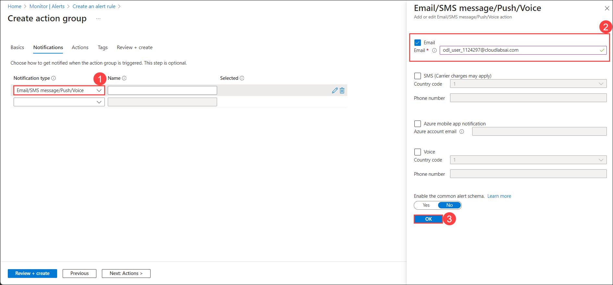
      
1. Now, enter the Name as **Alert for VM (1)** and click on **Next: Actions (2)**.

    
     
1. Leave everything as **Default** under **Actions** and click on **Review + create**.

1. Review the configuration and click on **Create**.

   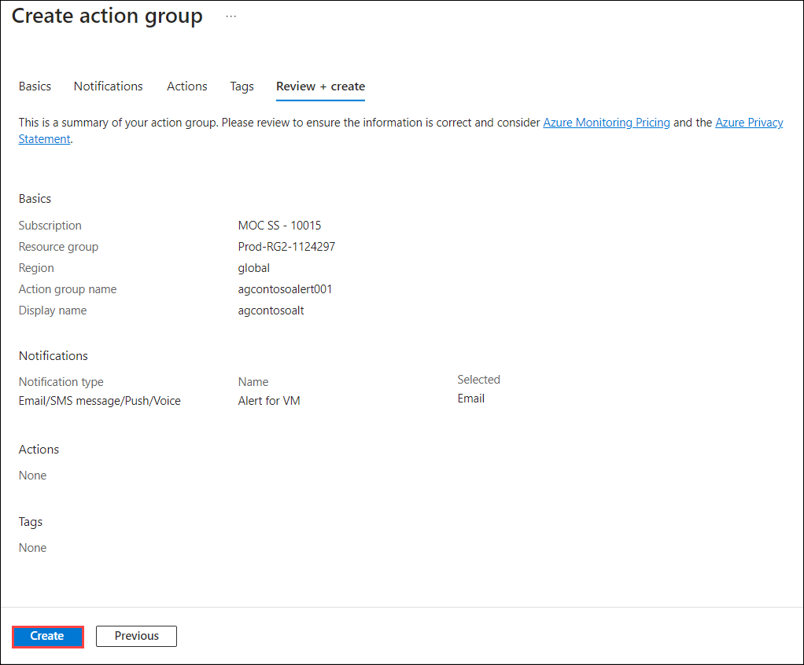
   
1. Now click on **Next : Details>**.

    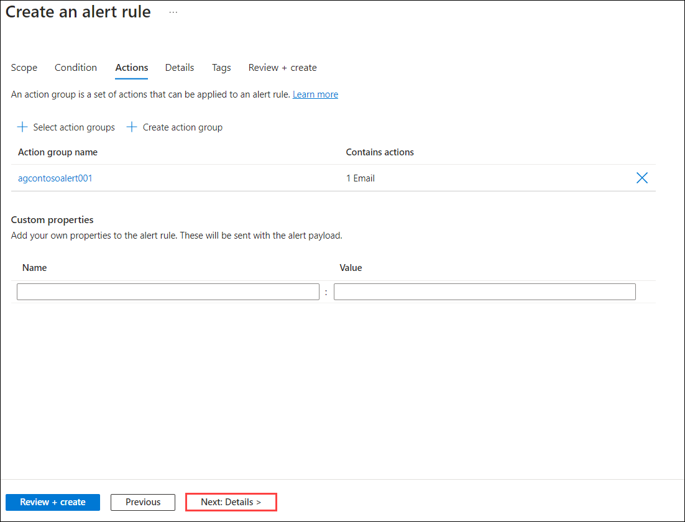
      
1. Under **Alert rule details**, enter the below details:

      - **Subscription (1)**: Select your Subscription.

      - **Resource group (2)**: Select **Prod-RG2-<inject key="DeploymentID" enableCopy="false"/>** from drop-down list.

      - **Alert rule name (3)**: **Alert for VM**

      - Check the box next to **Enable upon creation (4)**

      - Check the box next to **Automatically resolve alerts (5)**

      - Select **Review + create (6)**

        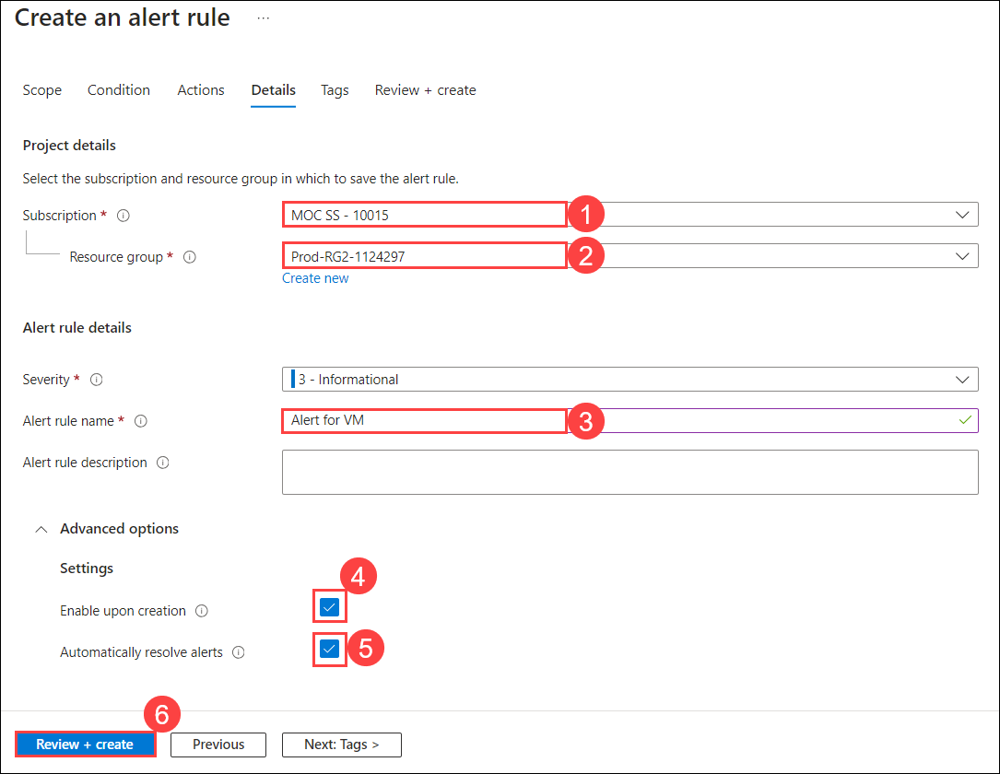
      
1. Review the configuration and click on **Create**.

    
    
1. Open a new browser tab, navigate to the below URL, and click on **Sign in** to access your Outlook account.
 
   ```
    https://outlook.live.com/owa/
   ```

1. You can **Sign in** using the following credentials.
 
   * Email/Username: <inject key="AzureAdUserEmail"></inject>
   * Password: <inject key="AzureAdUserPassword"></inject>
          
1. You will receive the **Alert mail** to your registered mail ID.

    

## Task 5: Run Sample traffic and perform traffic analytics, review logs

1. Navigate back to the Network Watcher and select **Traffic Analytics**, under **Logs** from the options on the left side of the Network Watcher blade.

   
      
1. On the **Traffic Analytics** page, set the time interval to **Last 1 hour**.

   
   
   > **Note**: If you observe the **Time interval** is greyed-out, click on **Meanwhile, click here to see just resource data** and perform the above step.

   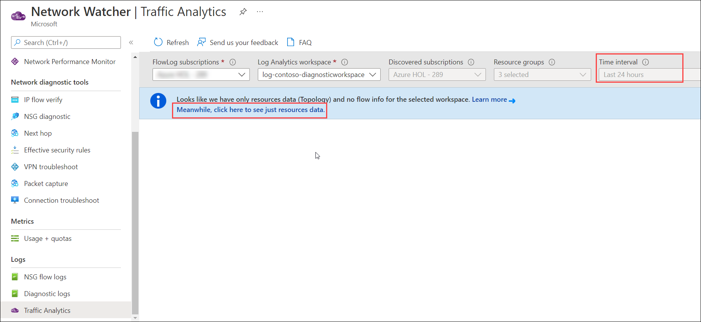
      
1. Now, you can observe the total number of network traffic flows from **Traffic Visualization**

    > **Note**: The dashboard may take up to 30 minutes to appear when deployed for the first time. This is because Traffic Analytics must first aggregate enough data for it to derive meaningful insights. If it takes more time, you can perform the next task and come back later and check on this.
      
      
     
1. Under **Traffic Analytics** Scroll down to **Your Environment** to view the total number of **Deployed Azure regions (1)**, **TA Enabled NSGs (2)**, **Virtual networks (3)**, and **Virtual subnetworks (4)**.

    
      
1. To visualize the traffic distribution by geography, click on **View map**. The geo-map shows the traffic distribution to a data center from countries/regions and continents communicating with it.

    
     
1. In the **Traffic Analytics Geo Map View** page, click on the **Green** icon which indicates the Azure region, and observe the resources deployed under the region, to explore more select **More details**.

    
      
1. Under the **More Insights** blade, scroll down and explore traffic distribution for deployments of the East US region.

    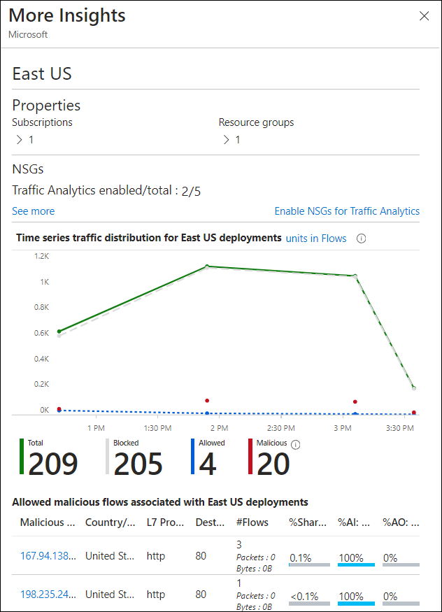
     
1. To close the **Traffic Analytics Geo Map View**, click on the cross at the top right corner.

     
      
1. Close the **Ports receiving traffic from Internet** page by clicking the **Cross (X) icon** from the top right corner.
      
1. Under the Traffic Analytics page, scroll down to **Traffic Distribution** to view the analytics of traffic flows across the host, subnet, VNet, and VMSS.

    
     
1. To view the analytics of traffic flows across the host, select **IP (1)**, then select **See all (2)** from **Traffic Distribution**.

    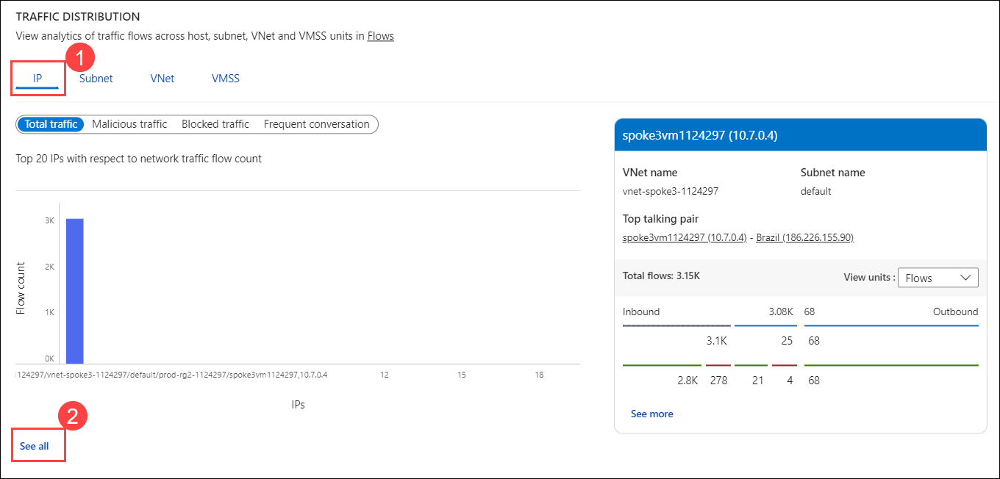
    
1. You can observe the graph of **Time trending chart for top 5 talking IPs** from **Traffic distribution across top IPs** page.

    
    
1. In the same way, you can explore more about **Subnets**, **VNet**, **VMSS**.
