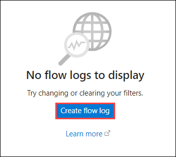
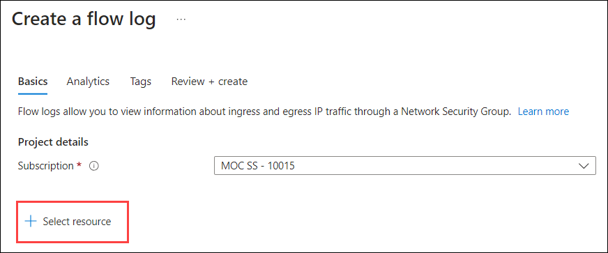
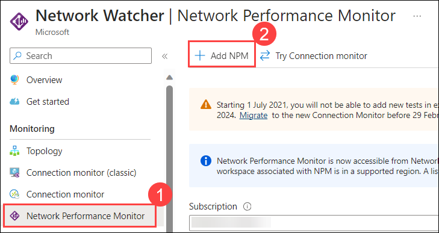
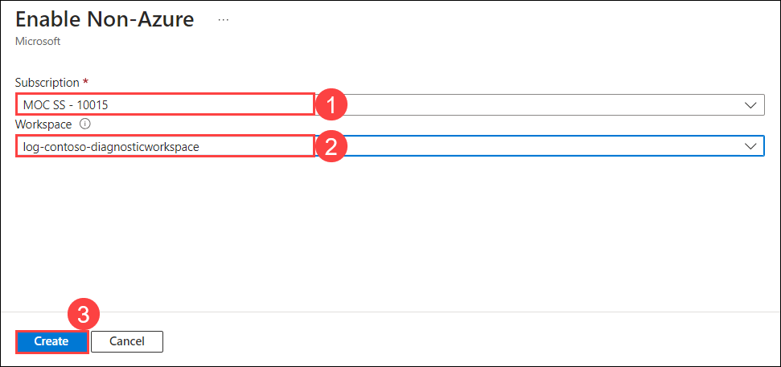
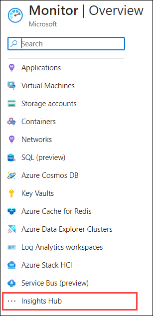
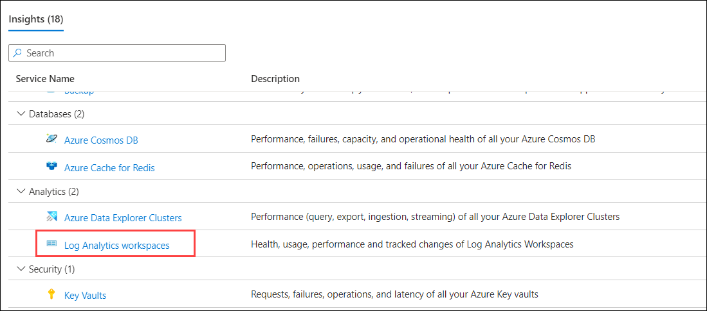
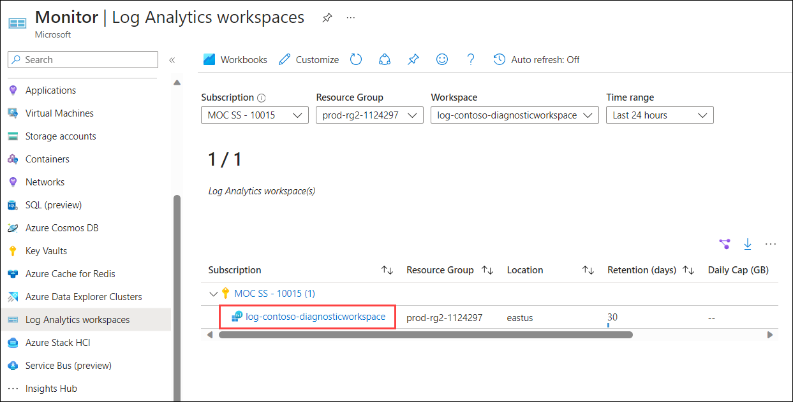
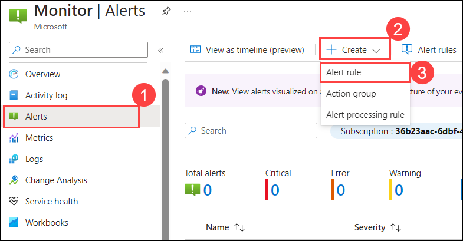

# Exercise 3: Monitoring Azure Network

In this exercise, you'll 

## Task 1: Enable Network Watcher

In this task, you will enable Network Watcher to monitor, diagnose, view metrics, and enable logs for resources in an Azure virtual network. 

1. From the **Home** page of Azure Portal, search **Network Watcher (1)** in the search box and then click on it **(2)**.

   
     
1. On the **Overview (1)** page of the Network Watcher, you can see the Network Watcher for both **primary and secondary regions (2).**

   
     
1. In case, if you don't see the **Network Watcher** for the preferred regions you can follow the below steps:

     - From the **Overview (1)** page of Network Watcher, select **+ Create (2)**

       

    -  In the **Add Network Watcher** blade, follow the below instructions: 

       - **Subscription (1)**: From the drop-down select your **Subscription**

       - **Region (2)**: Choose the region **(US) East US** from the drop-down list and click on it.

       - Click on **Add (3)**

         

## Task 2: Create Flow Logs and Log Analytics Workspace 

Network Security Group (NSG) flow logs are a feature of Azure Network Watcher that allows you to log information about IP traffic flowing through an NSG. Flow data is sent to Azure Storage accounts from where you can access it as well as export it to any visualization tool, SIEM, or IDS of your choice. To learn more about flow logs refer: ```https://docs.microsoft.com/en-us/azure/network-watcher/network-watcher-nsg-flow-logging-overview```

### Task 2.1: Create Storage Account

In this task, you will create a storage account, this storage account will be used to store the NSG flow logs
     
1. Now from the **Home** page of Azure Portal, search **Storage account (1)** on the search box and then click on it **(2)**. 

   
     
1. In the **Storage account** page, select **Create**.

   
     
1.  On the **Basics** tab of **Storage account** blade, enter the below details:

     - **Subscription (1)**: Select your **Subscription**

     - **Resource Group (2)**: Select **Prod-RG2-<inject key="DeploymentID" enableCopy="false"/>** from the drop down.

     - **Storage account name (3)**: Enter **storageaccount<inject key="DeploymentID" enableCopy="false"/>**

     - **Region (4)**: Select **East US**

     - Select **Review (5)**

       
         
 1.  Review the configuration of the storage account and click on **Create**.

           
      
 ### Task 2.2: Create Log Analytics Workspace
 
 In this task, you will create Log Analytics Workspace. This Log Analytics workspace will be used by Traffic Analytics to store the aggregated and indexed data that is then used to generate the analytics.
      
 1. From the **Home** page of Azure Portal, search **Log Analytics Workspaces (1)** on the search box and then click on it **(2)**. 

    
    
 1. Select **+ Create**.

    
      
 1.  On the **Basics** tab of **Create Log Analytics workspace**, enter the below information:
       
       - **Subscription (1)**: Select your **Subscription**.

       - **Resource Group (2)**: Select **Prod-RG2-<inject key="DeploymentID" enableCopy="false"/>**.

       - **Name (3)**: **log-contoso-diagnosticworkspace**

       - **Region (4)**: Select **East US**

       - Select **Review + Create (5)**.

         
       
 1. Review the configuration of analytics workspace and select **Create**

    
       
 ### Task 2.3: Create NSG flow logs.
 
 In this task, you will create NSG flow logs in the Network Watcher.

1. Now navigate back to Azure **Home** page, from search bar search for **Network Watcher (1)** and select it **(2)**.

   
   
1. On the Network Watcher page select the **Flow logs** under Logs.

   
    
      
1. Now click on **Create flow log**.

   
      
1. On the **Basics** tab of **Create a flow log**, enter the following details:

      - Under **Project details** click on **+ Select resource**.

         
         
      - On the **Select network security group** page, select **nsg-spoke3-<inject key="DeploymentID" enableCopy="false"/> (1)** and **nsg-spoke4-<inject key="DeploymentID" enableCopy="false"/> (1)** click on **Confirm selection (2)**.

        
        
      - Under **Instance details**, follow the below steps:


         - **Subscription (1)**: Select your **Subscription**.
         
         - **Storage Accounts (2)**: Enter **storageaccount<inject key="DeploymentID" enableCopy="false"/>**

         - **Retention (days) (3)**: Enter **7**

         - Select **Next : Analytics > (4)**

           
        
1. Under the **Analytics** tab, check the box to **Enable Traffic Analytics (1)**.

    - **Traffic Analytics processing interval (2)**: Select **Every 10 mins** from drop down.

    - **Subscription (3)**: Select your **Subscription**.

    - **Log Analytics Workspace (4)**: Select **log-contoso-diagnosticworkspace** from drop down.

    - Select **Review + Create (5)**.

      
        
1. Review the configuration of the flow log and select **Create**.

        
         
1. You'll be able to see the created NSG flow logs for both virtual machines under **Flow logs** of **Network watcher blade**

    

## Task 3: Deploy Network Monitoring Solution

Monitoring solutions in Azure Monitor provide analysis of the operation of a particular Azure application or service. You can add monitoring solutions to Azure Monitor for any applications and services that you use. In this task you'll add a Network performance monitor for the log analytics workspace under the Network watcher, you'll also use Solutions to confirm the deployment of Network monitoring solutions and monitors the multiple types of azure resources.

1. Select **Network Performance Monitor (1)** under **Monitoring** from Network Watcher page and click on **+ Add NPM (2)**.

   
     
1. In the **Enable Non-Azure** page, enter the following details:

   - **Subscription (1)**: Select your **Subscription**

   - **Workspace (2)**: Select **Log-contoso-diagnosticworkspace** from drop-down list.

   - Click on **Create (3)**

     
 
1. After successful deployment, navigate back to **Network Watcher** page and under **Network Performance Monitor** notice you are able to see newly added workspace.

   
     
1. Search **Solutions (1)** on the search bar of the Azure Portal's **Home** page and select it **(2)**.

   
     
10. You can see the **NetworkMonitoring(Log-contoso-diagnosticWorkspace)** under **Solutions** page. This confirms the deployment of **Network Monitoring Solution**.

    
       
1. You can also monitor the performance of Log Analytics Workspace from **Monitor**.

1. Search **Monitor (1)** on the search box of the Azure Portal's **Home** page and select it **(2)**.

    
      
1. Select **Insights Hub** under **Insights** from Monitor blade.

    
       
1. Select **Log Analytics workspaces** from the **Insights** page.

    
       
1. Select **log-contoso-diagnosticworkspace** from **Log Analytics workspaces** page.

    
       
1. From the **Overview** page, you can monitor multiple types of Azure resources.

   

   > **Note**: The data may take up to 30 minutes to appear when deployed for the first time.

## Task 4: Setup Azure Monitor Alerts and test notifications

In this task, you will be creating Azure Monitor Alerts and tests the notification. Alerts proactively notify you when issues are found with your infrastructure or application using your monitoring data in Azure Monitor.

 
1. Search **Monitor (1)** on the search box of the Azure Portal's **Home** page and select it **(2)**.

    
      
1. Select **Alerts (1)** under Monitor blade and click on **+ Create (2)** then select **Alert rule (3)**.

   
   
1. Under **Scope** tab, click on **+ Select scope**.

   
       
1. On **Select a resource** page, search for **Virtual machines** Under **Filter by resource type** and select it.

   
     
1. Now expand the resource group **<inject key="Resource Group" enableCopy="false"/> (1)** and select **<inject key="VM1Name" enableCopy="false"/>(2)**, then click on **Done (3)**.

   
   
1. After selecting the scope, click on **Next :  Condition >**.

   
    
1. Search for **Network (1)** and select **Network In total (2)**.

   
    
1. Under **Configure Signal Logic** page, follow the below steps: 
 
    - Operator : **Greater than (1)**

    - Aggregation type: **Total (2)**

    - Threshold value: **50 (3)**

    - Unit : **Byte(B) (4)**

    - Click on **Done (5)**
   

   
   
1. Click on **Next : Actions>**.

    
   
1. Select **Add action groups** from **Actions** coloumn.

   
    
1. Select **Create action group** under **Add action group** page.

   
     
1. Under the **Basics** tab of **Create action group**, enter the below details:

      - Subscription: Select your **Subscription (1)**

      - Resource group: Select **rg-contoso-prod-eastus (2)**

      - Action group name: Enter **agcontosoalert001 (3)**

      - Display name : Enter **agcontosoalt (4)**

      - Select **Next: Notifications (5)**.

      
       
1. Under **Notification** page, follow below steps:

    - Notification type: select **Email/SMS message/Push/Voice (1)** from drop-down list.

    - Check the box next to **Email** and enter  **<inject key="AzureAdUserEmail"></inject> (2)**

    - Select **OK (3)**.

      
      
1. Now, enter the Name as **Alert for VM (1)** and click on **Next: Actions (2)**.

    
     
1. Leave everything as **Default** under **Actions** and click on **Review + create**.

1. Review the configuration and click on **Create**.

   
   
1. Now click on **Next : Details>**.

    
      
1. Under **Alert rule details**, enter the below details:

      - Subscrition : Select your **Subscription (1)**

      - Resource group: Select **rg-contoso-prod-east (2)** from drop-down list.

      - Alert rule name: **Alert for VM (3)**

      - Check the box next to **Enable upon creation (4)**

      - Check the box next to **Automatically resolve alerts (5)**

      - Select **Review + create (6)**

      
      
1. Review the configuration and click on **Create**.

        
          
1. To test the notifications for the Alert Rule, browse the firewall's public IP Address in the new tab and refresh the page every 2 minutes.
          
1. You have successfully created the Alert Rule. To view the Alert Rule, click on **Total alert rules**. It might take a few minutes for changes to be shown.

    
    
1. Open a new browser tab, navigate to the below URL and click on **Sign in** to access your outlook account.
 
   ```
    https://outlook.live.com/owa/
   ```

1. You can **Sign in** using the following credentials.
 
   * Email/Username: <inject key="AzureAdUserEmail"></inject>
   * Password: <inject key="AzureAdUserPassword"></inject>
       
     
1. You will receive the **Alert mail** to your registered mail id.

    

### Add traffic manager 

### Traffic analytics -- NSG 
