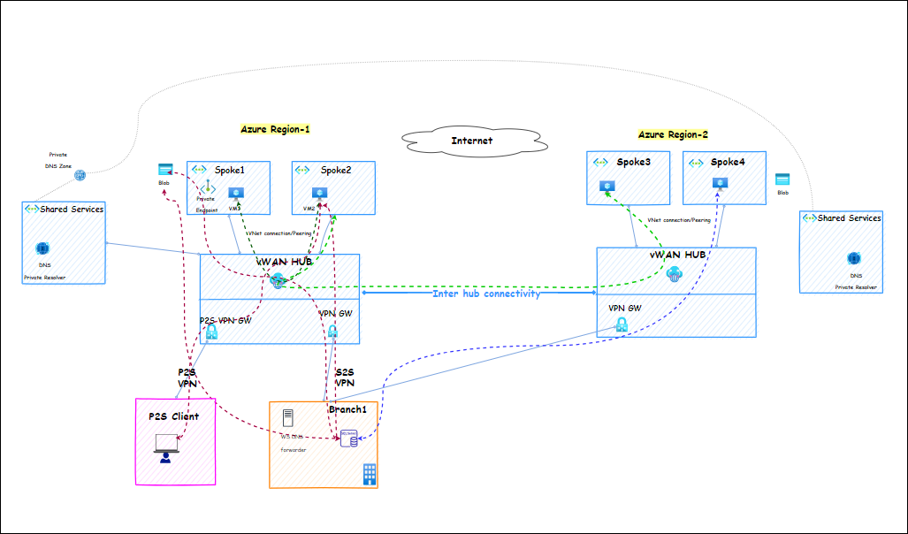

## Expanding Azure Virtual WAN to Support your Global Network

Azure Networking Solutions provides a fundamental understanding of key networking concepts within the Microsoft Azure cloud platform. This overview serves as a primer for individuals and organizations looking to leverage Azure's networking capabilities to build secure, scalable, and highly available cloud environments.

### Key features of Azure Networking Solutions

  - **Virtual Network:** An Azure Virtual Network (VNet) is a network or environment that can be used to run VMs and applications in the cloud. When it is created, the services and Virtual Machines within the Azure network interact securely with each other, the internet, and on-premises networks.

  - **Virtual Network Gateway:** It is a service used to send encrypted traffic between an Azure virtual network and on-premises locations over the public Internet.

  - **Virtual WAN:** It is a service that brings many networking, security, and routing functionalities together to provide a single operational interface.

  - **DNS Private Resolver:** It is a service that bridges an on-premises DNS with Azure DNS.

  - **Private DNS Zone:** It provides a reliable, secure DNS service to manage and resolve domain names in a virtual network without the need to add a custom DNS solution.

  - **DNS Forwarding Ruleset:** It is a setup with rules pointing to the on-prem DNS zone and linked to hub vnet and using the private DNS resolver outbound endpoint.

## Hands-on Lab Scenario

Contoso Insurance is set to launch a new online insurance portal, developed by their development team. The portal will be tested by internal and beta users before launch, using Azure as their cloud platform. Azure offers a wide range of IaaS facilities, including computing, networking, storage, security, and more, making it an ideal choice for businesses in the insurance industry.

Contoso plans to modernize its operations by migrating its on-premises infrastructure to Azure cloud, improving scalability and security. They will provision a comprehensive Azure Network Topology, including Platform and Application Landing Zone, and establish hybrid connectivity between their on-premises data center and Azure cloud.

The client requires assistance in configuring and deploying their insurance application on Azure, following the end-state architecture. The process will be done in phases, with the infrastructure of Azure resources for the Contoso Insurance Application ensuring consistency with the end-state architecture. The development and testing progress will be monitored.

## Azure services and related products

  - Virtual Network
  - Virtual Machines
  - Virtual Network Gateway
  - DNS Private Resolver
  - Private DNS Zone
  - DNS Forwarding Ruleset

## Solution Architecture

## Lab Context

In this Hands-on Lab, you'll learn about Azure networking fundamentals. You will get Hands-on experience with Azure resources and how to use networking resources and establish connections from cloud to on-premise resources.

### Exercise 1: Getting Started with Azure 

In this exercise, you'll log in to the Azure Portal and review the pre-deployed resources that are part of the lab environment. 

### Exercise 2: Provision user remote access to Azure

In this exercise, you'll be exploring and configuring VPN to provide user remote access.

### Exercise 3: Expand to a second Azure Region 

In this exercise, you'll provision connectivity from on-premises to Azure via Site-to-Site VPN (S2S VPN), with static routing, and verify connectivity between on-premises and Azure. This lab will emulate an on-premises site using another separate VNet in Azure with a Virtual Network Gateway as the VPN device.

### Exercise 4: Monitoring Azure Network

In this exercise, you'll enable a Network Watcher and create Flow Logs to run Sample traffic. You'll also deploy Log Analytics Workspace and Network Monitoring Solution to set up Azure Monitor Alerts and test notifications.
